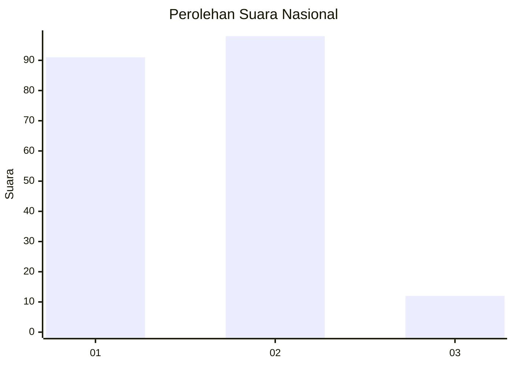
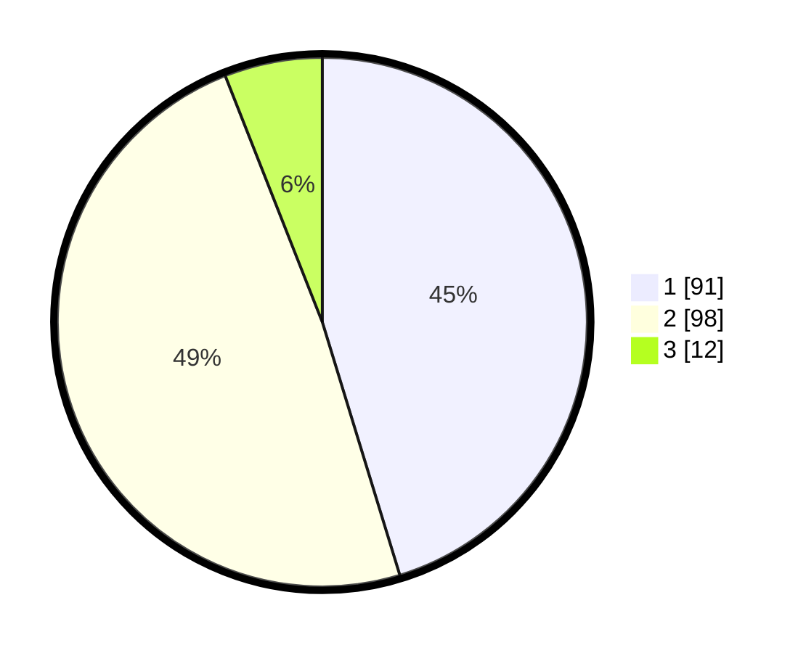

# Hasil

## Grafik

## Tabel

| No.    | Nama Paslon    | Suara | Suara (raw) | Persentase |
|:------ |:-------------- | -----:| -----------:| ----------:|
| 100025 | ANIES MUHAIMIN | 91    | [91][p-1]   | 45,27      |
| 100026 | PRABOWO GIBRAN | 98    | [98][p-2]   | 48,76      |
| 100027 | GANJAR MAHFUD  | 12    | [12][p-3]   | 5,97       |

[p-1]: https://github.com/gigit-pemilu/pemilu-2024/blob/main/pilpres/hitung-suara/sub/31-dki-jakarta/sub/72-jakarta-utara/sub/01-penjaringan/sub/1002-kamal-muara/sub/014-tps/sub/paslon-1.txt
[p-2]: https://github.com/gigit-pemilu/pemilu-2024/blob/main/pilpres/hitung-suara/sub/31-dki-jakarta/sub/72-jakarta-utara/sub/01-penjaringan/sub/1002-kamal-muara/sub/014-tps/sub/paslon-2.txt
[p-3]: https://github.com/gigit-pemilu/pemilu-2024/blob/main/pilpres/hitung-suara/sub/31-dki-jakarta/sub/72-jakarta-utara/sub/01-penjaringan/sub/1002-kamal-muara/sub/014-tps/sub/paslon-3.txt

## Foto C Plano

https://sirekap-obj-formc.kpu.go.id/eaad/pemilu/ppwp/31/72/01/10/02/3172011002014-20240222-212857--29db9a84-1165-4cf7-9644-ec03692862df.jpg

https://sirekap-obj-formc.kpu.go.id/eaad/pemilu/ppwp/31/72/01/10/02/3172011002014-20240222-212814--48331a44-eb2b-48a8-bf67-4380cf139c66.jpg

https://sirekap-obj-formc.kpu.go.id/eaad/pemilu/ppwp/31/72/01/10/02/3172011002014-20240222-212718--ad992b65-afaa-45d3-83d8-af59d839000d.jpg

## Metadata

| Key        | Value               |
| ---------- | ------------------- |
| Time Stamp | 2024-02-24 22:31:28 |

