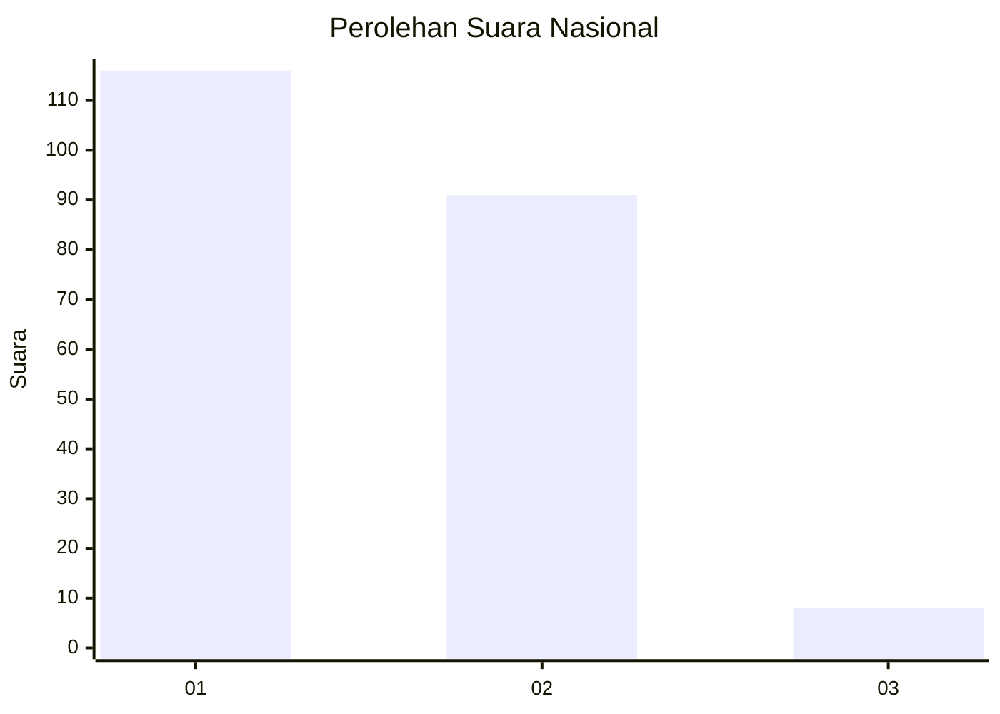
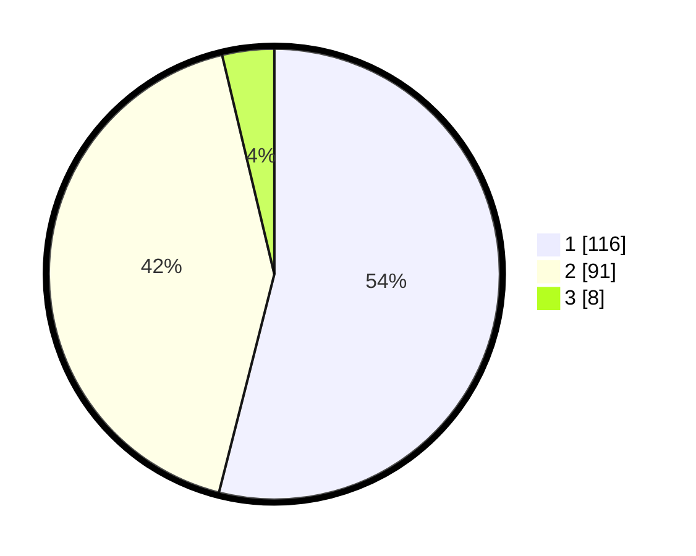

# Hasil

## Grafik

## Tabel

| No.    | Nama Paslon    | Suara | Suara (raw) | Persentase |
|:------ |:-------------- | -----:| -----------:| ----------:|
| 100025 | ANIES MUHAIMIN | 116   | [116][p-1]  | 53,95      |
| 100026 | PRABOWO GIBRAN | 91    | [91][p-2]   | 42,33      |
| 100027 | GANJAR MAHFUD  | 8     | [8][p-3]    | 3,72       |

[p-1]: https://github.com/gigit-pemilu/pemilu-2024/blob/main/pilpres/hitung-suara/sub/31-dki-jakarta/sub/72-jakarta-utara/sub/01-penjaringan/sub/1002-kamal-muara/sub/015-tps/sub/paslon-1.txt
[p-2]: https://github.com/gigit-pemilu/pemilu-2024/blob/main/pilpres/hitung-suara/sub/31-dki-jakarta/sub/72-jakarta-utara/sub/01-penjaringan/sub/1002-kamal-muara/sub/015-tps/sub/paslon-2.txt
[p-3]: https://github.com/gigit-pemilu/pemilu-2024/blob/main/pilpres/hitung-suara/sub/31-dki-jakarta/sub/72-jakarta-utara/sub/01-penjaringan/sub/1002-kamal-muara/sub/015-tps/sub/paslon-3.txt

## Foto C Plano

https://sirekap-obj-formc.kpu.go.id/90d3/pemilu/ppwp/31/72/01/10/02/3172011002015-20240222-213225--e1794da1-61b4-4bf9-afe3-2628ea5cfa2f.jpg

https://sirekap-obj-formc.kpu.go.id/90d3/pemilu/ppwp/31/72/01/10/02/3172011002015-20240222-213250--d81a7e7a-367d-44f3-91ff-21adff9b6e23.jpg

https://sirekap-obj-formc.kpu.go.id/90d3/pemilu/ppwp/31/72/01/10/02/3172011002015-20240222-213326--1be3b8af-8c8b-4af9-87b3-9a3b1eee6998.jpg

## Metadata

| Key        | Value               |
| ---------- | ------------------- |
| Time Stamp | 2024-02-24 22:31:28 |

