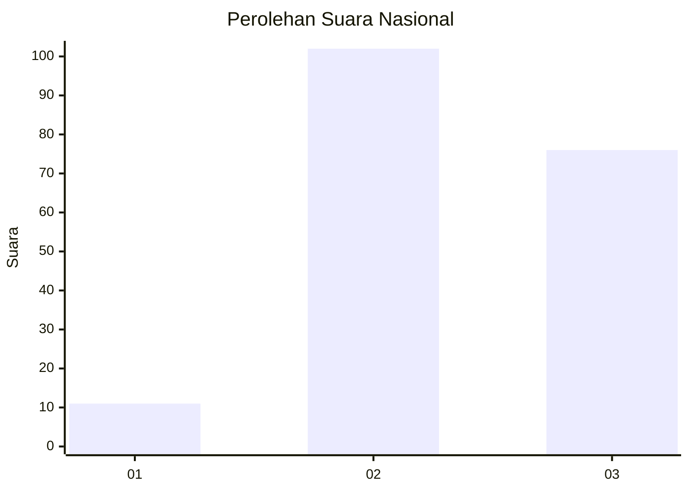
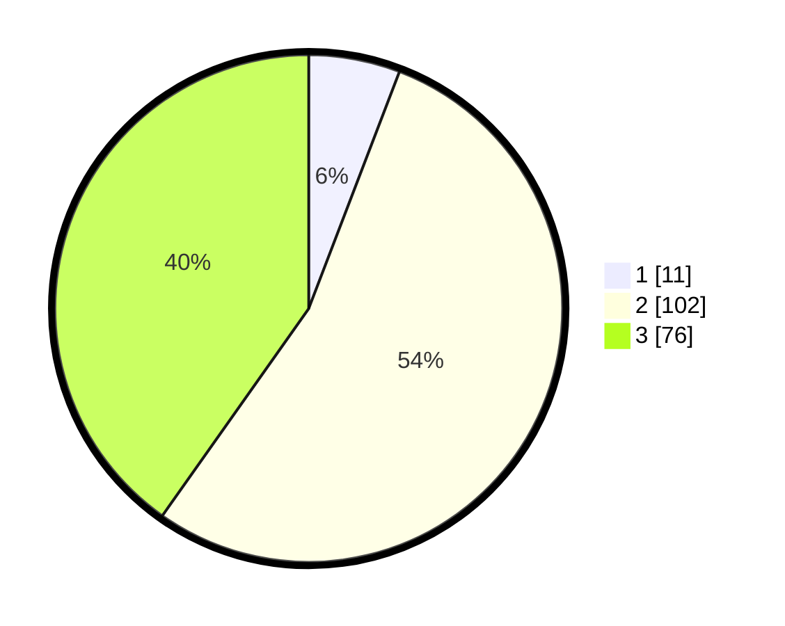

# Hasil

## Grafik

## Tabel

| No.    | Nama Paslon    | Suara | Suara (raw) | Persentase |
|:------ |:-------------- | -----:| -----------:| ----------:|
| 100025 | ANIES MUHAIMIN | 11    | [11][p-1]   | 5,82       |
| 100026 | PRABOWO GIBRAN | 102   | [102][p-2]  | 53,97      |
| 100027 | GANJAR MAHFUD  | 76    | [76][p-3]   | 40,21      |

[p-1]: https://github.com/gigit-pemilu/pemilu-2024/blob/main/pilpres/hitung-suara/sub/31-dki-jakarta/sub/72-jakarta-utara/sub/01-penjaringan/sub/1003-kapuk-muara/sub/044-tps/sub/paslon-1.txt
[p-2]: https://github.com/gigit-pemilu/pemilu-2024/blob/main/pilpres/hitung-suara/sub/31-dki-jakarta/sub/72-jakarta-utara/sub/01-penjaringan/sub/1003-kapuk-muara/sub/044-tps/sub/paslon-2.txt
[p-3]: https://github.com/gigit-pemilu/pemilu-2024/blob/main/pilpres/hitung-suara/sub/31-dki-jakarta/sub/72-jakarta-utara/sub/01-penjaringan/sub/1003-kapuk-muara/sub/044-tps/sub/paslon-3.txt

## Foto C Plano

https://sirekap-obj-formc.kpu.go.id/ccf1/pemilu/ppwp/31/72/01/10/03/3172011003044-20240218-115147--f092117d-a688-4eb6-baad-b24c401b3124.jpg

https://sirekap-obj-formc.kpu.go.id/ccf1/pemilu/ppwp/31/72/01/10/03/3172011003044-20240218-115212--72da41c8-b6f7-4625-887e-78c2c772accf.jpg

https://sirekap-obj-formc.kpu.go.id/ccf1/pemilu/ppwp/31/72/01/10/03/3172011003044-20240218-115233--fd05c32f-efae-41ec-a179-077e3d0ecb08.jpg

## Metadata

| Key        | Value               |
| ---------- | ------------------- |
| Time Stamp | 2024-02-21 17:00:00 |

