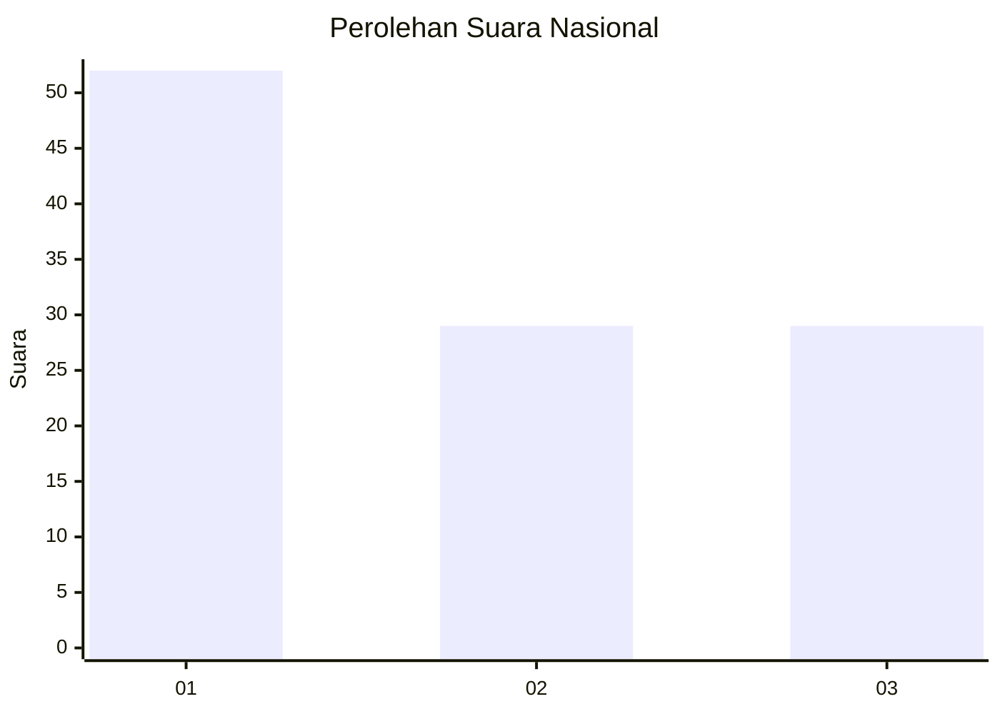
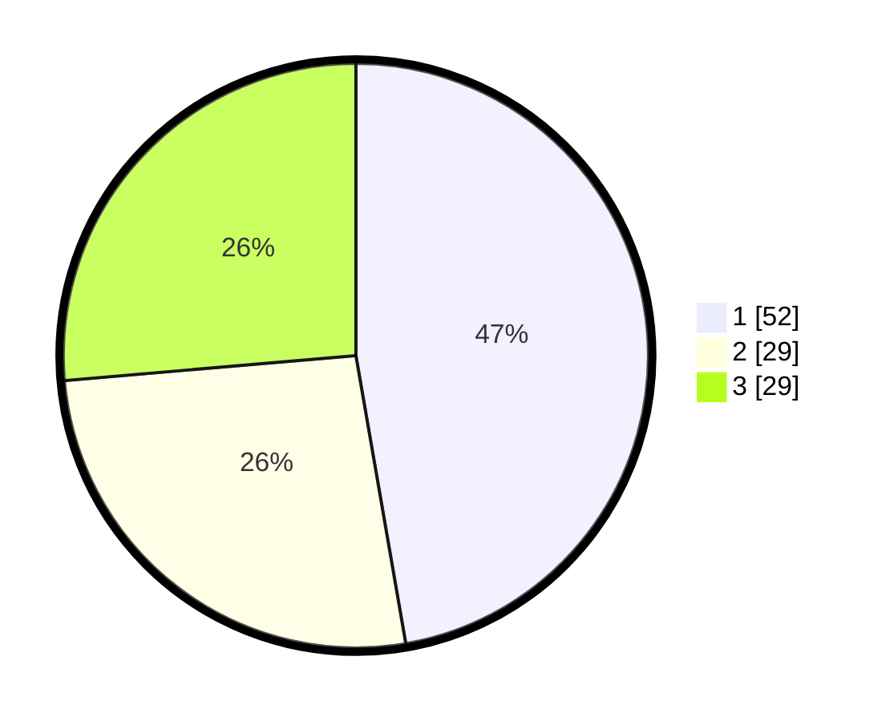

# Hasil

## Grafik

## Tabel

| No. | Nama Paslon    | Suara | Suara (raw) | Persentase |
|:--- |:-------------- | -----:| -----------:| ----------:|
| 1   | ANIES MUHAIMIN | 52    | [52][p-1]   | 47,27      |
| 2   | PRABOWO GIBRAN | 29    | [29][p-2]   | 26,36      |
| 3   | GANJAR MAHFUD  | 29    | [29][p-3]   | 26,36      |

[p-1]: https://github.com/gigit-pemilu/pemilu-2024/blob/main/pilpres/hitung-suara/sub/31-dki-jakarta/sub/72-jakarta-utara/sub/01-penjaringan/sub/1003-kapuk-muara/sub/055-tps/sub/paslon-1.txt
[p-2]: https://github.com/gigit-pemilu/pemilu-2024/blob/main/pilpres/hitung-suara/sub/31-dki-jakarta/sub/72-jakarta-utara/sub/01-penjaringan/sub/1003-kapuk-muara/sub/055-tps/sub/paslon-2.txt
[p-3]: https://github.com/gigit-pemilu/pemilu-2024/blob/main/pilpres/hitung-suara/sub/31-dki-jakarta/sub/72-jakarta-utara/sub/01-penjaringan/sub/1003-kapuk-muara/sub/055-tps/sub/paslon-3.txt

## Foto C Plano

https://sirekap-obj-formc.kpu.go.id/f602/pemilu/ppwp/31/72/01/10/03/3172011003055-20240217-130309--412acf93-417c-4569-85e4-f522eaa0d366.jpg

https://sirekap-obj-formc.kpu.go.id/f602/pemilu/ppwp/31/72/01/10/03/3172011003055-20240217-130354--aee2b92e-ada7-4eeb-b8bb-f34411fd27cd.jpg

https://sirekap-obj-formc.kpu.go.id/f602/pemilu/ppwp/31/72/01/10/03/3172011003055-20240217-130627--0eada78c-6cb1-49f6-97ac-dd3eb05f67bd.jpg

## Metadata

| Key        | Value               |
| ---------- | ------------------- |
| Time Stamp | 2024-02-21 17:00:00 |

