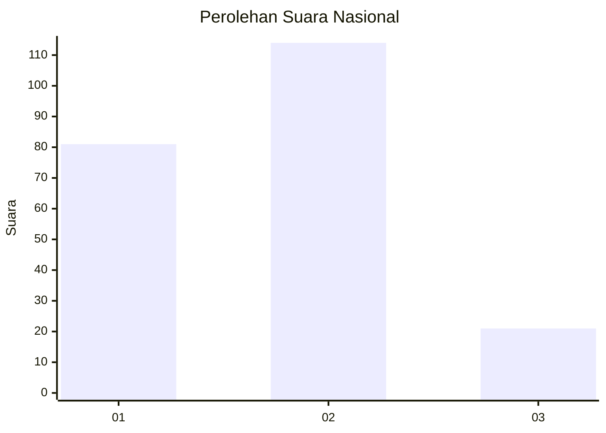
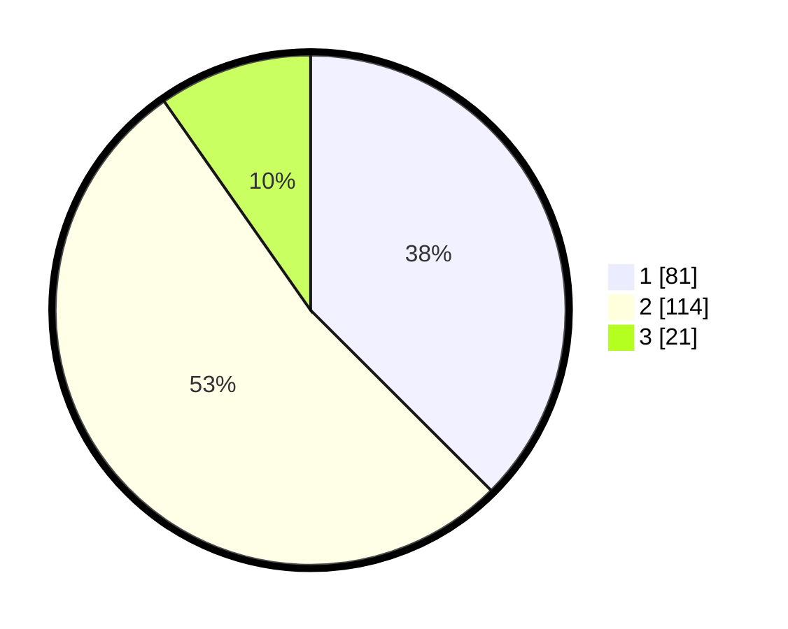

# Hasil

## Grafik

## Tabel

| No.    | Nama Paslon    | Suara | Suara (raw) | Persentase |
|:------ |:-------------- | -----:| -----------:| ----------:|
| 100025 | ANIES MUHAIMIN | 81    | [81][p-1]   | 37,50      |
| 100026 | PRABOWO GIBRAN | 114   | [114][p-2]  | 52,78      |
| 100027 | GANJAR MAHFUD  | 21    | [21][p-3]   | 9,72       |

[p-1]: https://github.com/gigit-pemilu/pemilu-2024/blob/main/pilpres/hitung-suara/sub/31-dki-jakarta/sub/72-jakarta-utara/sub/01-penjaringan/sub/1003-kapuk-muara/sub/064-tps/sub/paslon-1.txt
[p-2]: https://github.com/gigit-pemilu/pemilu-2024/blob/main/pilpres/hitung-suara/sub/31-dki-jakarta/sub/72-jakarta-utara/sub/01-penjaringan/sub/1003-kapuk-muara/sub/064-tps/sub/paslon-2.txt
[p-3]: https://github.com/gigit-pemilu/pemilu-2024/blob/main/pilpres/hitung-suara/sub/31-dki-jakarta/sub/72-jakarta-utara/sub/01-penjaringan/sub/1003-kapuk-muara/sub/064-tps/sub/paslon-3.txt

## Foto C Plano

https://sirekap-obj-formc.kpu.go.id/6c8e/pemilu/ppwp/31/72/01/10/03/3172011003064-20240224-144216--33b1d48a-ec70-4cb3-b68d-ec99f427dff4.jpg

https://sirekap-obj-formc.kpu.go.id/6c8e/pemilu/ppwp/31/72/01/10/03/3172011003064-20240224-144313--eb51995b-ad40-4118-b700-37d6606bc0de.jpg

https://sirekap-obj-formc.kpu.go.id/6c8e/pemilu/ppwp/31/72/01/10/03/3172011003064-20240224-144352--1f1cbec2-bb38-4c49-ba6d-ef2ef73a2705.jpg

## Metadata

| Key        | Value               |
| ---------- | ------------------- |
| Time Stamp | 2024-02-25 03:00:00 |

