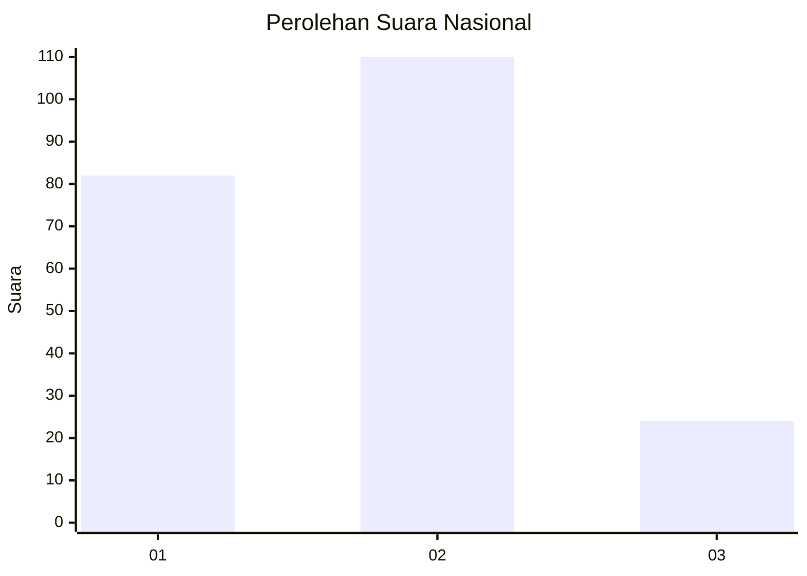
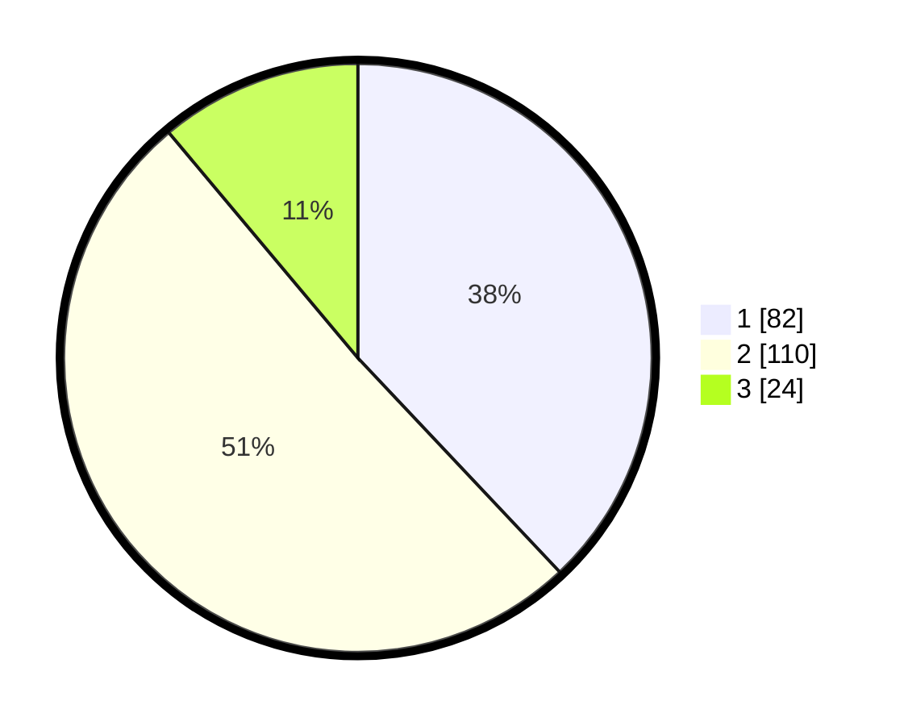

# Hasil

## Grafik

## Tabel

| No.    | Nama Paslon    | Suara | Suara (raw) | Persentase |
|:------ |:-------------- | -----:| -----------:| ----------:|
| 100025 | ANIES MUHAIMIN | 82    | [82][p-1]   | 37,96      |
| 100026 | PRABOWO GIBRAN | 110   | [110][p-2]  | 50,93      |
| 100027 | GANJAR MAHFUD  | 24    | [24][p-3]   | 11,11      |

[p-1]: https://github.com/gigit-pemilu/pemilu-2024/blob/main/pilpres/hitung-suara/sub/31-dki-jakarta/sub/72-jakarta-utara/sub/01-penjaringan/sub/1003-kapuk-muara/sub/065-tps/sub/paslon-1.txt
[p-2]: https://github.com/gigit-pemilu/pemilu-2024/blob/main/pilpres/hitung-suara/sub/31-dki-jakarta/sub/72-jakarta-utara/sub/01-penjaringan/sub/1003-kapuk-muara/sub/065-tps/sub/paslon-2.txt
[p-3]: https://github.com/gigit-pemilu/pemilu-2024/blob/main/pilpres/hitung-suara/sub/31-dki-jakarta/sub/72-jakarta-utara/sub/01-penjaringan/sub/1003-kapuk-muara/sub/065-tps/sub/paslon-3.txt

## Foto C Plano

https://sirekap-obj-formc.kpu.go.id/14e7/pemilu/ppwp/31/72/01/10/03/3172011003065-20240224-162111--1ca53454-f63e-4249-9505-c85b6eddeb81.jpg

https://sirekap-obj-formc.kpu.go.id/14e7/pemilu/ppwp/31/72/01/10/03/3172011003065-20240224-162131--5d2536ee-d75d-42f6-bd2e-5c4c68bfeafa.jpg

https://sirekap-obj-formc.kpu.go.id/14e7/pemilu/ppwp/31/72/01/10/03/3172011003065-20240224-162149--b16bc7a9-7278-454e-8b2e-da1f124b9700.jpg

## Metadata

| Key        | Value               |
| ---------- | ------------------- |
| Time Stamp | 2024-02-25 03:00:00 |

