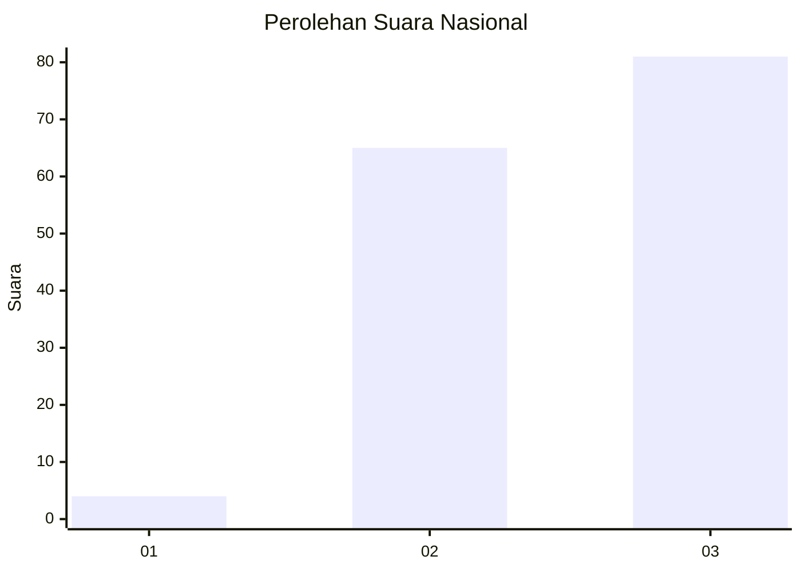
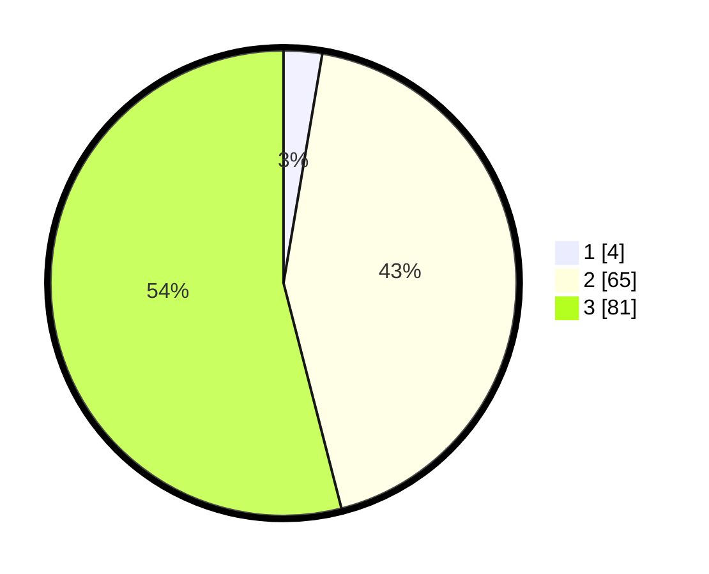

# Hasil

## Grafik

## Tabel

| No.    | Nama Paslon    | Suara | Suara (raw) | Persentase |
|:------ |:-------------- | -----:| -----------:| ----------:|
| 100025 | ANIES MUHAIMIN | 4     | [4][p-1]    | 2,67       |
| 100026 | PRABOWO GIBRAN | 65    | [65][p-2]   | 43,33      |
| 100027 | GANJAR MAHFUD  | 81    | [81][p-3]   | 54,00      |

[p-1]: https://github.com/gigit-pemilu/pemilu-2024/blob/main/pilpres/hitung-suara/sub/31-dki-jakarta/sub/72-jakarta-utara/sub/01-penjaringan/sub/1003-kapuk-muara/sub/067-tps/sub/paslon-1.txt
[p-2]: https://github.com/gigit-pemilu/pemilu-2024/blob/main/pilpres/hitung-suara/sub/31-dki-jakarta/sub/72-jakarta-utara/sub/01-penjaringan/sub/1003-kapuk-muara/sub/067-tps/sub/paslon-2.txt
[p-3]: https://github.com/gigit-pemilu/pemilu-2024/blob/main/pilpres/hitung-suara/sub/31-dki-jakarta/sub/72-jakarta-utara/sub/01-penjaringan/sub/1003-kapuk-muara/sub/067-tps/sub/paslon-3.txt

## Foto C Plano

https://sirekap-obj-formc.kpu.go.id/d142/pemilu/ppwp/31/72/01/10/03/3172011003067-20240224-204120--c9640112-8aa9-4b30-bbb3-7737c0e3fa32.jpg

https://sirekap-obj-formc.kpu.go.id/d142/pemilu/ppwp/31/72/01/10/03/3172011003067-20240224-204235--3e3e9c89-0b4d-44c7-8a84-6cc2b3cbb95e.jpg

https://sirekap-obj-formc.kpu.go.id/d142/pemilu/ppwp/31/72/01/10/03/3172011003067-20240224-204253--189b402d-c15e-45d8-a109-acddf7b03a2c.jpg

## Metadata

| Key        | Value               |
| ---------- | ------------------- |
| Time Stamp | 2024-02-25 03:00:00 |

