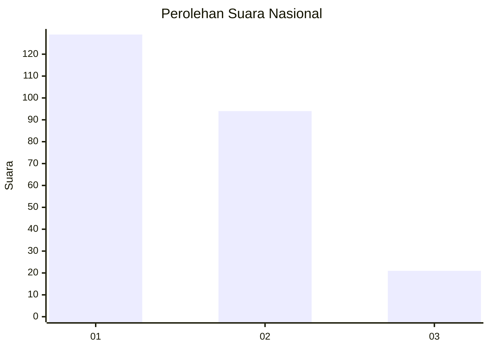
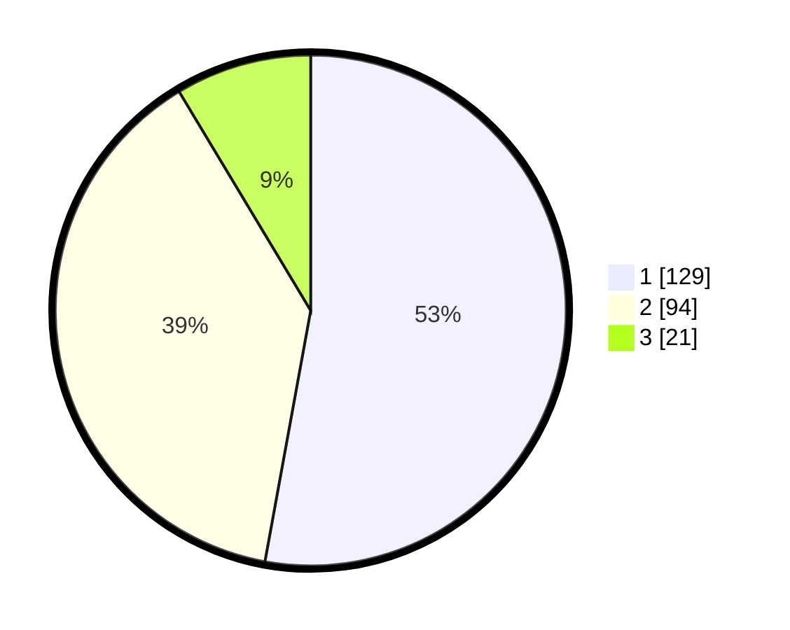

# Hasil

## Grafik

## Tabel

| No.    | Nama Paslon    | Suara | Suara (raw) | Persentase |
|:------ |:-------------- | -----:| -----------:| ----------:|
| 100025 | ANIES MUHAIMIN | 129   | [129][p-1]  | 52,87      |
| 100026 | PRABOWO GIBRAN | 94    | [94][p-2]   | 38,52      |
| 100027 | GANJAR MAHFUD  | 21    | [21][p-3]   | 8,61       |

[p-1]: https://github.com/gigit-pemilu/pemilu-2024/blob/main/pilpres/hitung-suara/sub/31-dki-jakarta/sub/72-jakarta-utara/sub/01-penjaringan/sub/1003-kapuk-muara/sub/069-tps/sub/paslon-1.txt
[p-2]: https://github.com/gigit-pemilu/pemilu-2024/blob/main/pilpres/hitung-suara/sub/31-dki-jakarta/sub/72-jakarta-utara/sub/01-penjaringan/sub/1003-kapuk-muara/sub/069-tps/sub/paslon-2.txt
[p-3]: https://github.com/gigit-pemilu/pemilu-2024/blob/main/pilpres/hitung-suara/sub/31-dki-jakarta/sub/72-jakarta-utara/sub/01-penjaringan/sub/1003-kapuk-muara/sub/069-tps/sub/paslon-3.txt

## Foto C Plano

https://sirekap-obj-formc.kpu.go.id/2143/pemilu/ppwp/31/72/01/10/03/3172011003069-20240225-165942--c6cb1389-8ccb-4fc2-8a26-97078fe87254.jpg

https://sirekap-obj-formc.kpu.go.id/2143/pemilu/ppwp/31/72/01/10/03/3172011003069-20240225-170018--47309f68-9668-474c-8960-0ee9f11ef450.jpg

https://sirekap-obj-formc.kpu.go.id/2143/pemilu/ppwp/31/72/01/10/03/3172011003069-20240225-170033--01cc3bc9-049f-4bee-a88e-51ae55d36b80.jpg

## Metadata

| Key        | Value               |
| ---------- | ------------------- |
| Time Stamp | 2024-02-26 09:00:00 |

