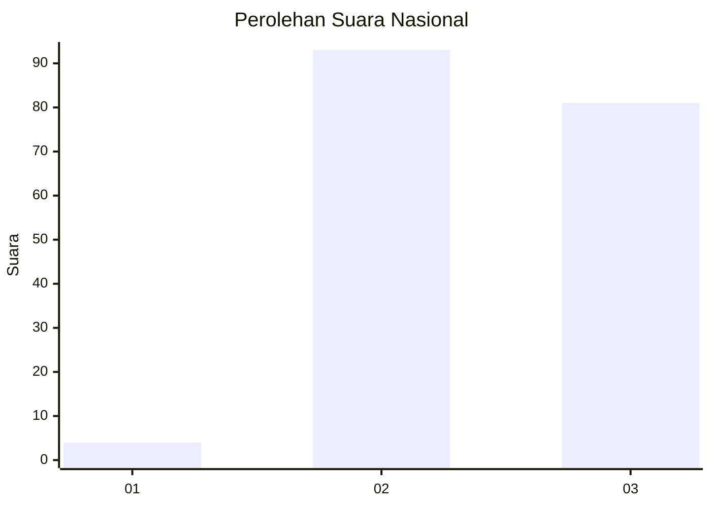
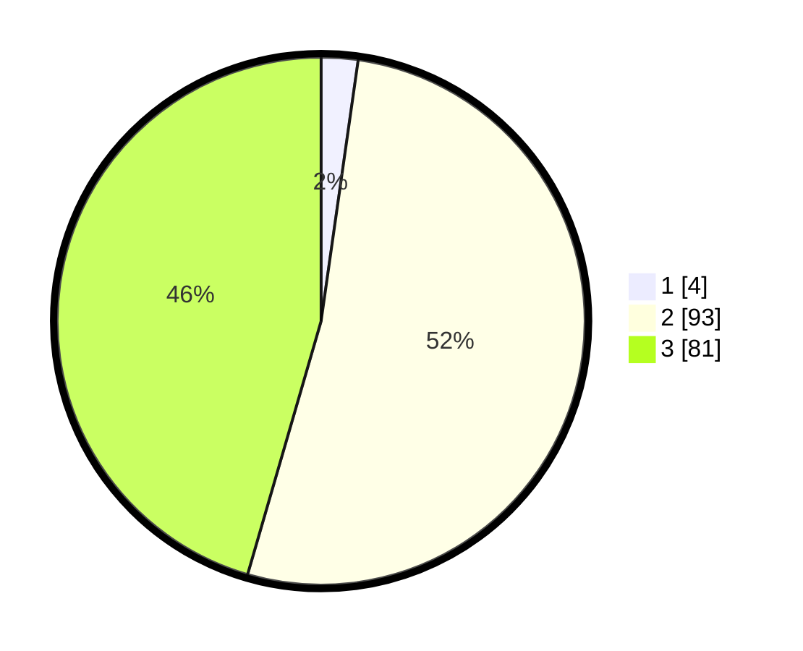

# Hasil

## Grafik

## Tabel

| No.    | Nama Paslon    | Suara | Suara (raw) | Persentase |
|:------ |:-------------- | -----:| -----------:| ----------:|
| 100025 | ANIES MUHAIMIN | 4     | [4][p-1]    | 2,25       |
| 100026 | PRABOWO GIBRAN | 93    | [93][p-2]   | 52,25      |
| 100027 | GANJAR MAHFUD  | 81    | [81][p-3]   | 45,51      |

[p-1]: https://github.com/gigit-pemilu/pemilu-2024/blob/main/pilpres/hitung-suara/sub/31-dki-jakarta/sub/72-jakarta-utara/sub/01-penjaringan/sub/1003-kapuk-muara/sub/070-tps/sub/paslon-1.txt
[p-2]: https://github.com/gigit-pemilu/pemilu-2024/blob/main/pilpres/hitung-suara/sub/31-dki-jakarta/sub/72-jakarta-utara/sub/01-penjaringan/sub/1003-kapuk-muara/sub/070-tps/sub/paslon-2.txt
[p-3]: https://github.com/gigit-pemilu/pemilu-2024/blob/main/pilpres/hitung-suara/sub/31-dki-jakarta/sub/72-jakarta-utara/sub/01-penjaringan/sub/1003-kapuk-muara/sub/070-tps/sub/paslon-3.txt

## Foto C Plano

https://sirekap-obj-formc.kpu.go.id/f9a3/pemilu/ppwp/31/72/01/10/03/3172011003070-20240225-202849--e8786fc0-3ec8-486d-a50b-0cdcc38da721.jpg

https://sirekap-obj-formc.kpu.go.id/f9a3/pemilu/ppwp/31/72/01/10/03/3172011003070-20240225-203242--10ae5410-7e63-4762-88c9-414ec03c75bb.jpg

https://sirekap-obj-formc.kpu.go.id/f9a3/pemilu/ppwp/31/72/01/10/03/3172011003070-20240225-203353--4ecce44b-c377-473a-86db-bc78ed7e4606.jpg

## Metadata

| Key        | Value               |
| ---------- | ------------------- |
| Time Stamp | 2024-02-26 09:00:00 |

