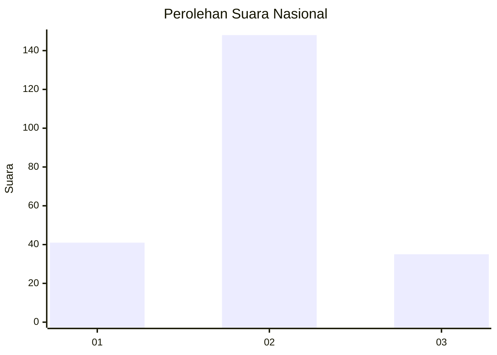
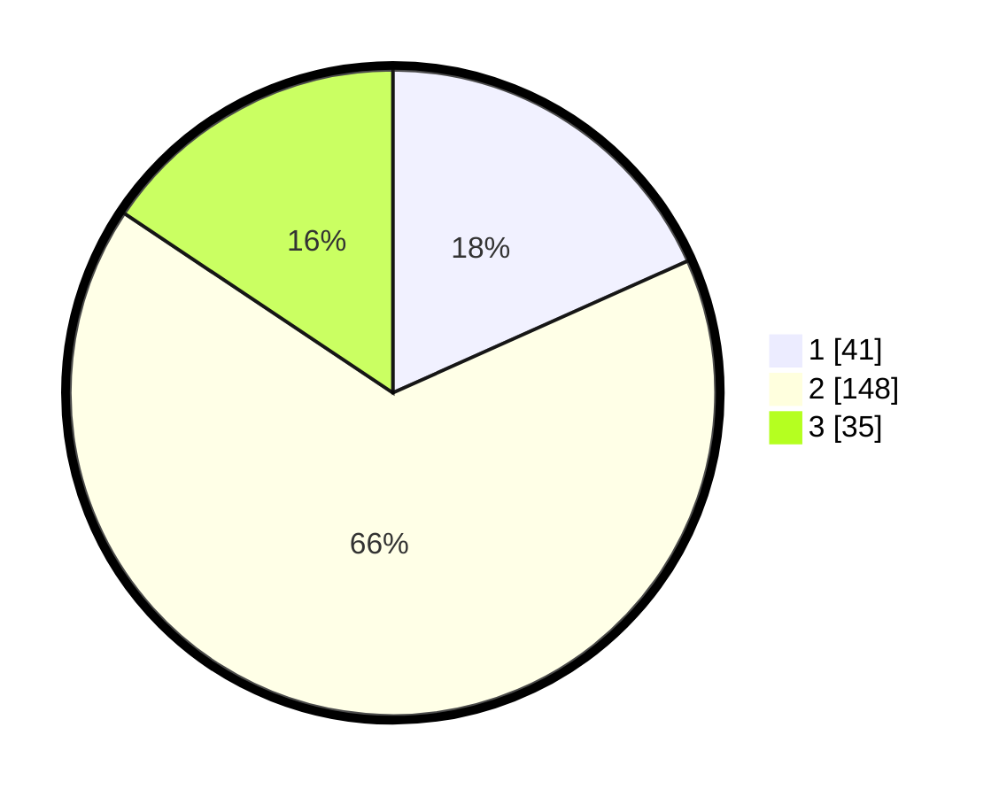

# Hasil

## Grafik

## Tabel

| No.    | Nama Paslon    | Suara | Suara (raw) | Persentase |
|:------ |:-------------- | -----:| -----------:| ----------:|
| 100025 | ANIES MUHAIMIN | 41    | [41][p-1]   | 18,30      |
| 100026 | PRABOWO GIBRAN | 148   | [148][p-2]  | 66,07      |
| 100027 | GANJAR MAHFUD  | 35    | [35][p-3]   | 15,63      |

[p-1]: https://github.com/gigit-pemilu/pemilu-2024/blob/main/pilpres/hitung-suara/sub/31-dki-jakarta/sub/72-jakarta-utara/sub/01-penjaringan/sub/1003-kapuk-muara/sub/107-tps/sub/paslon-1.txt
[p-2]: https://github.com/gigit-pemilu/pemilu-2024/blob/main/pilpres/hitung-suara/sub/31-dki-jakarta/sub/72-jakarta-utara/sub/01-penjaringan/sub/1003-kapuk-muara/sub/107-tps/sub/paslon-2.txt
[p-3]: https://github.com/gigit-pemilu/pemilu-2024/blob/main/pilpres/hitung-suara/sub/31-dki-jakarta/sub/72-jakarta-utara/sub/01-penjaringan/sub/1003-kapuk-muara/sub/107-tps/sub/paslon-3.txt

## Foto C Plano

https://sirekap-obj-formc.kpu.go.id/dddb/pemilu/ppwp/31/72/01/10/03/3172011003107-20240214-205758--8f07ea4c-c6ad-4fc9-8c72-80940f42812c.jpg

https://sirekap-obj-formc.kpu.go.id/dddb/pemilu/ppwp/31/72/01/10/03/3172011003107-20240214-230930--bd585510-6b93-4907-bd13-5721b5f95816.jpg

https://sirekap-obj-formc.kpu.go.id/dddb/pemilu/ppwp/31/72/01/10/03/3172011003107-20240214-231159--ab1a9be3-580d-49af-b6f7-a778871e01c5.jpg

## Metadata

| Key        | Value               |
| ---------- | ------------------- |
| Time Stamp | 2024-02-21 14:00:00 |

