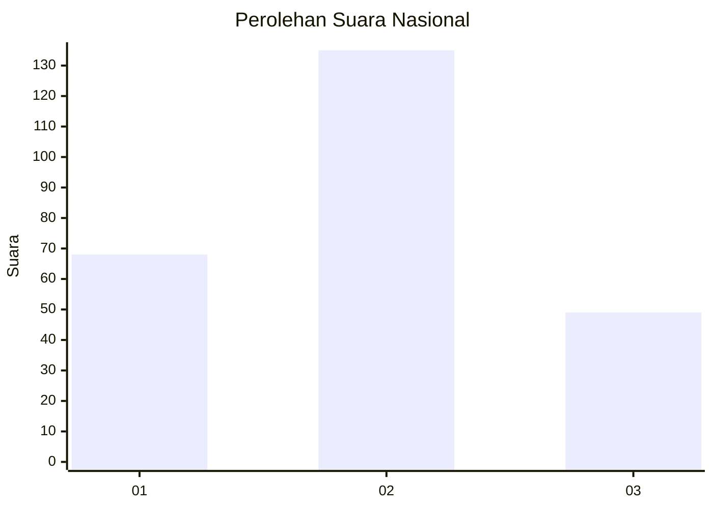
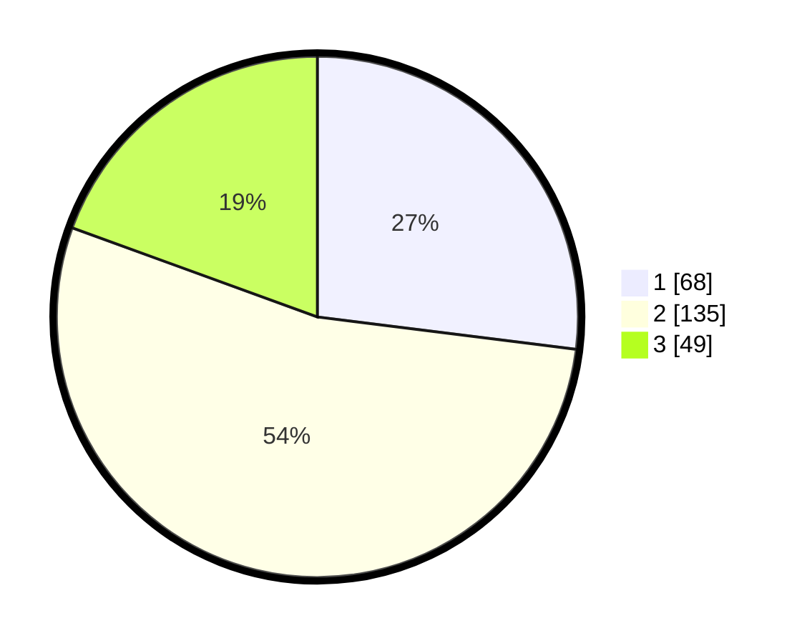

# Hasil

## Grafik

## Tabel

| No.    | Nama Paslon    | Suara | Suara (raw) | Persentase |
|:------ |:-------------- | -----:| -----------:| ----------:|
| 100025 | ANIES MUHAIMIN | 68    | [68][p-1]   | 26,98      |
| 100026 | PRABOWO GIBRAN | 135   | [135][p-2]  | 53,57      |
| 100027 | GANJAR MAHFUD  | 49    | [49][p-3]   | 19,44      |

[p-1]: https://github.com/gigit-pemilu/pemilu-2024/blob/main/pilpres/hitung-suara/sub/31-dki-jakarta/sub/72-jakarta-utara/sub/01-penjaringan/sub/1003-kapuk-muara/sub/112-tps/sub/paslon-1.txt
[p-2]: https://github.com/gigit-pemilu/pemilu-2024/blob/main/pilpres/hitung-suara/sub/31-dki-jakarta/sub/72-jakarta-utara/sub/01-penjaringan/sub/1003-kapuk-muara/sub/112-tps/sub/paslon-2.txt
[p-3]: https://github.com/gigit-pemilu/pemilu-2024/blob/main/pilpres/hitung-suara/sub/31-dki-jakarta/sub/72-jakarta-utara/sub/01-penjaringan/sub/1003-kapuk-muara/sub/112-tps/sub/paslon-3.txt

## Foto C Plano

https://sirekap-obj-formc.kpu.go.id/7844/pemilu/ppwp/31/72/01/10/03/3172011003112-20240214-232917--54b751d9-ce4a-4c3a-8544-caff78ba30b0.jpg

https://sirekap-obj-formc.kpu.go.id/7844/pemilu/ppwp/31/72/01/10/03/3172011003112-20240214-233144--02a2b17e-fd49-49c2-8ca8-a71e38bc1512.jpg

https://sirekap-obj-formc.kpu.go.id/7844/pemilu/ppwp/31/72/01/10/03/3172011003112-20240214-232636--513b5b92-8c49-44ae-805b-13514243f82f.jpg

## Metadata

| Key        | Value               |
| ---------- | ------------------- |
| Time Stamp | 2024-02-21 17:00:00 |

