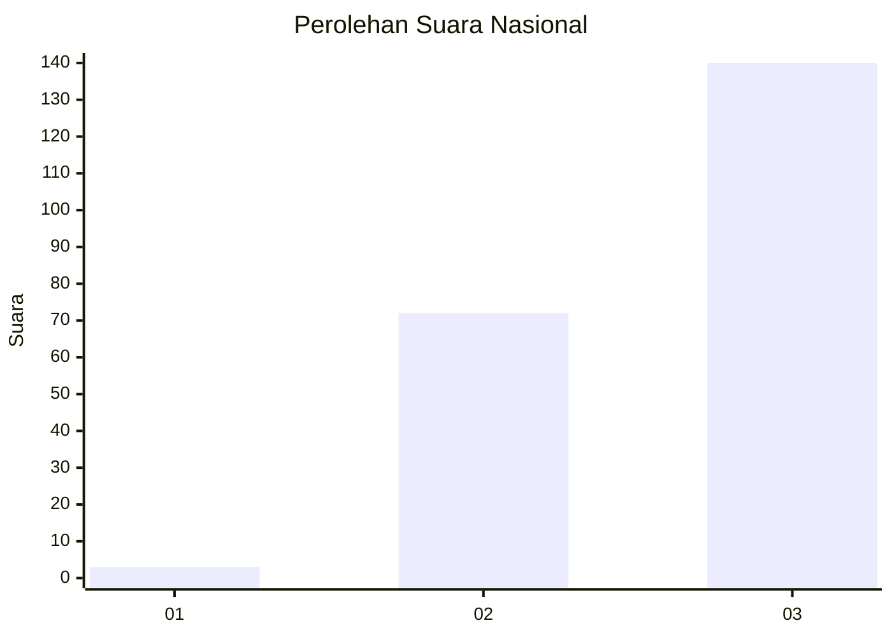
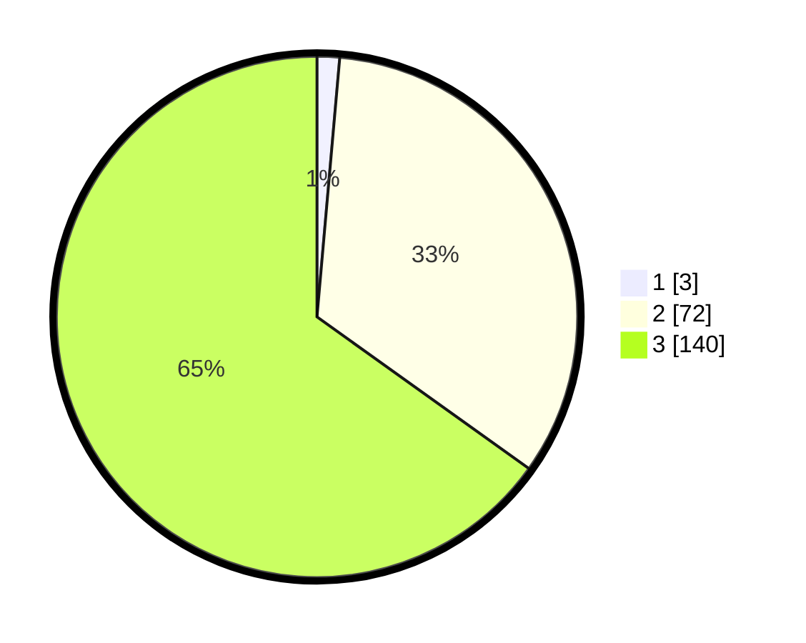

# Hasil

## Grafik

## Tabel

| No.    | Nama Paslon    | Suara | Suara (raw) | Persentase |
|:------ |:-------------- | -----:| -----------:| ----------:|
| 100025 | ANIES MUHAIMIN | 3     | [3][p-1]    | 1,40       |
| 100026 | PRABOWO GIBRAN | 72    | [72][p-2]   | 33,49      |
| 100027 | GANJAR MAHFUD  | 140   | [140][p-3]  | 65,12      |

[p-1]: https://github.com/gigit-pemilu/pemilu-2024/blob/main/pilpres/hitung-suara/sub/31-dki-jakarta/sub/72-jakarta-utara/sub/01-penjaringan/sub/1004-pejagalan/sub/021-tps/sub/paslon-1.txt
[p-2]: https://github.com/gigit-pemilu/pemilu-2024/blob/main/pilpres/hitung-suara/sub/31-dki-jakarta/sub/72-jakarta-utara/sub/01-penjaringan/sub/1004-pejagalan/sub/021-tps/sub/paslon-2.txt
[p-3]: https://github.com/gigit-pemilu/pemilu-2024/blob/main/pilpres/hitung-suara/sub/31-dki-jakarta/sub/72-jakarta-utara/sub/01-penjaringan/sub/1004-pejagalan/sub/021-tps/sub/paslon-3.txt

## Foto C Plano

https://sirekap-obj-formc.kpu.go.id/7cd7/pemilu/ppwp/31/72/01/10/04/3172011004021-20240223-150448--163d21b1-d592-44b0-90db-f7bdeacd0e50.jpg

https://sirekap-obj-formc.kpu.go.id/7cd7/pemilu/ppwp/31/72/01/10/04/3172011004021-20240223-150419--17be5757-2a38-4b39-aea3-aefc57fcc10f.jpg

https://sirekap-obj-formc.kpu.go.id/7cd7/pemilu/ppwp/31/72/01/10/04/3172011004021-20240223-150339--3d673f7e-3f23-4b37-89ba-ccd728147db8.jpg

## Metadata

| Key        | Value               |
| ---------- | ------------------- |
| Time Stamp | 2024-02-24 22:31:28 |

