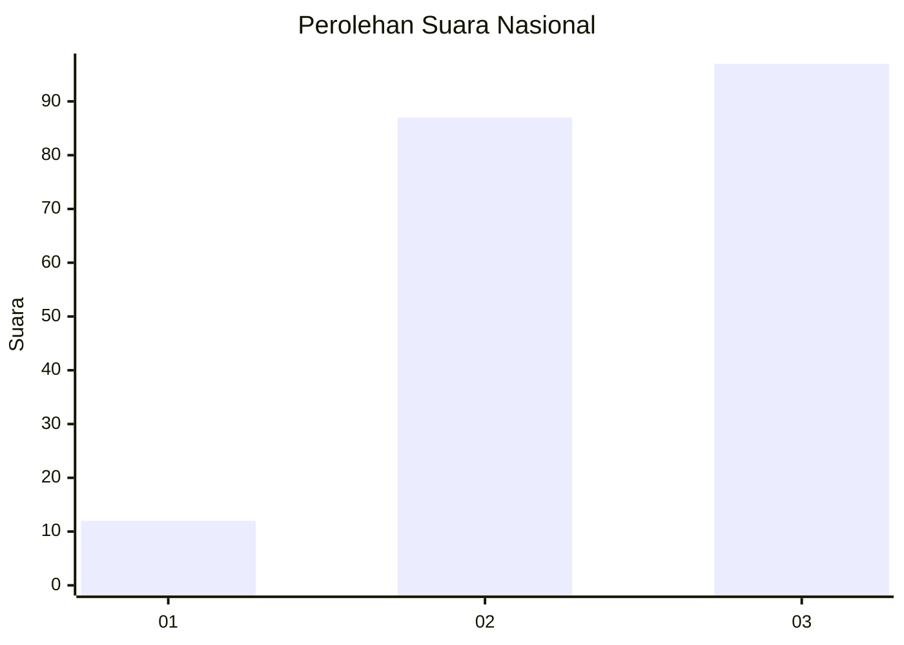
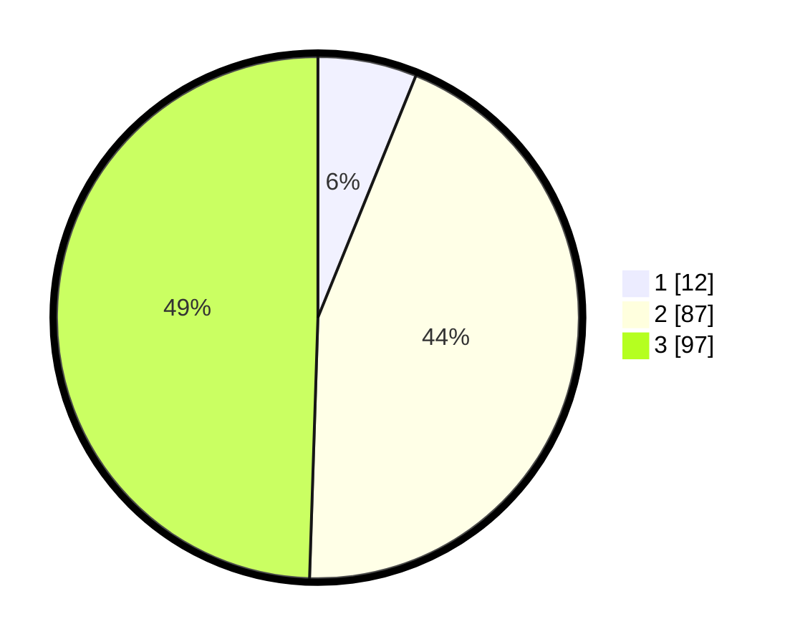

# Hasil

## Grafik

## Tabel

| No.    | Nama Paslon    | Suara | Suara (raw) | Persentase |
|:------ |:-------------- | -----:| -----------:| ----------:|
| 100025 | ANIES MUHAIMIN | 12    | [12][p-1]   | 6,12       |
| 100026 | PRABOWO GIBRAN | 87    | [87][p-2]   | 44,39      |
| 100027 | GANJAR MAHFUD  | 97    | [97][p-3]   | 49,49      |

[p-1]: https://github.com/gigit-pemilu/pemilu-2024/blob/main/pilpres/hitung-suara/sub/31-dki-jakarta/sub/72-jakarta-utara/sub/01-penjaringan/sub/1004-pejagalan/sub/022-tps/sub/paslon-1.txt
[p-2]: https://github.com/gigit-pemilu/pemilu-2024/blob/main/pilpres/hitung-suara/sub/31-dki-jakarta/sub/72-jakarta-utara/sub/01-penjaringan/sub/1004-pejagalan/sub/022-tps/sub/paslon-2.txt
[p-3]: https://github.com/gigit-pemilu/pemilu-2024/blob/main/pilpres/hitung-suara/sub/31-dki-jakarta/sub/72-jakarta-utara/sub/01-penjaringan/sub/1004-pejagalan/sub/022-tps/sub/paslon-3.txt

## Foto C Plano

https://sirekap-obj-formc.kpu.go.id/7fd7/pemilu/ppwp/31/72/01/10/04/3172011004022-20240223-172519--a1513459-a83a-42b9-acff-4539b0a262ee.jpg

https://sirekap-obj-formc.kpu.go.id/7fd7/pemilu/ppwp/31/72/01/10/04/3172011004022-20240223-172548--90f0c4ca-5785-4a0e-9e3e-031454f9ef0e.jpg

https://sirekap-obj-formc.kpu.go.id/7fd7/pemilu/ppwp/31/72/01/10/04/3172011004022-20240223-172657--1dcbf2ee-9843-43e6-8bac-8927689b7ffe.jpg

## Metadata

| Key        | Value               |
| ---------- | ------------------- |
| Time Stamp | 2024-02-24 22:31:28 |

