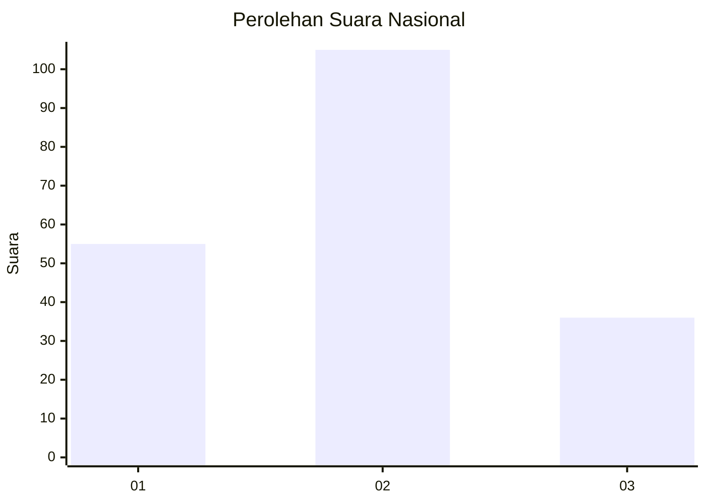
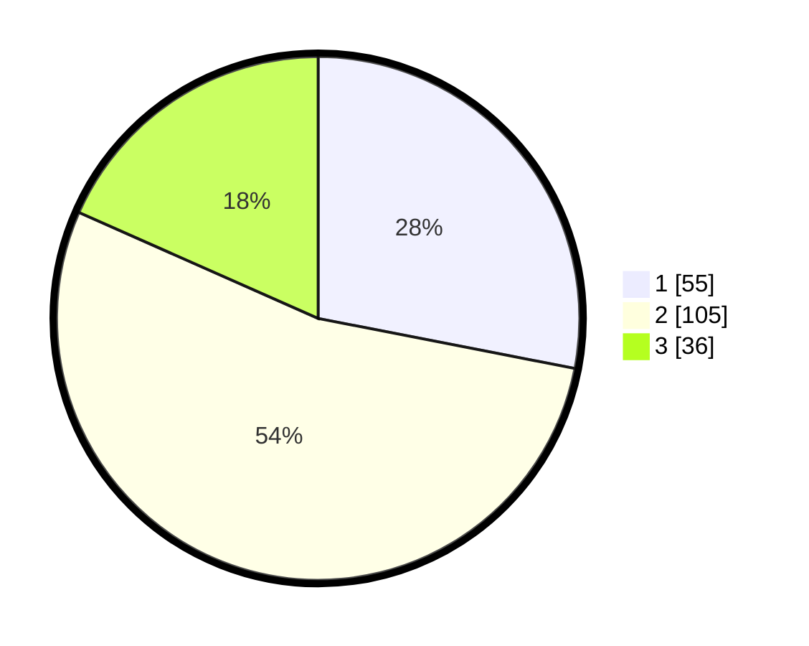

# Hasil

## Grafik

## Tabel

| No.    | Nama Paslon    | Suara | Suara (raw) | Persentase |
|:------ |:-------------- | -----:| -----------:| ----------:|
| 100025 | ANIES MUHAIMIN | 55    | [55][p-1]   | 28,06      |
| 100026 | PRABOWO GIBRAN | 105   | [105][p-2]  | 53,57      |
| 100027 | GANJAR MAHFUD  | 36    | [36][p-3]   | 18,37      |

[p-1]: https://github.com/gigit-pemilu/pemilu-2024/blob/main/pilpres/hitung-suara/sub/31-dki-jakarta/sub/72-jakarta-utara/sub/01-penjaringan/sub/1004-pejagalan/sub/024-tps/sub/paslon-1.txt
[p-2]: https://github.com/gigit-pemilu/pemilu-2024/blob/main/pilpres/hitung-suara/sub/31-dki-jakarta/sub/72-jakarta-utara/sub/01-penjaringan/sub/1004-pejagalan/sub/024-tps/sub/paslon-2.txt
[p-3]: https://github.com/gigit-pemilu/pemilu-2024/blob/main/pilpres/hitung-suara/sub/31-dki-jakarta/sub/72-jakarta-utara/sub/01-penjaringan/sub/1004-pejagalan/sub/024-tps/sub/paslon-3.txt

## Foto C Plano

https://sirekap-obj-formc.kpu.go.id/daf7/pemilu/ppwp/31/72/01/10/04/3172011004024-20240223-220341--33ff2b57-d52f-4cc4-a107-146ce4ca4bf9.jpg

https://sirekap-obj-formc.kpu.go.id/daf7/pemilu/ppwp/31/72/01/10/04/3172011004024-20240223-220430--8ce65332-fa88-439b-913a-66d134226bae.jpg

https://sirekap-obj-formc.kpu.go.id/daf7/pemilu/ppwp/31/72/01/10/04/3172011004024-20240223-220651--4768618c-213d-4d3e-874b-f994b74415ea.jpg

## Metadata

| Key        | Value               |
| ---------- | ------------------- |
| Time Stamp | 2024-02-24 22:31:28 |

