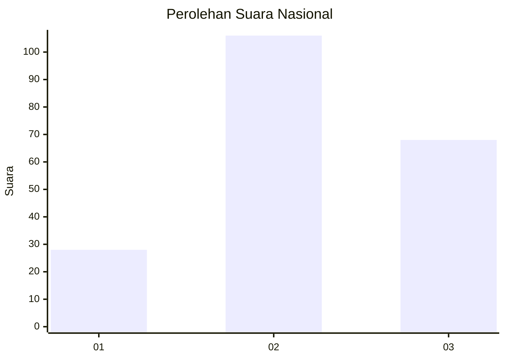
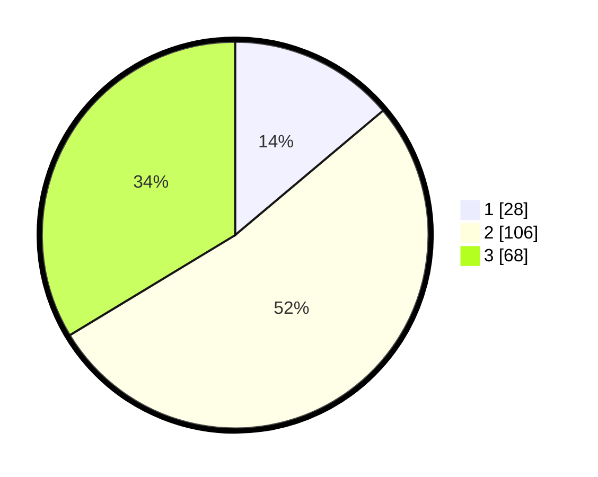

# Hasil

## Grafik

## Tabel

| No.    | Nama Paslon    | Suara | Suara (raw) | Persentase |
|:------ |:-------------- | -----:| -----------:| ----------:|
| 100025 | ANIES MUHAIMIN | 28    | [28][p-1]   | 13,86      |
| 100026 | PRABOWO GIBRAN | 106   | [106][p-2]  | 52,48      |
| 100027 | GANJAR MAHFUD  | 68    | [68][p-3]   | 33,66      |

[p-1]: https://github.com/gigit-pemilu/pemilu-2024/blob/main/pilpres/hitung-suara/sub/31-dki-jakarta/sub/72-jakarta-utara/sub/01-penjaringan/sub/1004-pejagalan/sub/029-tps/sub/paslon-1.txt
[p-2]: https://github.com/gigit-pemilu/pemilu-2024/blob/main/pilpres/hitung-suara/sub/31-dki-jakarta/sub/72-jakarta-utara/sub/01-penjaringan/sub/1004-pejagalan/sub/029-tps/sub/paslon-2.txt
[p-3]: https://github.com/gigit-pemilu/pemilu-2024/blob/main/pilpres/hitung-suara/sub/31-dki-jakarta/sub/72-jakarta-utara/sub/01-penjaringan/sub/1004-pejagalan/sub/029-tps/sub/paslon-3.txt

## Foto C Plano

https://sirekap-obj-formc.kpu.go.id/35a5/pemilu/ppwp/31/72/01/10/04/3172011004029-20240224-165724--2d066738-93a9-401d-86b9-565b7ccab2b8.jpg

https://sirekap-obj-formc.kpu.go.id/35a5/pemilu/ppwp/31/72/01/10/04/3172011004029-20240224-165749--c9ddece8-a6a3-4b91-84c7-d46fee29d834.jpg

https://sirekap-obj-formc.kpu.go.id/35a5/pemilu/ppwp/31/72/01/10/04/3172011004029-20240224-165822--614d3f8a-a7e2-463f-9840-42cb0e4285ef.jpg

## Metadata

| Key        | Value               |
| ---------- | ------------------- |
| Time Stamp | 2024-02-25 03:00:00 |

