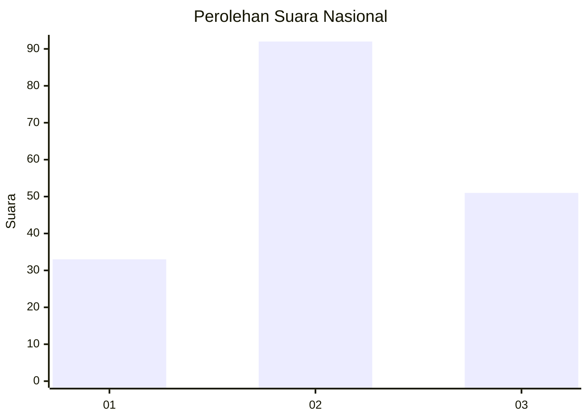
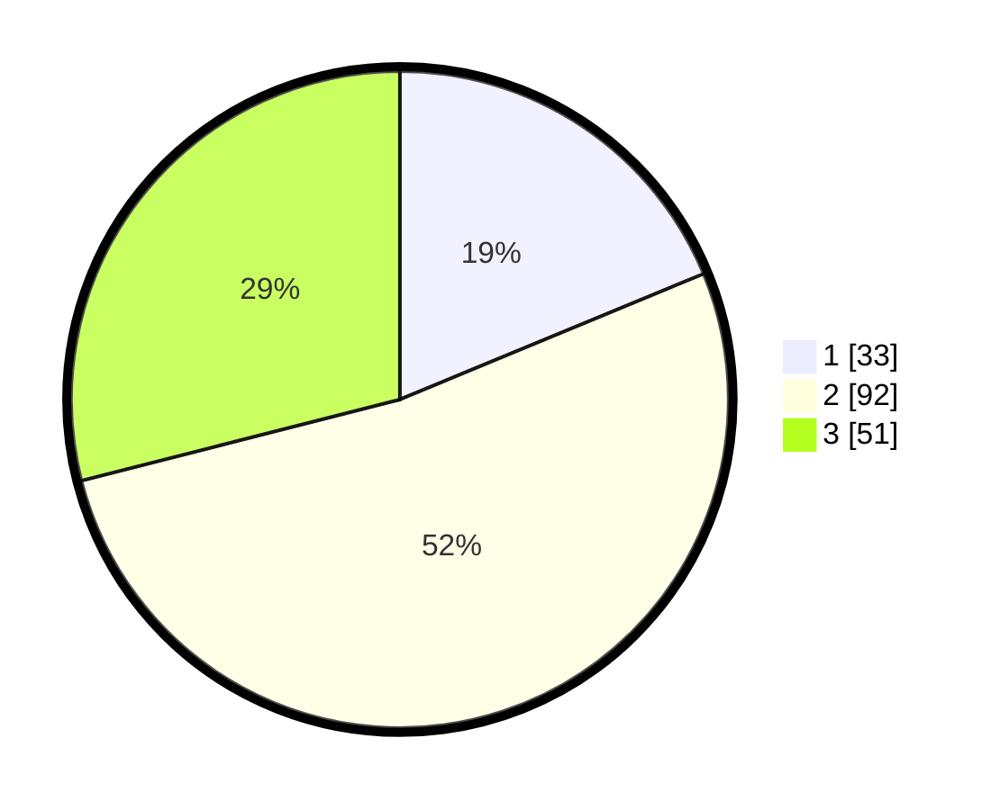

# Hasil

## Grafik

## Tabel

| No.    | Nama Paslon    | Suara | Suara (raw) | Persentase |
|:------ |:-------------- | -----:| -----------:| ----------:|
| 100025 | ANIES MUHAIMIN | 33    | [33][p-1]   | 18,75      |
| 100026 | PRABOWO GIBRAN | 92    | [92][p-2]   | 52,27      |
| 100027 | GANJAR MAHFUD  | 51    | [51][p-3]   | 28,98      |

[p-1]: https://github.com/gigit-pemilu/pemilu-2024/blob/main/pilpres/hitung-suara/sub/31-dki-jakarta/sub/72-jakarta-utara/sub/01-penjaringan/sub/1004-pejagalan/sub/030-tps/sub/paslon-1.txt
[p-2]: https://github.com/gigit-pemilu/pemilu-2024/blob/main/pilpres/hitung-suara/sub/31-dki-jakarta/sub/72-jakarta-utara/sub/01-penjaringan/sub/1004-pejagalan/sub/030-tps/sub/paslon-2.txt
[p-3]: https://github.com/gigit-pemilu/pemilu-2024/blob/main/pilpres/hitung-suara/sub/31-dki-jakarta/sub/72-jakarta-utara/sub/01-penjaringan/sub/1004-pejagalan/sub/030-tps/sub/paslon-3.txt

## Foto C Plano

https://sirekap-obj-formc.kpu.go.id/5c1c/pemilu/ppwp/31/72/01/10/04/3172011004030-20240224-203735--41cdf8df-607e-43e1-b2d8-22cb8d5884c9.jpg

https://sirekap-obj-formc.kpu.go.id/5c1c/pemilu/ppwp/31/72/01/10/04/3172011004030-20240224-203826--e6e91dd4-6b48-49c9-a3be-d1a1de585eb7.jpg

https://sirekap-obj-formc.kpu.go.id/5c1c/pemilu/ppwp/31/72/01/10/04/3172011004030-20240224-203858--8ef7d5d0-5c62-48b8-a113-8a52f1b4efca.jpg

## Metadata

| Key        | Value               |
| ---------- | ------------------- |
| Time Stamp | 2024-02-25 03:00:00 |

