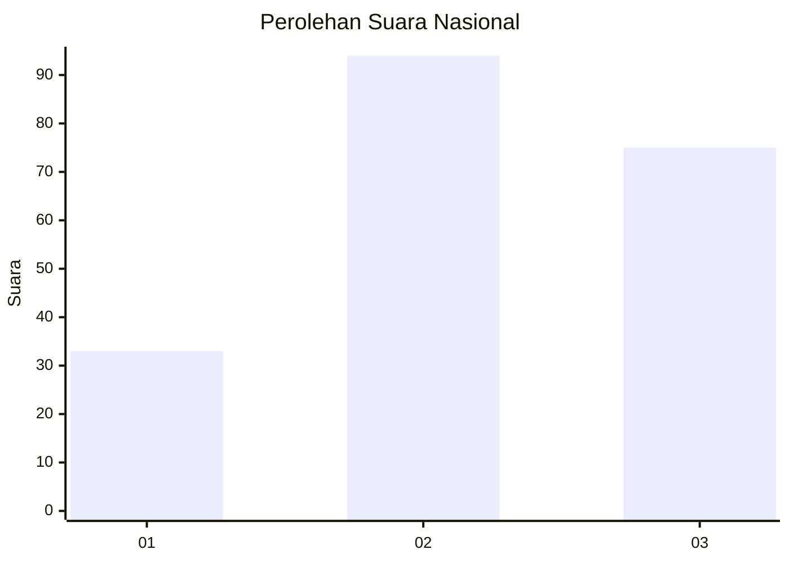
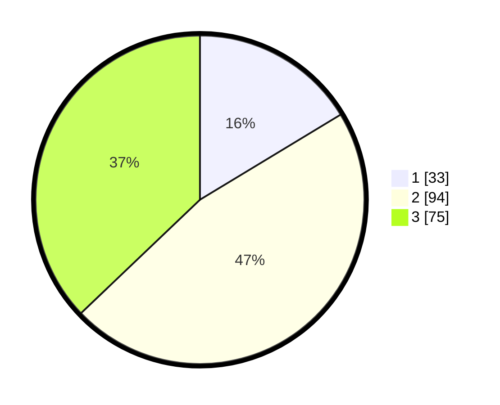

# Hasil

## Grafik

## Tabel

| No.    | Nama Paslon    | Suara | Suara (raw) | Persentase |
|:------ |:-------------- | -----:| -----------:| ----------:|
| 100025 | ANIES MUHAIMIN | 33    | [33][p-1]   | 16,34      |
| 100026 | PRABOWO GIBRAN | 94    | [94][p-2]   | 46,53      |
| 100027 | GANJAR MAHFUD  | 75    | [75][p-3]   | 37,13      |

[p-1]: https://github.com/gigit-pemilu/pemilu-2024/blob/main/pilpres/hitung-suara/sub/31-dki-jakarta/sub/72-jakarta-utara/sub/01-penjaringan/sub/1004-pejagalan/sub/032-tps/sub/paslon-1.txt
[p-2]: https://github.com/gigit-pemilu/pemilu-2024/blob/main/pilpres/hitung-suara/sub/31-dki-jakarta/sub/72-jakarta-utara/sub/01-penjaringan/sub/1004-pejagalan/sub/032-tps/sub/paslon-2.txt
[p-3]: https://github.com/gigit-pemilu/pemilu-2024/blob/main/pilpres/hitung-suara/sub/31-dki-jakarta/sub/72-jakarta-utara/sub/01-penjaringan/sub/1004-pejagalan/sub/032-tps/sub/paslon-3.txt

## Foto C Plano

https://sirekap-obj-formc.kpu.go.id/6034/pemilu/ppwp/31/72/01/10/04/3172011004032-20240224-215246--7cd7ff19-5a74-4259-89cd-d7b3372406fd.jpg

https://sirekap-obj-formc.kpu.go.id/6034/pemilu/ppwp/31/72/01/10/04/3172011004032-20240224-215335--3d239e24-54ca-42f9-a06c-1718a740bec3.jpg

https://sirekap-obj-formc.kpu.go.id/6034/pemilu/ppwp/31/72/01/10/04/3172011004032-20240224-215313--5755aba6-b270-4250-8aea-d88fc746c193.jpg

## Metadata

| Key        | Value               |
| ---------- | ------------------- |
| Time Stamp | 2024-02-25 03:00:00 |

