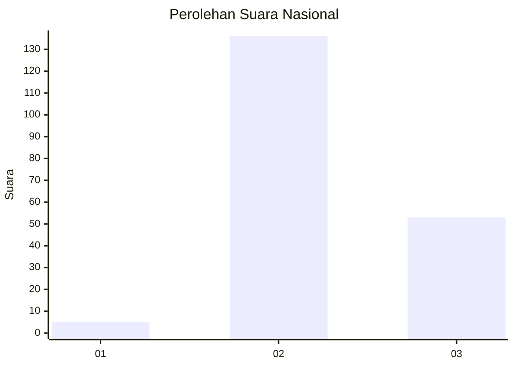
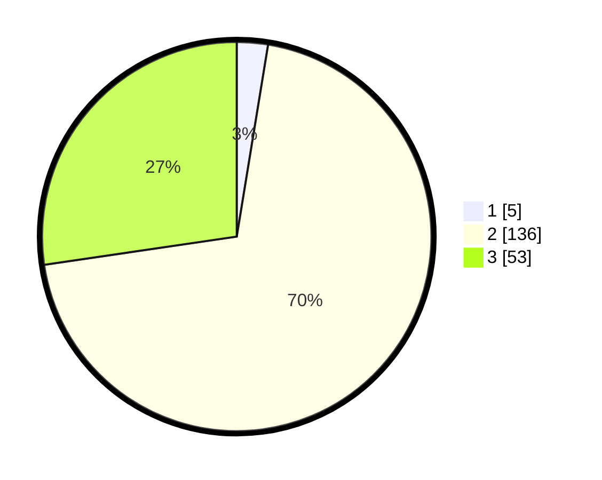

# Hasil

## Grafik

## Tabel

| No.    | Nama Paslon    | Suara | Suara (raw) | Persentase |
|:------ |:-------------- | -----:| -----------:| ----------:|
| 100025 | ANIES MUHAIMIN | 5     | [5][p-1]    | 2,58       |
| 100026 | PRABOWO GIBRAN | 136   | [136][p-2]  | 70,10      |
| 100027 | GANJAR MAHFUD  | 53    | [53][p-3]   | 27,32      |

[p-1]: https://github.com/gigit-pemilu/pemilu-2024/blob/main/pilpres/hitung-suara/sub/31-dki-jakarta/sub/72-jakarta-utara/sub/01-penjaringan/sub/1004-pejagalan/sub/036-tps/sub/paslon-1.txt
[p-2]: https://github.com/gigit-pemilu/pemilu-2024/blob/main/pilpres/hitung-suara/sub/31-dki-jakarta/sub/72-jakarta-utara/sub/01-penjaringan/sub/1004-pejagalan/sub/036-tps/sub/paslon-2.txt
[p-3]: https://github.com/gigit-pemilu/pemilu-2024/blob/main/pilpres/hitung-suara/sub/31-dki-jakarta/sub/72-jakarta-utara/sub/01-penjaringan/sub/1004-pejagalan/sub/036-tps/sub/paslon-3.txt

## Foto C Plano

https://sirekap-obj-formc.kpu.go.id/0162/pemilu/ppwp/31/72/01/10/04/3172011004036-20240225-211956--c96489a0-3fc1-4faf-a4d6-f816fd22f2e3.jpg

https://sirekap-obj-formc.kpu.go.id/0162/pemilu/ppwp/31/72/01/10/04/3172011004036-20240225-212020--14f2031f-addd-4d5f-ab09-f35a99d86a5e.jpg

https://sirekap-obj-formc.kpu.go.id/0162/pemilu/ppwp/31/72/01/10/04/3172011004036-20240225-212131--3f6c9ed7-87df-4214-bf57-f96825ba0492.jpg

## Metadata

| Key        | Value               |
| ---------- | ------------------- |
| Time Stamp | 2024-02-26 09:00:00 |

