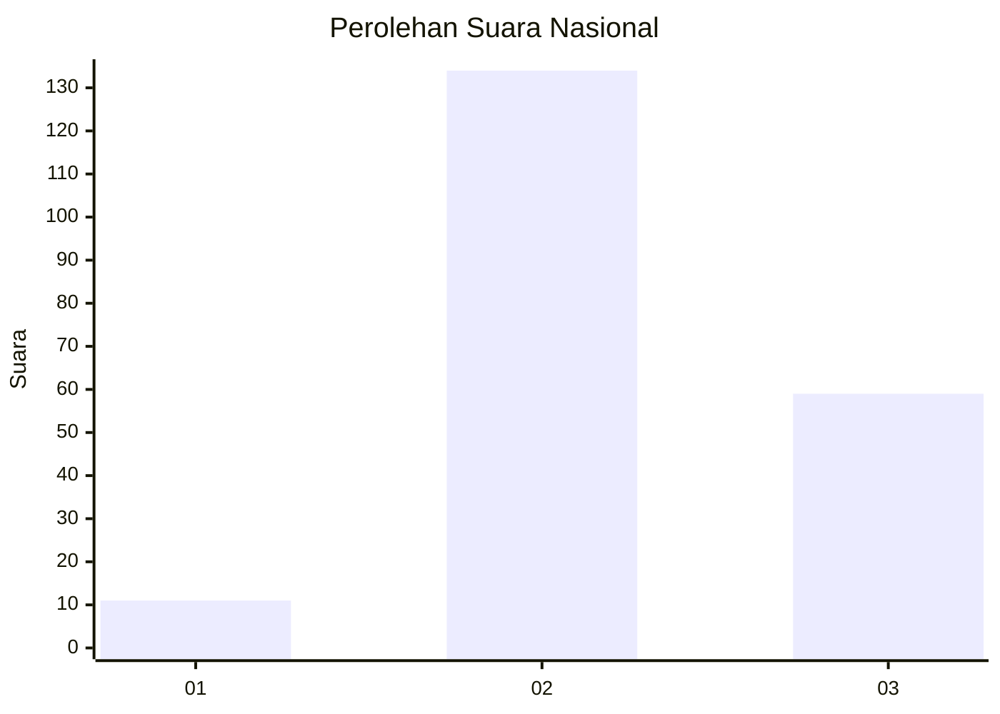
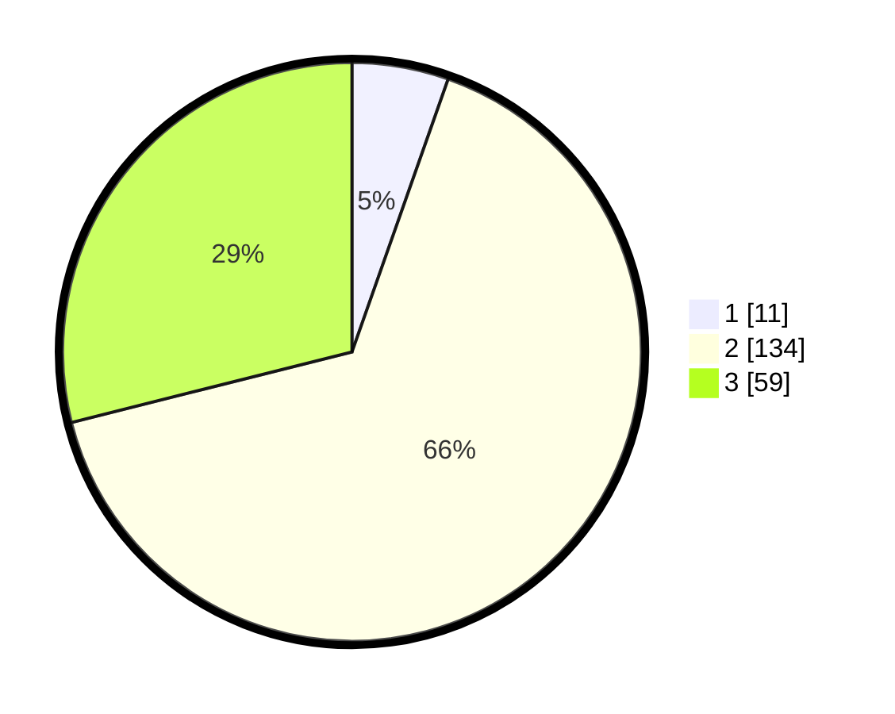

# Hasil

## Grafik

## Tabel

| No.    | Nama Paslon    | Suara | Suara (raw) | Persentase |
|:------ |:-------------- | -----:| -----------:| ----------:|
| 100025 | ANIES MUHAIMIN | 11    | [11][p-1]   | 5,39       |
| 100026 | PRABOWO GIBRAN | 134   | [134][p-2]  | 65,69      |
| 100027 | GANJAR MAHFUD  | 59    | [59][p-3]   | 28,92      |

[p-1]: https://github.com/gigit-pemilu/pemilu-2024/blob/main/pilpres/hitung-suara/sub/31-dki-jakarta/sub/72-jakarta-utara/sub/01-penjaringan/sub/1004-pejagalan/sub/039-tps/sub/paslon-1.txt
[p-2]: https://github.com/gigit-pemilu/pemilu-2024/blob/main/pilpres/hitung-suara/sub/31-dki-jakarta/sub/72-jakarta-utara/sub/01-penjaringan/sub/1004-pejagalan/sub/039-tps/sub/paslon-2.txt
[p-3]: https://github.com/gigit-pemilu/pemilu-2024/blob/main/pilpres/hitung-suara/sub/31-dki-jakarta/sub/72-jakarta-utara/sub/01-penjaringan/sub/1004-pejagalan/sub/039-tps/sub/paslon-3.txt

## Foto C Plano

https://sirekap-obj-formc.kpu.go.id/93f5/pemilu/ppwp/31/72/01/10/04/3172011004039-20240226-143131--ac101af4-e690-4a69-8cbc-662894471a7b.jpg

https://sirekap-obj-formc.kpu.go.id/93f5/pemilu/ppwp/31/72/01/10/04/3172011004039-20240226-143340--7565512d-dfbd-4ef9-bfcb-a94a8925edab.jpg

https://sirekap-obj-formc.kpu.go.id/93f5/pemilu/ppwp/31/72/01/10/04/3172011004039-20240226-143451--a7ff3e14-2cc7-4e2c-a5c3-742d7771695b.jpg

## Metadata

| Key        | Value               |
| ---------- | ------------------- |
| Time Stamp | 2024-02-26 15:00:00 |

