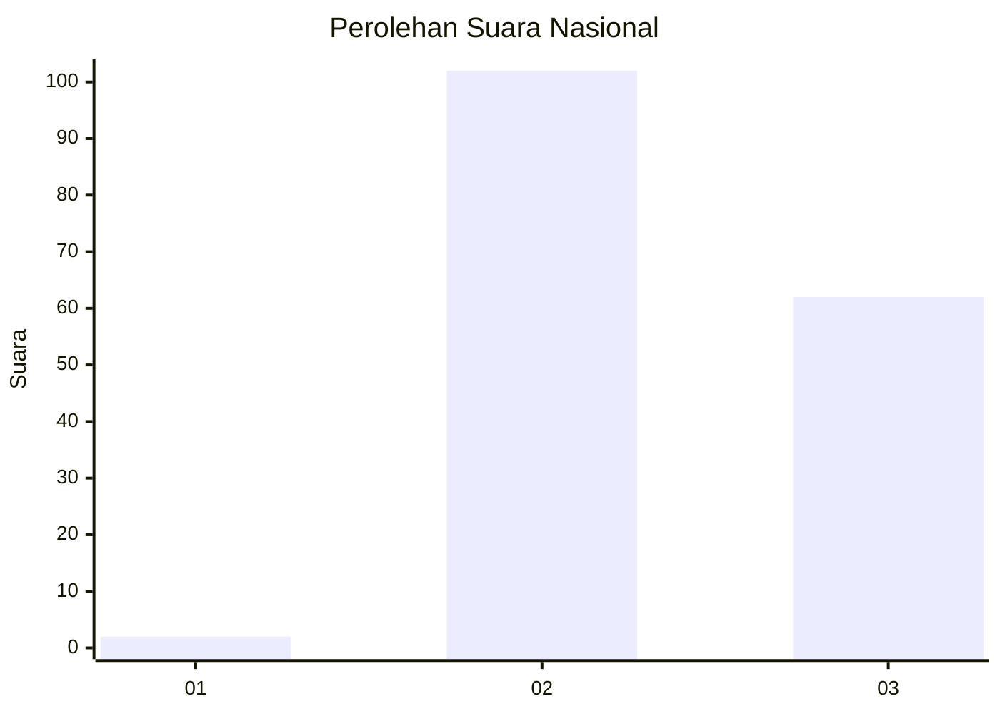
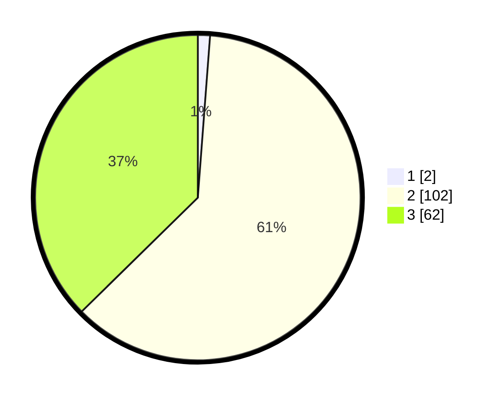

# Hasil

## Grafik

## Tabel

| No.    | Nama Paslon    | Suara | Suara (raw) | Persentase |
|:------ |:-------------- | -----:| -----------:| ----------:|
| 100025 | ANIES MUHAIMIN | 2     | [2][p-1]    | 1,20       |
| 100026 | PRABOWO GIBRAN | 102   | [102][p-2]  | 61,45      |
| 100027 | GANJAR MAHFUD  | 62    | [62][p-3]   | 37,35      |

[p-1]: https://github.com/gigit-pemilu/pemilu-2024/blob/main/pilpres/hitung-suara/sub/31-dki-jakarta/sub/72-jakarta-utara/sub/01-penjaringan/sub/1004-pejagalan/sub/047-tps/sub/paslon-1.txt
[p-2]: https://github.com/gigit-pemilu/pemilu-2024/blob/main/pilpres/hitung-suara/sub/31-dki-jakarta/sub/72-jakarta-utara/sub/01-penjaringan/sub/1004-pejagalan/sub/047-tps/sub/paslon-2.txt
[p-3]: https://github.com/gigit-pemilu/pemilu-2024/blob/main/pilpres/hitung-suara/sub/31-dki-jakarta/sub/72-jakarta-utara/sub/01-penjaringan/sub/1004-pejagalan/sub/047-tps/sub/paslon-3.txt

## Foto C Plano

https://sirekap-obj-formc.kpu.go.id/7f91/pemilu/ppwp/31/72/01/10/04/3172011004047-20240215-002129--c3fb50fa-6ae2-4a75-abbf-153fd9446ee0.jpg

https://sirekap-obj-formc.kpu.go.id/7f91/pemilu/ppwp/31/72/01/10/04/3172011004047-20240215-002212--dd86c7e2-876d-44c9-8d09-25df5a724d59.jpg

https://sirekap-obj-formc.kpu.go.id/7f91/pemilu/ppwp/31/72/01/10/04/3172011004047-20240215-002304--4a834b49-972c-4d81-bcd3-83c1e47223aa.jpg

## Metadata

| Key        | Value               |
| ---------- | ------------------- |
| Time Stamp | 2024-02-21 17:00:00 |

