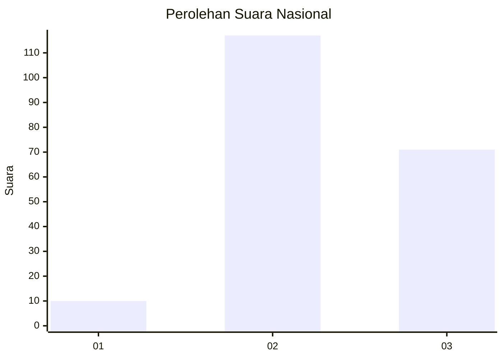
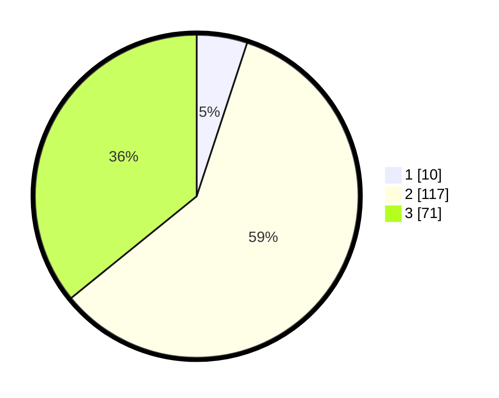

# Hasil

## Grafik

## Tabel

| No.    | Nama Paslon    | Suara | Suara (raw) | Persentase |
|:------ |:-------------- | -----:| -----------:| ----------:|
| 100025 | ANIES MUHAIMIN | 10    | [10][p-1]   | 5,05       |
| 100026 | PRABOWO GIBRAN | 117   | [117][p-2]  | 59,09      |
| 100027 | GANJAR MAHFUD  | 71    | [71][p-3]   | 35,86      |

[p-1]: https://github.com/gigit-pemilu/pemilu-2024/blob/main/pilpres/hitung-suara/sub/31-dki-jakarta/sub/72-jakarta-utara/sub/01-penjaringan/sub/1004-pejagalan/sub/049-tps/sub/paslon-1.txt
[p-2]: https://github.com/gigit-pemilu/pemilu-2024/blob/main/pilpres/hitung-suara/sub/31-dki-jakarta/sub/72-jakarta-utara/sub/01-penjaringan/sub/1004-pejagalan/sub/049-tps/sub/paslon-2.txt
[p-3]: https://github.com/gigit-pemilu/pemilu-2024/blob/main/pilpres/hitung-suara/sub/31-dki-jakarta/sub/72-jakarta-utara/sub/01-penjaringan/sub/1004-pejagalan/sub/049-tps/sub/paslon-3.txt

## Foto C Plano

https://sirekap-obj-formc.kpu.go.id/5f56/pemilu/ppwp/31/72/01/10/04/3172011004049-20240224-143311--af98aab5-bf0c-4508-b7dd-768ec5e4c60a.jpg

https://sirekap-obj-formc.kpu.go.id/5f56/pemilu/ppwp/31/72/01/10/04/3172011004049-20240224-142726--602684fd-e6f5-4519-b0a6-039069804b58.jpg

https://sirekap-obj-formc.kpu.go.id/5f56/pemilu/ppwp/31/72/01/10/04/3172011004049-20240224-142803--6f60c714-05c9-4f8b-9ff3-9427f3ded8e1.jpg

## Metadata

| Key        | Value               |
| ---------- | ------------------- |
| Time Stamp | 2024-02-24 22:31:28 |

