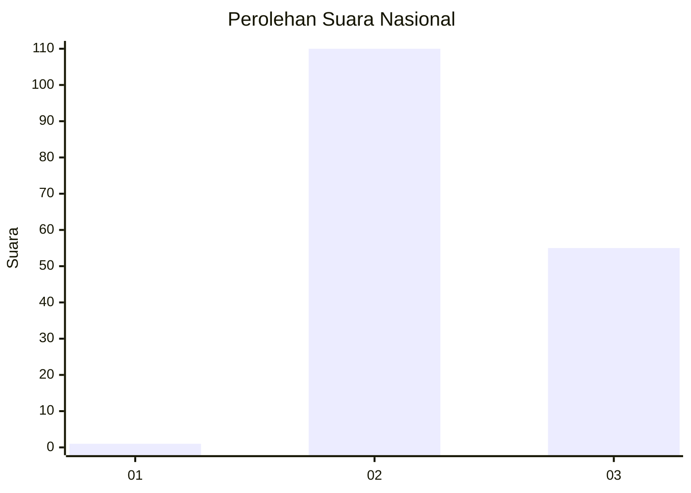
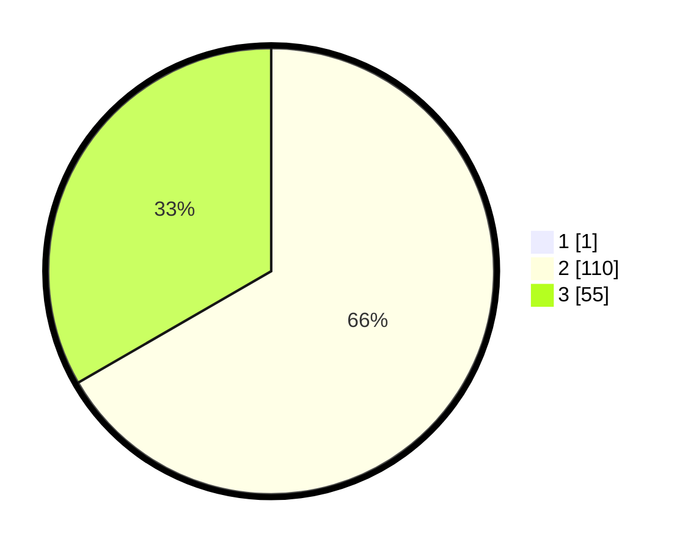

# Hasil

## Grafik

## Tabel

| No.    | Nama Paslon    | Suara | Suara (raw) | Persentase |
|:------ |:-------------- | -----:| -----------:| ----------:|
| 100025 | ANIES MUHAIMIN | 1     | [1][p-1]    | 0,60       |
| 100026 | PRABOWO GIBRAN | 110   | [110][p-2]  | 66,27      |
| 100027 | GANJAR MAHFUD  | 55    | [55][p-3]   | 33,13      |

[p-1]: https://github.com/gigit-pemilu/pemilu-2024/blob/main/pilpres/hitung-suara/sub/31-dki-jakarta/sub/72-jakarta-utara/sub/01-penjaringan/sub/1004-pejagalan/sub/067-tps/sub/paslon-1.txt
[p-2]: https://github.com/gigit-pemilu/pemilu-2024/blob/main/pilpres/hitung-suara/sub/31-dki-jakarta/sub/72-jakarta-utara/sub/01-penjaringan/sub/1004-pejagalan/sub/067-tps/sub/paslon-2.txt
[p-3]: https://github.com/gigit-pemilu/pemilu-2024/blob/main/pilpres/hitung-suara/sub/31-dki-jakarta/sub/72-jakarta-utara/sub/01-penjaringan/sub/1004-pejagalan/sub/067-tps/sub/paslon-3.txt

## Foto C Plano

https://sirekap-obj-formc.kpu.go.id/7570/pemilu/ppwp/31/72/01/10/04/3172011004067-20240214-214032--d3ae79c1-3c68-4d84-ae82-453a1eeda629.jpg

https://sirekap-obj-formc.kpu.go.id/7570/pemilu/ppwp/31/72/01/10/04/3172011004067-20240214-214208--65c5e4a6-acad-4248-bcac-b6f86260dbf6.jpg

https://sirekap-obj-formc.kpu.go.id/7570/pemilu/ppwp/31/72/01/10/04/3172011004067-20240214-214437--edffe1eb-0099-4b30-b91b-0379d8c418b0.jpg

## Metadata

| Key        | Value               |
| ---------- | ------------------- |
| Time Stamp | 2024-02-21 14:00:00 |

