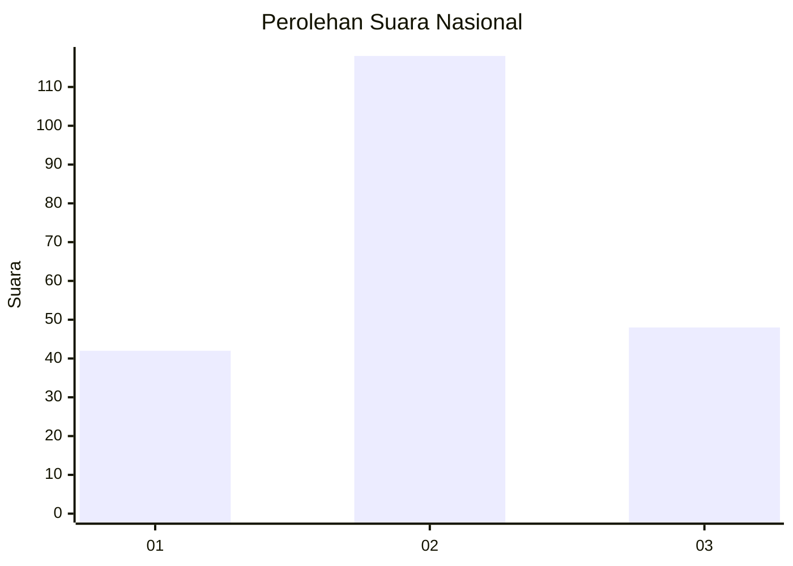
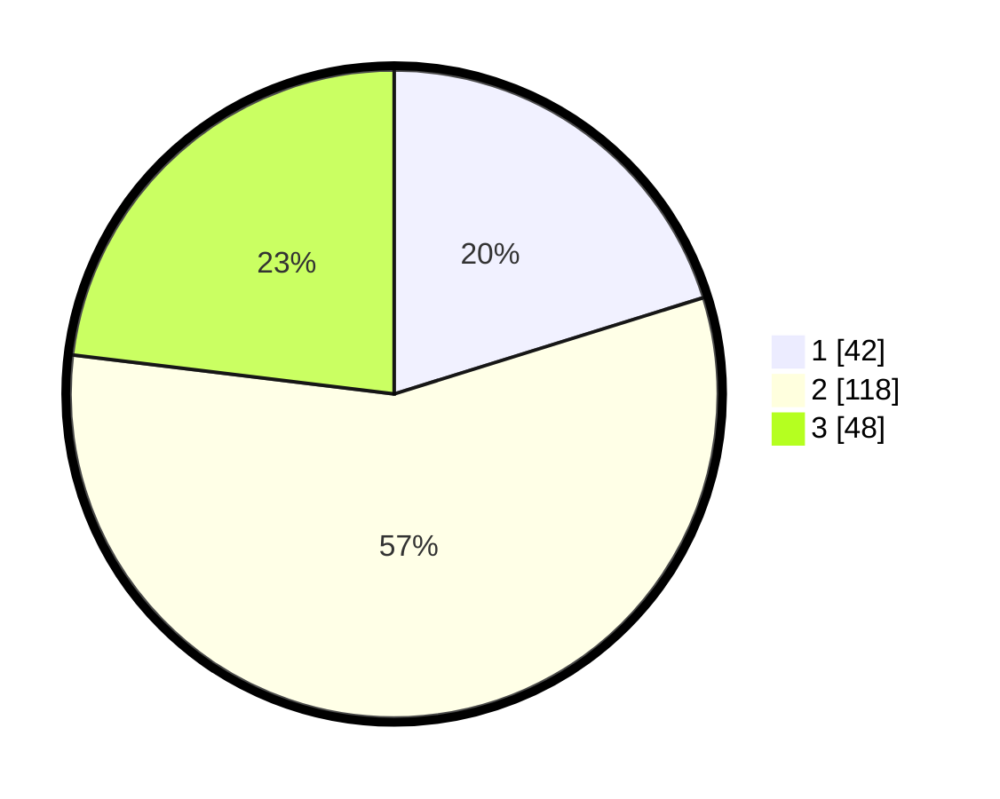

# Hasil

## Grafik

## Tabel

| No.    | Nama Paslon    | Suara | Suara (raw) | Persentase |
|:------ |:-------------- | -----:| -----------:| ----------:|
| 100025 | ANIES MUHAIMIN | 42    | [42][p-1]   | 20,19      |
| 100026 | PRABOWO GIBRAN | 118   | [118][p-2]  | 56,73      |
| 100027 | GANJAR MAHFUD  | 48    | [48][p-3]   | 23,08      |

[p-1]: https://github.com/gigit-pemilu/pemilu-2024/blob/main/pilpres/hitung-suara/sub/31-dki-jakarta/sub/72-jakarta-utara/sub/01-penjaringan/sub/1004-pejagalan/sub/080-tps/sub/paslon-1.txt
[p-2]: https://github.com/gigit-pemilu/pemilu-2024/blob/main/pilpres/hitung-suara/sub/31-dki-jakarta/sub/72-jakarta-utara/sub/01-penjaringan/sub/1004-pejagalan/sub/080-tps/sub/paslon-2.txt
[p-3]: https://github.com/gigit-pemilu/pemilu-2024/blob/main/pilpres/hitung-suara/sub/31-dki-jakarta/sub/72-jakarta-utara/sub/01-penjaringan/sub/1004-pejagalan/sub/080-tps/sub/paslon-3.txt

## Foto C Plano

https://sirekap-obj-formc.kpu.go.id/2413/pemilu/ppwp/31/72/01/10/04/3172011004080-20240214-213008--5eb116aa-7195-4359-8a84-1c10016f047f.jpg

https://sirekap-obj-formc.kpu.go.id/2413/pemilu/ppwp/31/72/01/10/04/3172011004080-20240214-224008--ad3cf126-06c2-4b30-afcd-dc714e0d205b.jpg

https://sirekap-obj-formc.kpu.go.id/2413/pemilu/ppwp/31/72/01/10/04/3172011004080-20240214-224111--75432897-2531-4148-875a-25113fe0519d.jpg

## Metadata

| Key        | Value               |
| ---------- | ------------------- |
| Time Stamp | 2024-02-21 18:00:00 |

