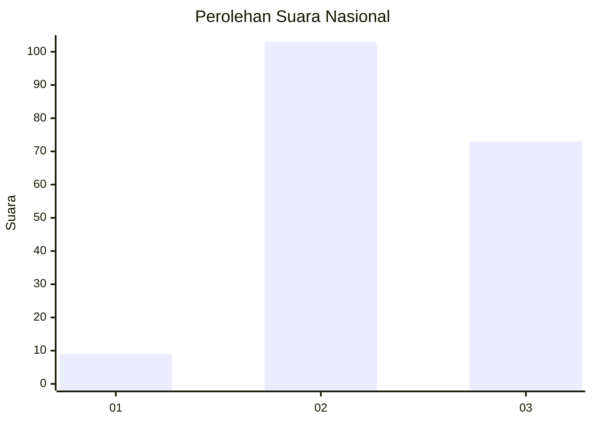
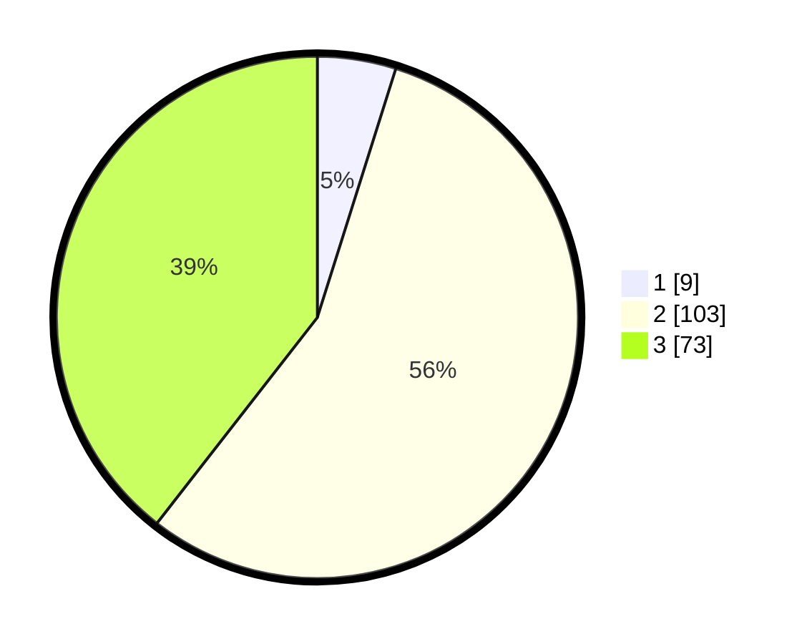

# Hasil

## Grafik

## Tabel

| No.    | Nama Paslon    | Suara | Suara (raw) | Persentase |
|:------ |:-------------- | -----:| -----------:| ----------:|
| 100025 | ANIES MUHAIMIN | 9     | [9][p-1]    | 4,86       |
| 100026 | PRABOWO GIBRAN | 103   | [103][p-2]  | 55,68      |
| 100027 | GANJAR MAHFUD  | 73    | [73][p-3]   | 39,46      |

[p-1]: https://github.com/gigit-pemilu/pemilu-2024/blob/main/pilpres/hitung-suara/sub/31-dki-jakarta/sub/72-jakarta-utara/sub/01-penjaringan/sub/1004-pejagalan/sub/087-tps/sub/paslon-1.txt
[p-2]: https://github.com/gigit-pemilu/pemilu-2024/blob/main/pilpres/hitung-suara/sub/31-dki-jakarta/sub/72-jakarta-utara/sub/01-penjaringan/sub/1004-pejagalan/sub/087-tps/sub/paslon-2.txt
[p-3]: https://github.com/gigit-pemilu/pemilu-2024/blob/main/pilpres/hitung-suara/sub/31-dki-jakarta/sub/72-jakarta-utara/sub/01-penjaringan/sub/1004-pejagalan/sub/087-tps/sub/paslon-3.txt

## Foto C Plano

https://sirekap-obj-formc.kpu.go.id/1148/pemilu/ppwp/31/72/01/10/04/3172011004087-20240214-155143--766a4dfc-0443-4bf5-98e7-b98012a08217.jpg

https://sirekap-obj-formc.kpu.go.id/1148/pemilu/ppwp/31/72/01/10/04/3172011004087-20240214-155123--1d0f82b9-682c-404a-a9a1-5204e8468732.jpg

https://sirekap-obj-formc.kpu.go.id/1148/pemilu/ppwp/31/72/01/10/04/3172011004087-20240214-155214--922cc1c0-ca09-4aa1-b718-b6cf47aa5baf.jpg

## Metadata

| Key        | Value               |
| ---------- | ------------------- |
| Time Stamp | 2024-02-21 18:00:00 |

