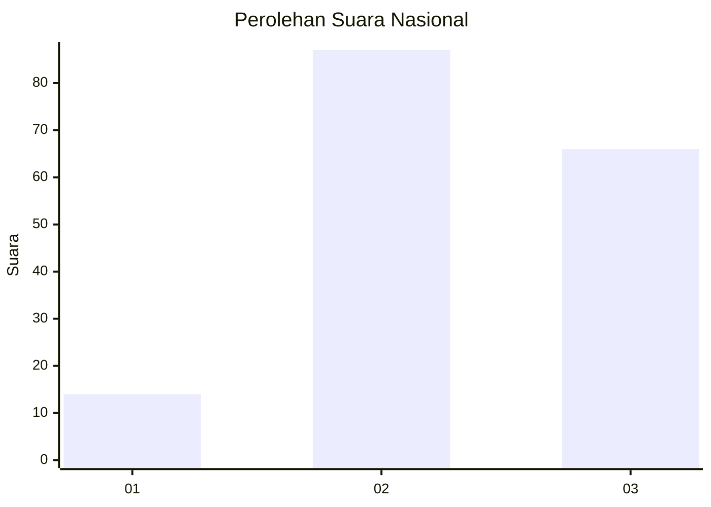
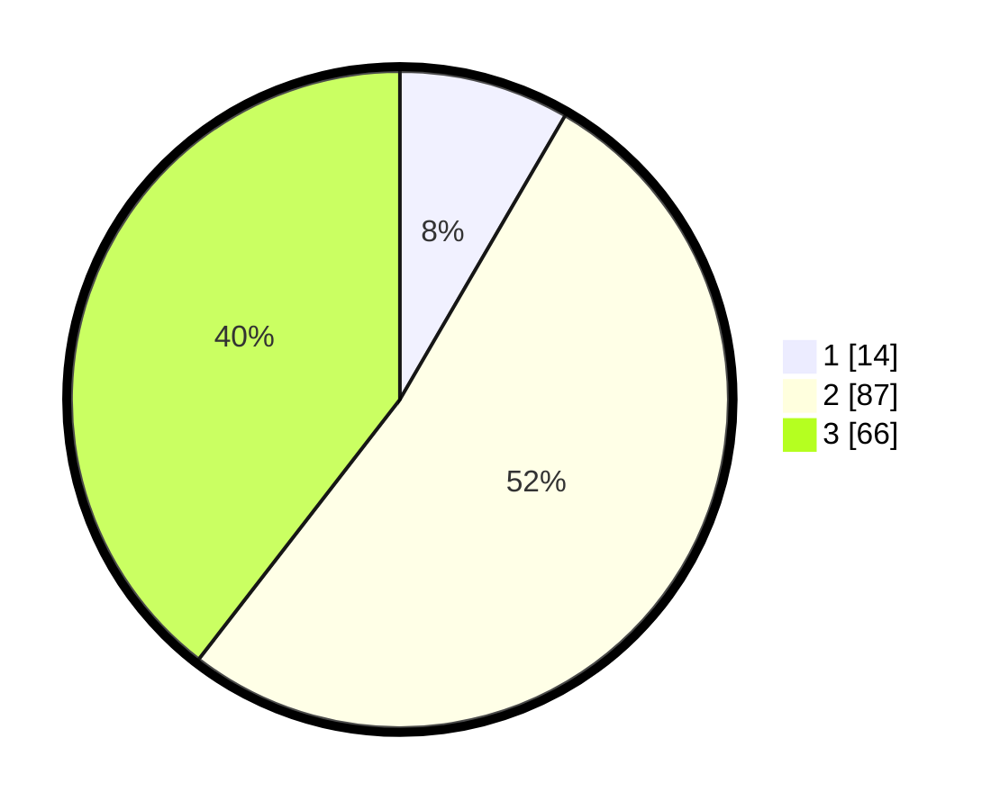

# Hasil

## Grafik

## Tabel

| No.    | Nama Paslon    | Suara | Suara (raw) | Persentase |
|:------ |:-------------- | -----:| -----------:| ----------:|
| 100025 | ANIES MUHAIMIN | 14    | [14][p-1]   | 8,38       |
| 100026 | PRABOWO GIBRAN | 87    | [87][p-2]   | 52,10      |
| 100027 | GANJAR MAHFUD  | 66    | [66][p-3]   | 39,52      |

[p-1]: https://github.com/gigit-pemilu/pemilu-2024/blob/main/pilpres/hitung-suara/sub/31-dki-jakarta/sub/72-jakarta-utara/sub/01-penjaringan/sub/1004-pejagalan/sub/099-tps/sub/paslon-1.txt
[p-2]: https://github.com/gigit-pemilu/pemilu-2024/blob/main/pilpres/hitung-suara/sub/31-dki-jakarta/sub/72-jakarta-utara/sub/01-penjaringan/sub/1004-pejagalan/sub/099-tps/sub/paslon-2.txt
[p-3]: https://github.com/gigit-pemilu/pemilu-2024/blob/main/pilpres/hitung-suara/sub/31-dki-jakarta/sub/72-jakarta-utara/sub/01-penjaringan/sub/1004-pejagalan/sub/099-tps/sub/paslon-3.txt

## Foto C Plano

https://sirekap-obj-formc.kpu.go.id/44b7/pemilu/ppwp/31/72/01/10/04/3172011004099-20240215-004623--239ab408-5fa1-408d-8f1b-325f2f3b0e4c.jpg

https://sirekap-obj-formc.kpu.go.id/44b7/pemilu/ppwp/31/72/01/10/04/3172011004099-20240215-004734--33c9f5a8-5762-4be4-a231-5f9fa37aafd8.jpg

https://sirekap-obj-formc.kpu.go.id/44b7/pemilu/ppwp/31/72/01/10/04/3172011004099-20240215-004828--3adabfa3-de87-4a48-97e7-457894568c20.jpg

## Metadata

| Key        | Value               |
| ---------- | ------------------- |
| Time Stamp | 2024-02-21 14:00:00 |

