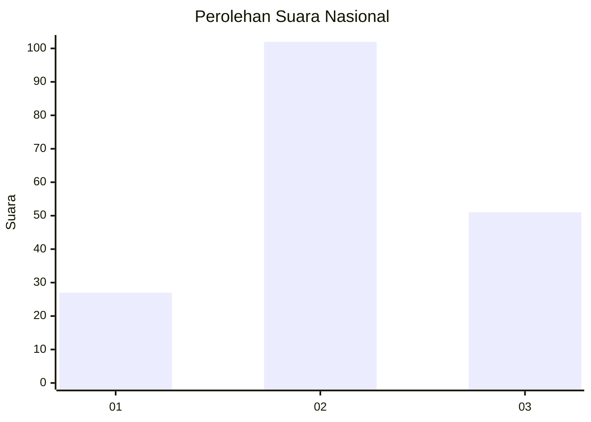
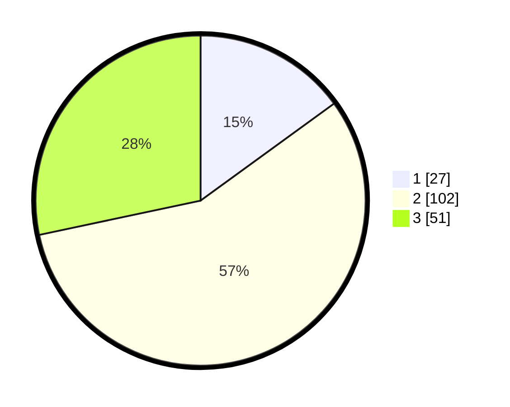

# Hasil

## Grafik

## Tabel

| No.    | Nama Paslon    | Suara | Suara (raw) | Persentase |
|:------ |:-------------- | -----:| -----------:| ----------:|
| 100025 | ANIES MUHAIMIN | 27    | [27][p-1]   | 15,00      |
| 100026 | PRABOWO GIBRAN | 102   | [102][p-2]  | 56,67      |
| 100027 | GANJAR MAHFUD  | 51    | [51][p-3]   | 28,33      |

[p-1]: https://github.com/gigit-pemilu/pemilu-2024/blob/main/pilpres/hitung-suara/sub/31-dki-jakarta/sub/72-jakarta-utara/sub/01-penjaringan/sub/1004-pejagalan/sub/114-tps/sub/paslon-1.txt
[p-2]: https://github.com/gigit-pemilu/pemilu-2024/blob/main/pilpres/hitung-suara/sub/31-dki-jakarta/sub/72-jakarta-utara/sub/01-penjaringan/sub/1004-pejagalan/sub/114-tps/sub/paslon-2.txt
[p-3]: https://github.com/gigit-pemilu/pemilu-2024/blob/main/pilpres/hitung-suara/sub/31-dki-jakarta/sub/72-jakarta-utara/sub/01-penjaringan/sub/1004-pejagalan/sub/114-tps/sub/paslon-3.txt

## Foto C Plano

https://sirekap-obj-formc.kpu.go.id/205a/pemilu/ppwp/31/72/01/10/04/3172011004114-20240214-204043--e1e0ba5d-cade-4f78-a10d-ec25a3add9fe.jpg

https://sirekap-obj-formc.kpu.go.id/205a/pemilu/ppwp/31/72/01/10/04/3172011004114-20240214-204201--92ffd1de-1a02-49e3-af79-27c75ae38bbd.jpg

https://sirekap-obj-formc.kpu.go.id/205a/pemilu/ppwp/31/72/01/10/04/3172011004114-20240214-204315--4cf9d7b6-8c78-4d03-9c71-e77222215aef.jpg

## Metadata

| Key        | Value               |
| ---------- | ------------------- |
| Time Stamp | 2024-02-21 18:00:00 |

