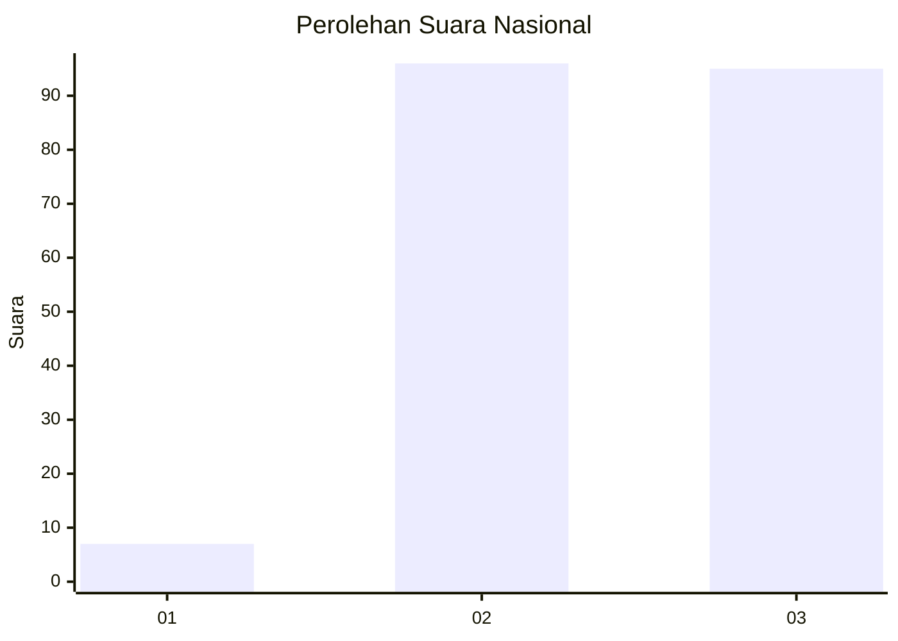
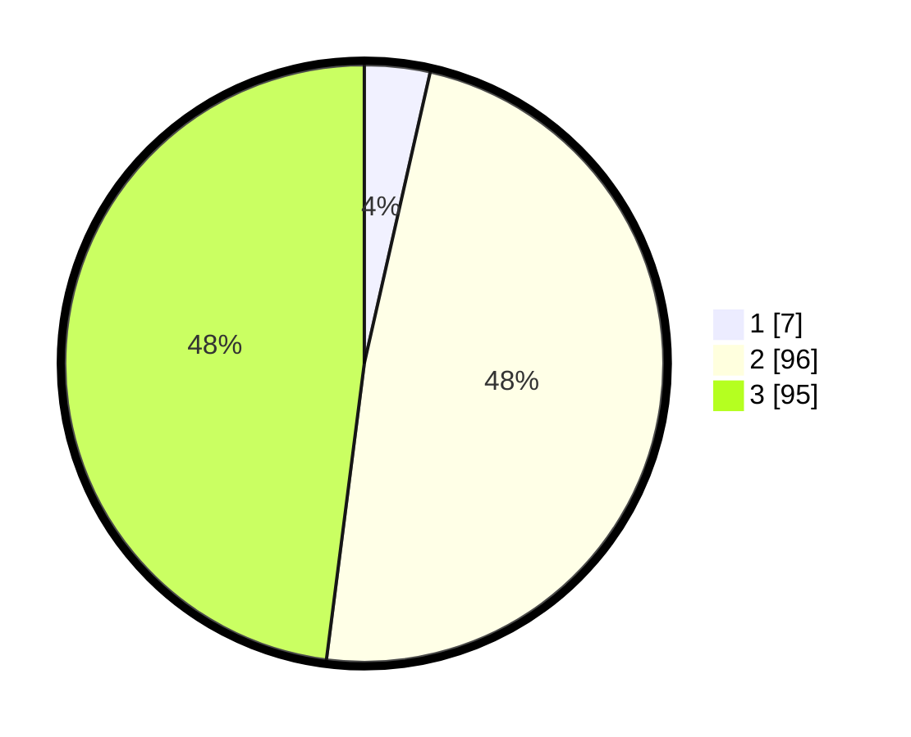

# Hasil

## Grafik

## Tabel

| No.    | Nama Paslon    | Suara | Suara (raw) | Persentase |
|:------ |:-------------- | -----:| -----------:| ----------:|
| 100025 | ANIES MUHAIMIN | 7     | [7][p-1]    | 3,54       |
| 100026 | PRABOWO GIBRAN | 96    | [96][p-2]   | 48,48      |
| 100027 | GANJAR MAHFUD  | 95    | [95][p-3]   | 47,98      |

[p-1]: https://github.com/gigit-pemilu/pemilu-2024/blob/main/pilpres/hitung-suara/sub/31-dki-jakarta/sub/72-jakarta-utara/sub/01-penjaringan/sub/1004-pejagalan/sub/123-tps/sub/paslon-1.txt
[p-2]: https://github.com/gigit-pemilu/pemilu-2024/blob/main/pilpres/hitung-suara/sub/31-dki-jakarta/sub/72-jakarta-utara/sub/01-penjaringan/sub/1004-pejagalan/sub/123-tps/sub/paslon-2.txt
[p-3]: https://github.com/gigit-pemilu/pemilu-2024/blob/main/pilpres/hitung-suara/sub/31-dki-jakarta/sub/72-jakarta-utara/sub/01-penjaringan/sub/1004-pejagalan/sub/123-tps/sub/paslon-3.txt

## Foto C Plano

https://sirekap-obj-formc.kpu.go.id/c7f0/pemilu/ppwp/31/72/01/10/04/3172011004123-20240215-011817--88fb1d3a-d58d-45d6-85de-386422b6b5ab.jpg

https://sirekap-obj-formc.kpu.go.id/c7f0/pemilu/ppwp/31/72/01/10/04/3172011004123-20240215-002907--b9a954f0-e010-43e8-94e6-78f794fda028.jpg

https://sirekap-obj-formc.kpu.go.id/c7f0/pemilu/ppwp/31/72/01/10/04/3172011004123-20240215-002952--58d62b01-9ec6-4e18-9811-e398ff2d544f.jpg

## Metadata

| Key        | Value               |
| ---------- | ------------------- |
| Time Stamp | 2024-02-21 14:00:00 |

