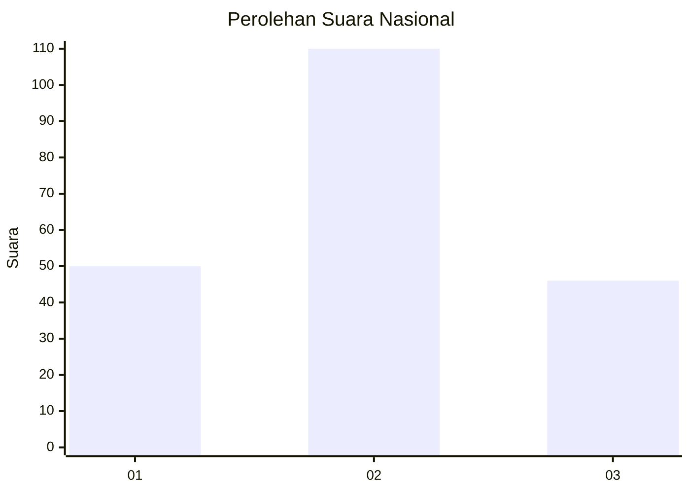
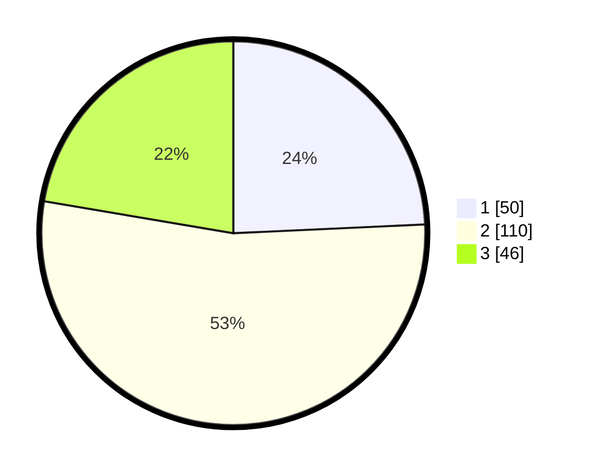

# Hasil

## Grafik

## Tabel

| No.    | Nama Paslon    | Suara | Suara (raw) | Persentase |
|:------ |:-------------- | -----:| -----------:| ----------:|
| 100025 | ANIES MUHAIMIN | 50    | [50][p-1]   | 24,27      |
| 100026 | PRABOWO GIBRAN | 110   | [110][p-2]  | 53,40      |
| 100027 | GANJAR MAHFUD  | 46    | [46][p-3]   | 22,33      |

[p-1]: https://github.com/gigit-pemilu/pemilu-2024/blob/main/pilpres/hitung-suara/sub/31-dki-jakarta/sub/72-jakarta-utara/sub/01-penjaringan/sub/1004-pejagalan/sub/175-tps/sub/paslon-1.txt
[p-2]: https://github.com/gigit-pemilu/pemilu-2024/blob/main/pilpres/hitung-suara/sub/31-dki-jakarta/sub/72-jakarta-utara/sub/01-penjaringan/sub/1004-pejagalan/sub/175-tps/sub/paslon-2.txt
[p-3]: https://github.com/gigit-pemilu/pemilu-2024/blob/main/pilpres/hitung-suara/sub/31-dki-jakarta/sub/72-jakarta-utara/sub/01-penjaringan/sub/1004-pejagalan/sub/175-tps/sub/paslon-3.txt

## Foto C Plano

https://sirekap-obj-formc.kpu.go.id/ee74/pemilu/ppwp/31/72/01/10/04/3172011004175-20240214-214934--5d07878b-5b76-4a7a-b287-eb27f6cf7aad.jpg

https://sirekap-obj-formc.kpu.go.id/ee74/pemilu/ppwp/31/72/01/10/04/3172011004175-20240214-215042--b3d6ac5c-5b42-46fb-a093-ec12d0e63282.jpg

https://sirekap-obj-formc.kpu.go.id/ee74/pemilu/ppwp/31/72/01/10/04/3172011004175-20240214-215234--17e132ab-4b9b-4dc5-abae-09274176bead.jpg

## Metadata

| Key        | Value               |
| ---------- | ------------------- |
| Time Stamp | 2024-02-21 14:00:00 |

