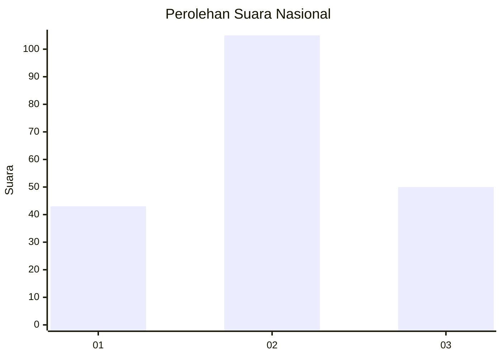
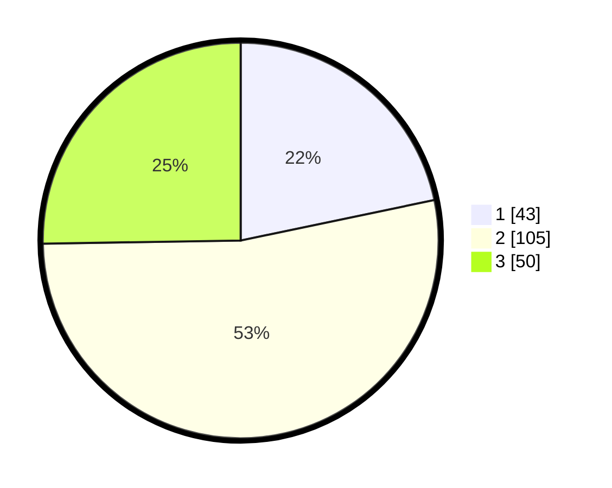

# Hasil

## Grafik

## Tabel

| No.    | Nama Paslon    | Suara | Suara (raw) | Persentase |
|:------ |:-------------- | -----:| -----------:| ----------:|
| 100025 | ANIES MUHAIMIN | 43    | [43][p-1]   | 21,72      |
| 100026 | PRABOWO GIBRAN | 105   | [105][p-2]  | 53,03      |
| 100027 | GANJAR MAHFUD  | 50    | [50][p-3]   | 25,25      |

[p-1]: https://github.com/gigit-pemilu/pemilu-2024/blob/main/pilpres/hitung-suara/sub/31-dki-jakarta/sub/72-jakarta-utara/sub/01-penjaringan/sub/1004-pejagalan/sub/176-tps/sub/paslon-1.txt
[p-2]: https://github.com/gigit-pemilu/pemilu-2024/blob/main/pilpres/hitung-suara/sub/31-dki-jakarta/sub/72-jakarta-utara/sub/01-penjaringan/sub/1004-pejagalan/sub/176-tps/sub/paslon-2.txt
[p-3]: https://github.com/gigit-pemilu/pemilu-2024/blob/main/pilpres/hitung-suara/sub/31-dki-jakarta/sub/72-jakarta-utara/sub/01-penjaringan/sub/1004-pejagalan/sub/176-tps/sub/paslon-3.txt

## Foto C Plano

https://sirekap-obj-formc.kpu.go.id/eab4/pemilu/ppwp/31/72/01/10/04/3172011004176-20240214-232518--2f8130c4-bb68-4782-809b-aa3f0a6f3249.jpg

https://sirekap-obj-formc.kpu.go.id/eab4/pemilu/ppwp/31/72/01/10/04/3172011004176-20240214-213005--f5277a99-9f3d-4451-b04c-3366a063ec2c.jpg

https://sirekap-obj-formc.kpu.go.id/eab4/pemilu/ppwp/31/72/01/10/04/3172011004176-20240214-233821--93bf76c7-e953-451f-b414-96ec7956af29.jpg

## Metadata

| Key        | Value               |
| ---------- | ------------------- |
| Time Stamp | 2024-02-21 18:00:00 |

