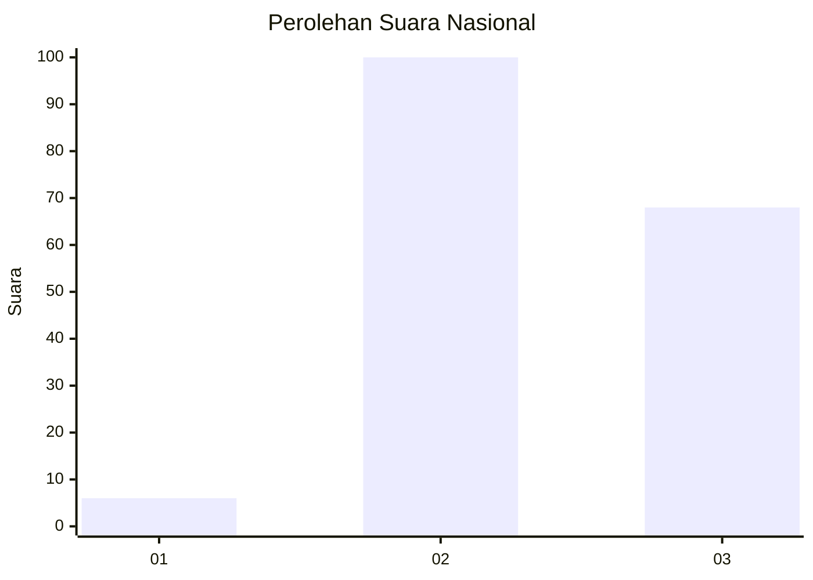
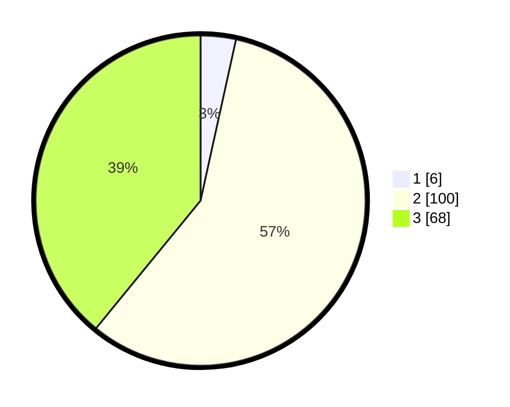

# Hasil

## Grafik

## Tabel

| No.    | Nama Paslon    | Suara | Suara (raw) | Persentase |
|:------ |:-------------- | -----:| -----------:| ----------:|
| 100025 | ANIES MUHAIMIN | 6     | [6][p-1]    | 3,45       |
| 100026 | PRABOWO GIBRAN | 100   | [100][p-2]  | 57,47      |
| 100027 | GANJAR MAHFUD  | 68    | [68][p-3]   | 39,08      |

[p-1]: https://github.com/gigit-pemilu/pemilu-2024/blob/main/pilpres/hitung-suara/sub/31-dki-jakarta/sub/72-jakarta-utara/sub/01-penjaringan/sub/1004-pejagalan/sub/183-tps/sub/paslon-1.txt
[p-2]: https://github.com/gigit-pemilu/pemilu-2024/blob/main/pilpres/hitung-suara/sub/31-dki-jakarta/sub/72-jakarta-utara/sub/01-penjaringan/sub/1004-pejagalan/sub/183-tps/sub/paslon-2.txt
[p-3]: https://github.com/gigit-pemilu/pemilu-2024/blob/main/pilpres/hitung-suara/sub/31-dki-jakarta/sub/72-jakarta-utara/sub/01-penjaringan/sub/1004-pejagalan/sub/183-tps/sub/paslon-3.txt

## Foto C Plano

https://sirekap-obj-formc.kpu.go.id/07a1/pemilu/ppwp/31/72/01/10/04/3172011004183-20240214-222320--44d30894-d411-44c5-a231-e18030be723d.jpg

https://sirekap-obj-formc.kpu.go.id/07a1/pemilu/ppwp/31/72/01/10/04/3172011004183-20240214-222426--be0eb22c-6bbf-4ccf-983c-778af8102f26.jpg

https://sirekap-obj-formc.kpu.go.id/07a1/pemilu/ppwp/31/72/01/10/04/3172011004183-20240214-222521--89bda36b-62cd-46ee-98a4-d50c5fbbbeec.jpg

## Metadata

| Key        | Value               |
| ---------- | ------------------- |
| Time Stamp | 2024-02-21 18:00:00 |

