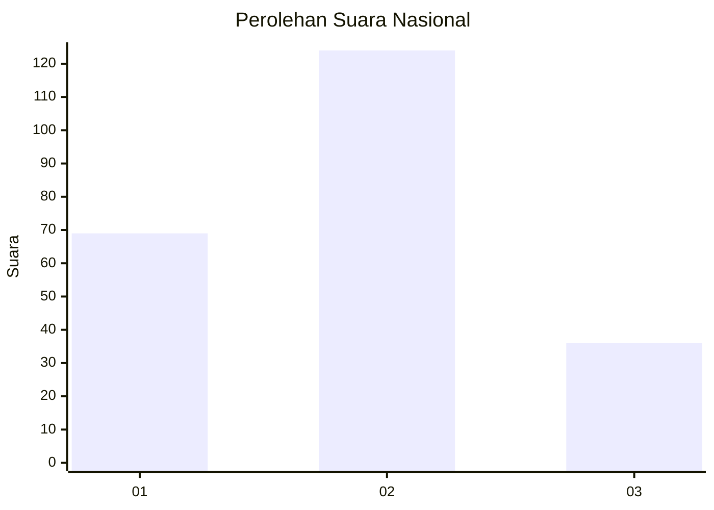
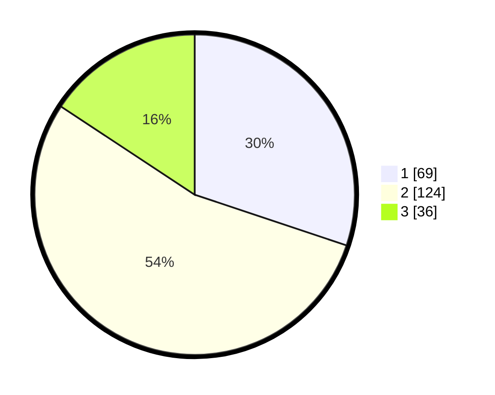

# Hasil

## Grafik

## Tabel

| No.    | Nama Paslon    | Suara | Suara (raw) | Persentase |
|:------ |:-------------- | -----:| -----------:| ----------:|
| 100025 | ANIES MUHAIMIN | 69    | [69][p-1]   | 30,13      |
| 100026 | PRABOWO GIBRAN | 124   | [124][p-2]  | 54,15      |
| 100027 | GANJAR MAHFUD  | 36    | [36][p-3]   | 15,72      |

[p-1]: https://github.com/gigit-pemilu/pemilu-2024/blob/main/pilpres/hitung-suara/sub/31-dki-jakarta/sub/72-jakarta-utara/sub/01-penjaringan/sub/1004-pejagalan/sub/189-tps/sub/paslon-1.txt
[p-2]: https://github.com/gigit-pemilu/pemilu-2024/blob/main/pilpres/hitung-suara/sub/31-dki-jakarta/sub/72-jakarta-utara/sub/01-penjaringan/sub/1004-pejagalan/sub/189-tps/sub/paslon-2.txt
[p-3]: https://github.com/gigit-pemilu/pemilu-2024/blob/main/pilpres/hitung-suara/sub/31-dki-jakarta/sub/72-jakarta-utara/sub/01-penjaringan/sub/1004-pejagalan/sub/189-tps/sub/paslon-3.txt

## Foto C Plano

https://sirekap-obj-formc.kpu.go.id/0288/pemilu/ppwp/31/72/01/10/04/3172011004189-20240215-014245--d3afaa76-b47c-4580-a905-ba7c40f0e199.jpg

https://sirekap-obj-formc.kpu.go.id/0288/pemilu/ppwp/31/72/01/10/04/3172011004189-20240214-215624--dbb47919-b9f1-4dbd-8483-9a230d97e946.jpg

https://sirekap-obj-formc.kpu.go.id/0288/pemilu/ppwp/31/72/01/10/04/3172011004189-20240214-215711--7a95fafa-bca8-41e0-bccc-8551ce4f1434.jpg

## Metadata

| Key        | Value               |
| ---------- | ------------------- |
| Time Stamp | 2024-02-21 18:00:00 |

