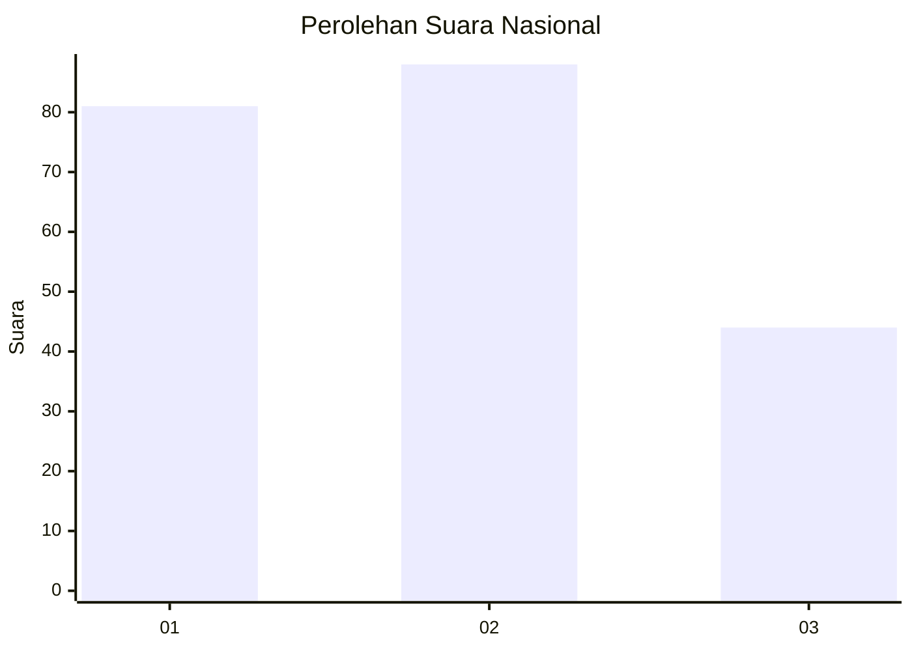
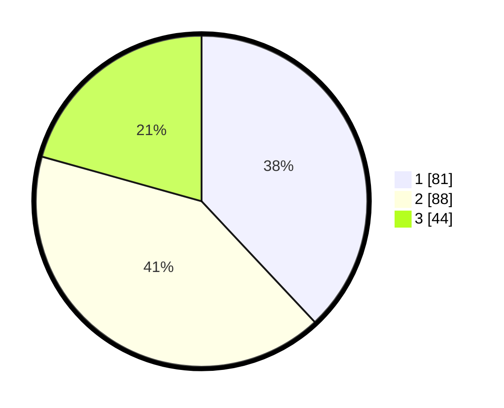

# Hasil

## Grafik

## Tabel

| No.    | Nama Paslon    | Suara | Suara (raw) | Persentase |
|:------ |:-------------- | -----:| -----------:| ----------:|
| 100025 | ANIES MUHAIMIN | 81    | [81][p-1]   | 38,03      |
| 100026 | PRABOWO GIBRAN | 88    | [88][p-2]   | 41,31      |
| 100027 | GANJAR MAHFUD  | 44    | [44][p-3]   | 20,66      |

[p-1]: https://github.com/gigit-pemilu/pemilu-2024/blob/main/pilpres/hitung-suara/sub/31-dki-jakarta/sub/72-jakarta-utara/sub/01-penjaringan/sub/1004-pejagalan/sub/192-tps/sub/paslon-1.txt
[p-2]: https://github.com/gigit-pemilu/pemilu-2024/blob/main/pilpres/hitung-suara/sub/31-dki-jakarta/sub/72-jakarta-utara/sub/01-penjaringan/sub/1004-pejagalan/sub/192-tps/sub/paslon-2.txt
[p-3]: https://github.com/gigit-pemilu/pemilu-2024/blob/main/pilpres/hitung-suara/sub/31-dki-jakarta/sub/72-jakarta-utara/sub/01-penjaringan/sub/1004-pejagalan/sub/192-tps/sub/paslon-3.txt

## Foto C Plano

https://sirekap-obj-formc.kpu.go.id/f2e4/pemilu/ppwp/31/72/01/10/04/3172011004192-20240214-221211--53ce87fa-e95e-4ee5-a53f-91c4823e62b7.jpg

https://sirekap-obj-formc.kpu.go.id/f2e4/pemilu/ppwp/31/72/01/10/04/3172011004192-20240214-221253--0580ee6f-7dee-4eb7-abd3-c3ee7240e913.jpg

https://sirekap-obj-formc.kpu.go.id/f2e4/pemilu/ppwp/31/72/01/10/04/3172011004192-20240214-221334--21f41700-6079-4d9a-8cc1-b5dd664492b9.jpg

## Metadata

| Key        | Value               |
| ---------- | ------------------- |
| Time Stamp | 2024-02-21 17:00:00 |

