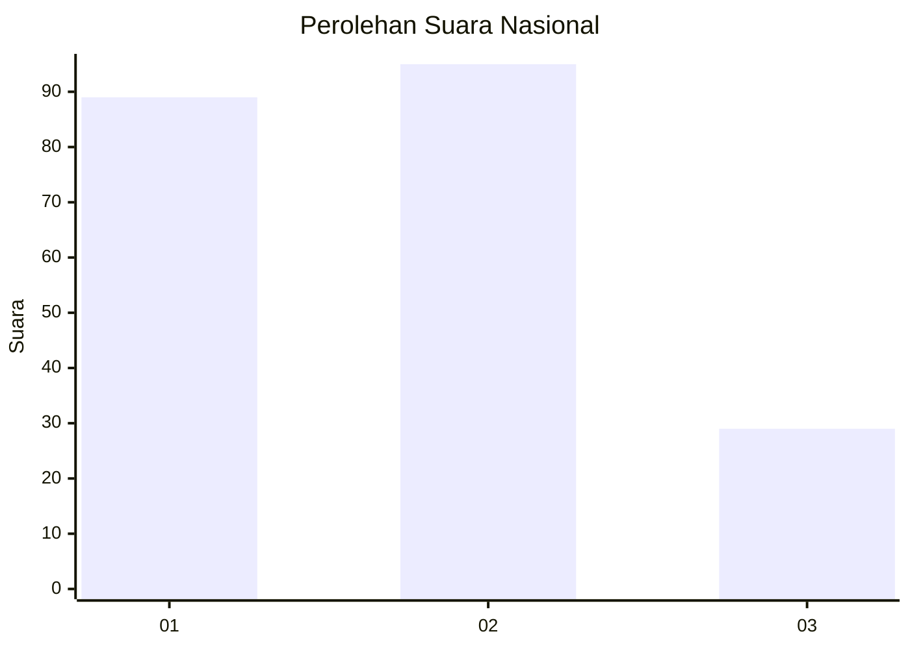
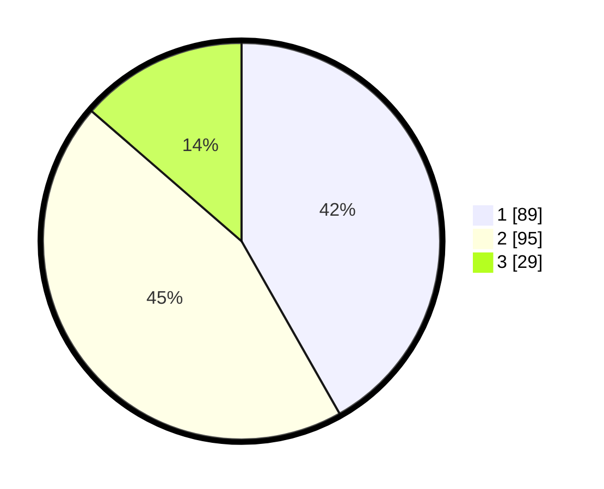

# Hasil

## Grafik

## Tabel

| No.    | Nama Paslon    | Suara | Suara (raw) | Persentase |
|:------ |:-------------- | -----:| -----------:| ----------:|
| 100025 | ANIES MUHAIMIN | 89    | [89][p-1]   | 41,78      |
| 100026 | PRABOWO GIBRAN | 95    | [95][p-2]   | 44,60      |
| 100027 | GANJAR MAHFUD  | 29    | [29][p-3]   | 13,62      |

[p-1]: https://github.com/gigit-pemilu/pemilu-2024/blob/main/pilpres/hitung-suara/sub/31-dki-jakarta/sub/72-jakarta-utara/sub/01-penjaringan/sub/1004-pejagalan/sub/195-tps/sub/paslon-1.txt
[p-2]: https://github.com/gigit-pemilu/pemilu-2024/blob/main/pilpres/hitung-suara/sub/31-dki-jakarta/sub/72-jakarta-utara/sub/01-penjaringan/sub/1004-pejagalan/sub/195-tps/sub/paslon-2.txt
[p-3]: https://github.com/gigit-pemilu/pemilu-2024/blob/main/pilpres/hitung-suara/sub/31-dki-jakarta/sub/72-jakarta-utara/sub/01-penjaringan/sub/1004-pejagalan/sub/195-tps/sub/paslon-3.txt

## Foto C Plano

https://sirekap-obj-formc.kpu.go.id/105e/pemilu/ppwp/31/72/01/10/04/3172011004195-20240214-204811--e8b04f7d-3a51-475e-bdd4-4c742c130476.jpg

https://sirekap-obj-formc.kpu.go.id/105e/pemilu/ppwp/31/72/01/10/04/3172011004195-20240214-204956--4edaaf5e-4cbe-4f2a-8d94-47f3e7ee010b.jpg

https://sirekap-obj-formc.kpu.go.id/105e/pemilu/ppwp/31/72/01/10/04/3172011004195-20240214-205135--5608fbd3-b550-4820-b0b3-5b12c93c3640.jpg

## Metadata

| Key        | Value               |
| ---------- | ------------------- |
| Time Stamp | 2024-02-21 14:00:00 |

