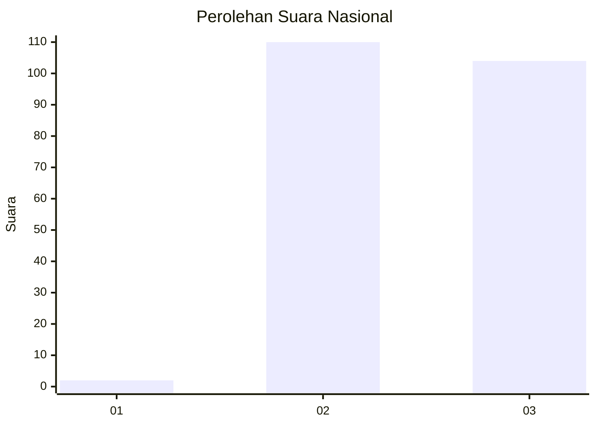
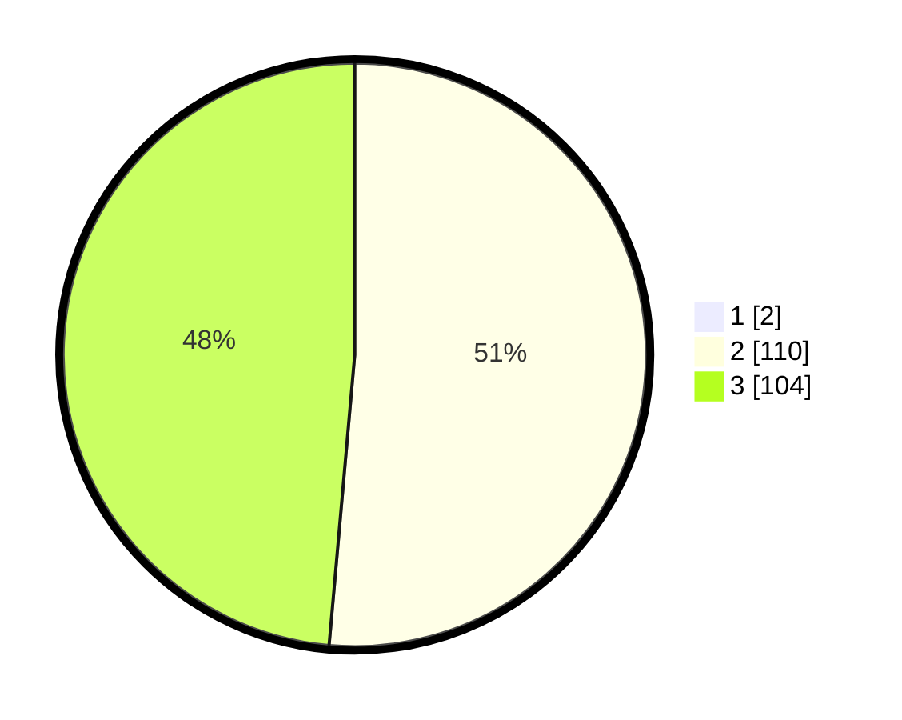

# Hasil

## Grafik

## Tabel

| No.    | Nama Paslon    | Suara | Suara (raw) | Persentase |
|:------ |:-------------- | -----:| -----------:| ----------:|
| 100025 | ANIES MUHAIMIN | 2     | [2][p-1]    | 0,93       |
| 100026 | PRABOWO GIBRAN | 110   | [110][p-2]  | 50,93      |
| 100027 | GANJAR MAHFUD  | 104   | [104][p-3]  | 48,15      |

[p-1]: https://github.com/gigit-pemilu/pemilu-2024/blob/main/pilpres/hitung-suara/sub/31-dki-jakarta/sub/72-jakarta-utara/sub/01-penjaringan/sub/1004-pejagalan/sub/198-tps/sub/paslon-1.txt
[p-2]: https://github.com/gigit-pemilu/pemilu-2024/blob/main/pilpres/hitung-suara/sub/31-dki-jakarta/sub/72-jakarta-utara/sub/01-penjaringan/sub/1004-pejagalan/sub/198-tps/sub/paslon-2.txt
[p-3]: https://github.com/gigit-pemilu/pemilu-2024/blob/main/pilpres/hitung-suara/sub/31-dki-jakarta/sub/72-jakarta-utara/sub/01-penjaringan/sub/1004-pejagalan/sub/198-tps/sub/paslon-3.txt

## Foto C Plano

https://sirekap-obj-formc.kpu.go.id/2c7d/pemilu/ppwp/31/72/01/10/04/3172011004198-20240214-221823--a7c861de-1d82-4b75-a1c2-b75331a230dc.jpg

https://sirekap-obj-formc.kpu.go.id/2c7d/pemilu/ppwp/31/72/01/10/04/3172011004198-20240214-221959--4f48ff63-1509-4018-8ecb-60482c463430.jpg

https://sirekap-obj-formc.kpu.go.id/2c7d/pemilu/ppwp/31/72/01/10/04/3172011004198-20240214-222159--415ea6c1-a4df-4a06-9a3f-be24eecdb685.jpg

## Metadata

| Key        | Value               |
| ---------- | ------------------- |
| Time Stamp | 2024-02-21 18:00:00 |

