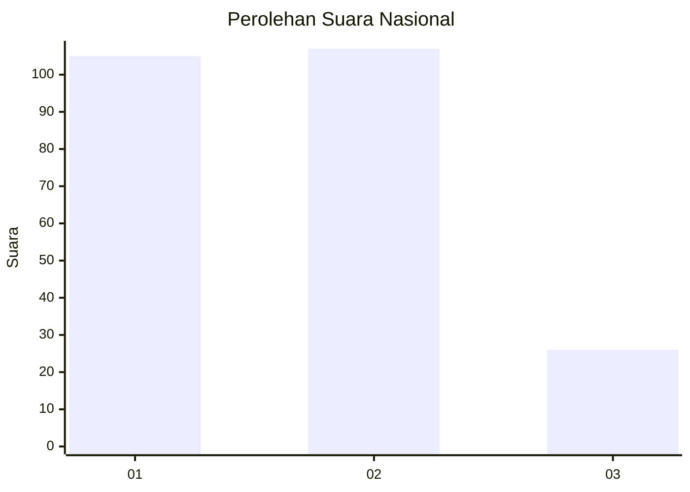
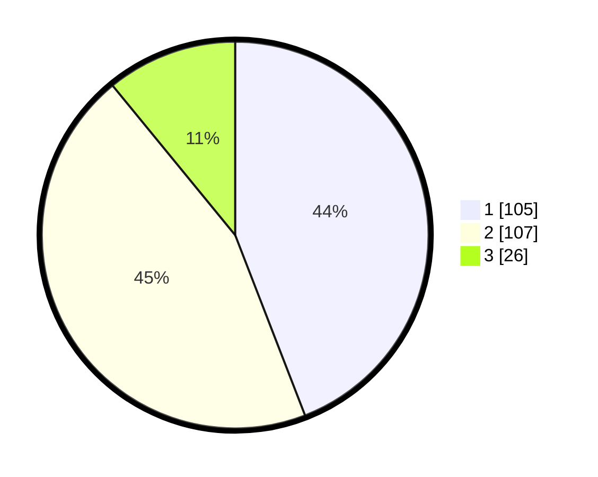

# Hasil

## Grafik

## Tabel

| No.    | Nama Paslon    | Suara | Suara (raw) | Persentase |
|:------ |:-------------- | -----:| -----------:| ----------:|
| 100025 | ANIES MUHAIMIN | 105   | [105][p-1]  | 44,12      |
| 100026 | PRABOWO GIBRAN | 107   | [107][p-2]  | 44,96      |
| 100027 | GANJAR MAHFUD  | 26    | [26][p-3]   | 10,92      |

[p-1]: https://github.com/gigit-pemilu/pemilu-2024/blob/main/pilpres/hitung-suara/sub/31-dki-jakarta/sub/72-jakarta-utara/sub/01-penjaringan/sub/1004-pejagalan/sub/201-tps/sub/paslon-1.txt
[p-2]: https://github.com/gigit-pemilu/pemilu-2024/blob/main/pilpres/hitung-suara/sub/31-dki-jakarta/sub/72-jakarta-utara/sub/01-penjaringan/sub/1004-pejagalan/sub/201-tps/sub/paslon-2.txt
[p-3]: https://github.com/gigit-pemilu/pemilu-2024/blob/main/pilpres/hitung-suara/sub/31-dki-jakarta/sub/72-jakarta-utara/sub/01-penjaringan/sub/1004-pejagalan/sub/201-tps/sub/paslon-3.txt

## Foto C Plano

https://sirekap-obj-formc.kpu.go.id/aaa5/pemilu/ppwp/31/72/01/10/04/3172011004201-20240302-111943--5b6a21d5-ed75-4a03-a124-1351b89db816.jpg

https://sirekap-obj-formc.kpu.go.id/aaa5/pemilu/ppwp/31/72/01/10/04/3172011004201-20240215-025452--06f145e0-d7da-4575-a735-be6b65d6affe.jpg

https://sirekap-obj-formc.kpu.go.id/aaa5/pemilu/ppwp/31/72/01/10/04/3172011004201-20240215-030745--5dd92e32-aacb-43cf-88a9-eaf32b6ac7a8.jpg

## Metadata

| Key        | Value               |
| ---------- | ------------------- |
| Time Stamp | 2024-03-02 12:00:00 |

