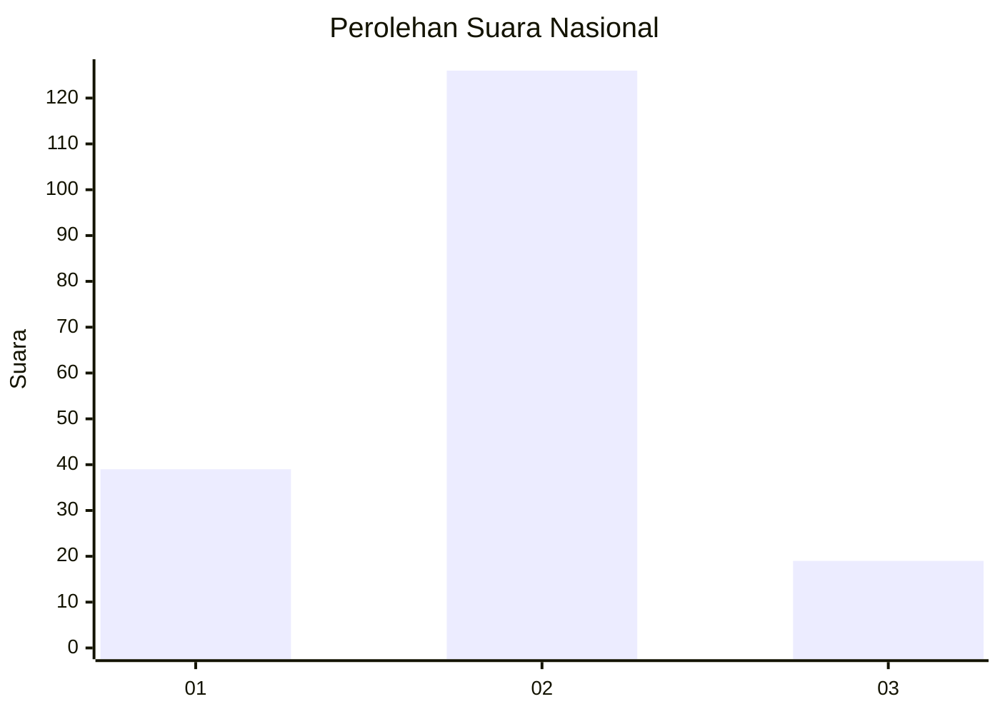

# Hasil

## Grafik

## Tabel

| No.    | Nama Paslon    | Suara | Suara (raw) | Persentase |
|:------ |:-------------- | -----:| -----------:| ----------:|
| 100025 | ANIES MUHAIMIN | 39    | [39][p-1]   | 21,20      |
| 100026 | PRABOWO GIBRAN | 126   | [126][p-2]  | 68,48      |
| 100027 | GANJAR MAHFUD  | 19    | [19][p-3]   | 10,33      |

[p-1]: https://github.com/gigit-pemilu/pemilu-2024/blob/main/pilpres/hitung-suara/sub/31-dki-jakarta/sub/72-jakarta-utara/sub/01-penjaringan/sub/1004-pejagalan/sub/215-tps/sub/paslon-1.txt
[p-2]: https://github.com/gigit-pemilu/pemilu-2024/blob/main/pilpres/hitung-suara/sub/31-dki-jakarta/sub/72-jakarta-utara/sub/01-penjaringan/sub/1004-pejagalan/sub/215-tps/sub/paslon-2.txt
[p-3]: https://github.com/gigit-pemilu/pemilu-2024/blob/main/pilpres/hitung-suara/sub/31-dki-jakarta/sub/72-jakarta-utara/sub/01-penjaringan/sub/1004-pejagalan/sub/215-tps/sub/paslon-3.txt

## Foto C Plano

https://sirekap-obj-formc.kpu.go.id/0a70/pemilu/ppwp/31/72/01/10/04/3172011004215-20240302-111248--3e2e10de-a9db-4fab-bea0-8f14b8abff24.jpg

https://sirekap-obj-formc.kpu.go.id/0a70/pemilu/ppwp/31/72/01/10/04/3172011004215-20240215-002308--53ed91fd-157a-4037-a23a-827441a994ef.jpg

https://sirekap-obj-formc.kpu.go.id/0a70/pemilu/ppwp/31/72/01/10/04/3172011004215-20240215-002433--5a47e720-68a7-4e76-876d-5b5991f1bce9.jpg

## Metadata

| Key        | Value               |
| ---------- | ------------------- |
| Time Stamp | 2024-03-02 12:00:00 |

