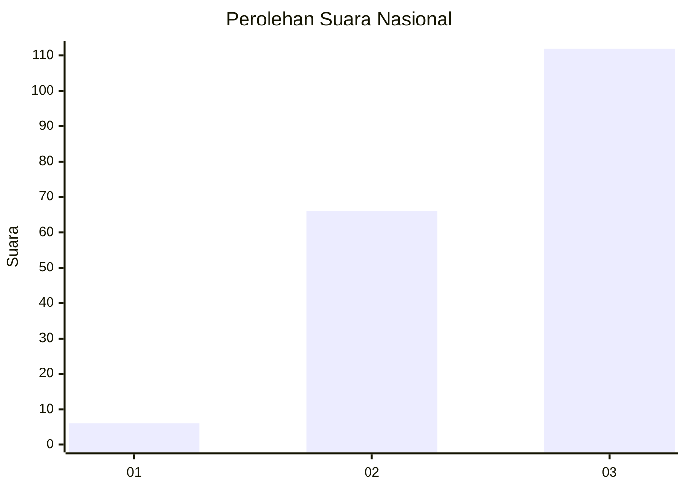
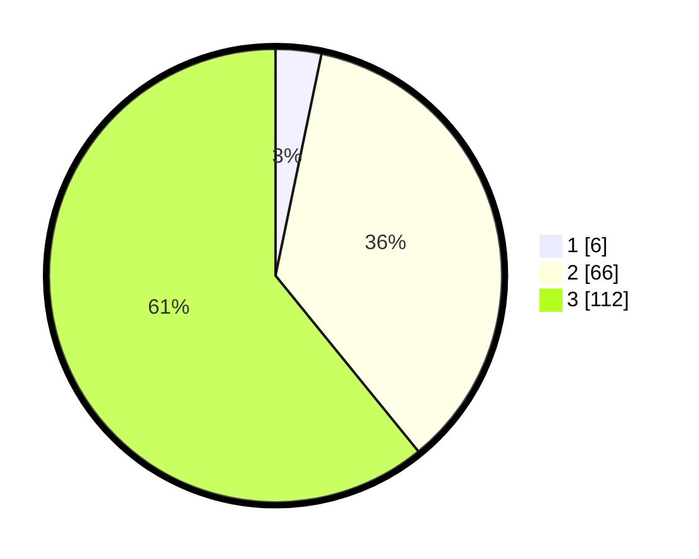

# Hasil

## Grafik

## Tabel

| No.    | Nama Paslon    | Suara | Suara (raw) | Persentase |
|:------ |:-------------- | -----:| -----------:| ----------:|
| 100025 | ANIES MUHAIMIN | 6     | [6][p-1]    | 3,26       |
| 100026 | PRABOWO GIBRAN | 66    | [66][p-2]   | 35,87      |
| 100027 | GANJAR MAHFUD  | 112   | [112][p-3]  | 60,87      |

[p-1]: https://github.com/gigit-pemilu/pemilu-2024/blob/main/pilpres/hitung-suara/sub/31-dki-jakarta/sub/72-jakarta-utara/sub/01-penjaringan/sub/1004-pejagalan/sub/220-tps/sub/paslon-1.txt
[p-2]: https://github.com/gigit-pemilu/pemilu-2024/blob/main/pilpres/hitung-suara/sub/31-dki-jakarta/sub/72-jakarta-utara/sub/01-penjaringan/sub/1004-pejagalan/sub/220-tps/sub/paslon-2.txt
[p-3]: https://github.com/gigit-pemilu/pemilu-2024/blob/main/pilpres/hitung-suara/sub/31-dki-jakarta/sub/72-jakarta-utara/sub/01-penjaringan/sub/1004-pejagalan/sub/220-tps/sub/paslon-3.txt

## Foto C Plano

https://sirekap-obj-formc.kpu.go.id/d9ac/pemilu/ppwp/31/72/01/10/04/3172011004220-20240302-115516--ccdd72ee-1058-453e-86fe-e21cf1be6521.jpg

https://sirekap-obj-formc.kpu.go.id/d9ac/pemilu/ppwp/31/72/01/10/04/3172011004220-20240214-214808--7a51d09d-0d6c-472b-a019-b6a9b0ded4e0.jpg

https://sirekap-obj-formc.kpu.go.id/d9ac/pemilu/ppwp/31/72/01/10/04/3172011004220-20240302-115618--a3a247fc-5989-472a-b159-5974fdb4a083.jpg

## Metadata

| Key        | Value               |
| ---------- | ------------------- |
| Time Stamp | 2024-03-02 12:00:00 |

