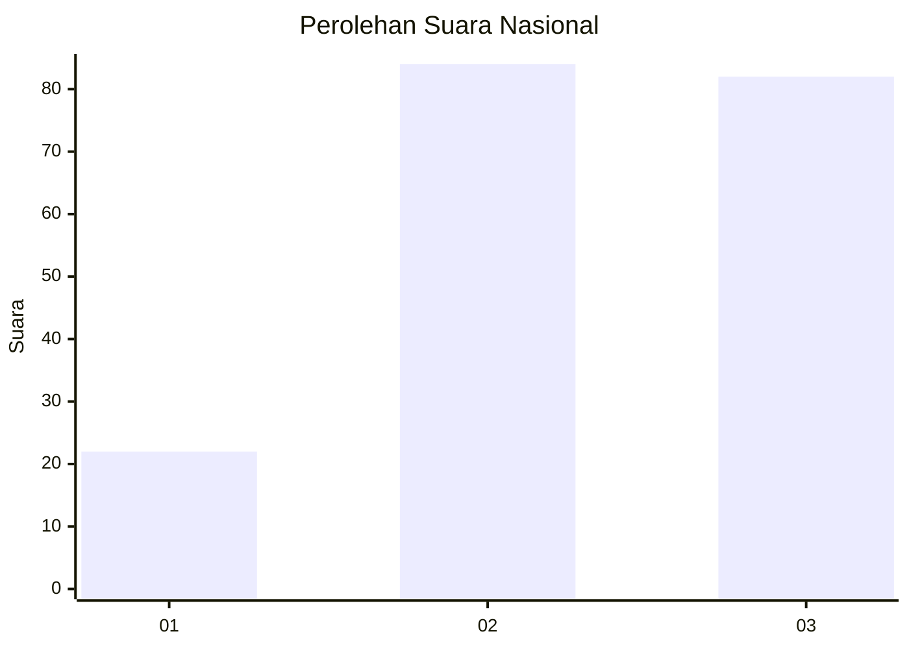
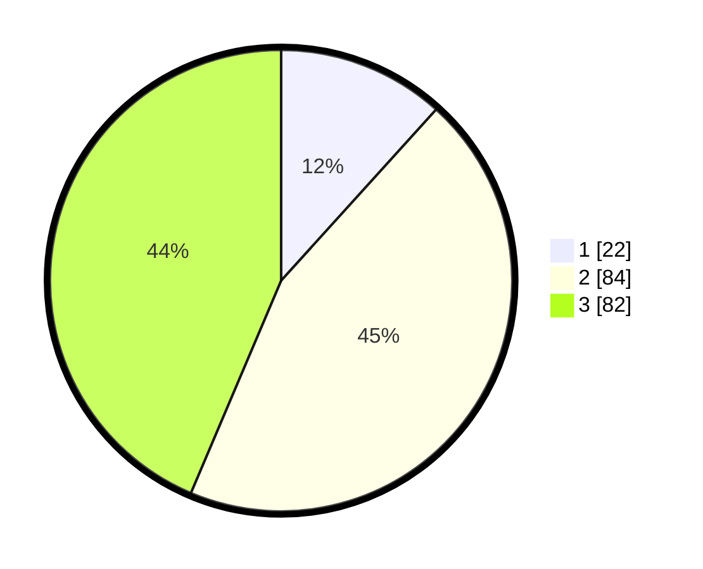

# Hasil

## Grafik

## Tabel

| No.    | Nama Paslon    | Suara | Suara (raw) | Persentase |
|:------ |:-------------- | -----:| -----------:| ----------:|
| 100025 | ANIES MUHAIMIN | 22    | [22][p-1]   | 11,70      |
| 100026 | PRABOWO GIBRAN | 84    | [84][p-2]   | 44,68      |
| 100027 | GANJAR MAHFUD  | 82    | [82][p-3]   | 43,62      |

[p-1]: https://github.com/gigit-pemilu/pemilu-2024/blob/main/pilpres/hitung-suara/sub/31-dki-jakarta/sub/72-jakarta-utara/sub/01-penjaringan/sub/1004-pejagalan/sub/221-tps/sub/paslon-1.txt
[p-2]: https://github.com/gigit-pemilu/pemilu-2024/blob/main/pilpres/hitung-suara/sub/31-dki-jakarta/sub/72-jakarta-utara/sub/01-penjaringan/sub/1004-pejagalan/sub/221-tps/sub/paslon-2.txt
[p-3]: https://github.com/gigit-pemilu/pemilu-2024/blob/main/pilpres/hitung-suara/sub/31-dki-jakarta/sub/72-jakarta-utara/sub/01-penjaringan/sub/1004-pejagalan/sub/221-tps/sub/paslon-3.txt

## Foto C Plano

https://sirekap-obj-formc.kpu.go.id/6055/pemilu/ppwp/31/72/01/10/04/3172011004221-20240215-093934--4d9bb84d-ea67-495b-8948-020b1ac9a22e.jpg

https://sirekap-obj-formc.kpu.go.id/6055/pemilu/ppwp/31/72/01/10/04/3172011004221-20240215-093943--7c0ed10e-2334-45ed-b35a-cd12e93c6c6a.jpg

https://sirekap-obj-formc.kpu.go.id/6055/pemilu/ppwp/31/72/01/10/04/3172011004221-20240215-093949--e2d0bab5-7ec6-4532-94b7-6a2a4300df9a.jpg

## Metadata

| Key        | Value               |
| ---------- | ------------------- |
| Time Stamp | 2024-02-21 18:00:00 |

