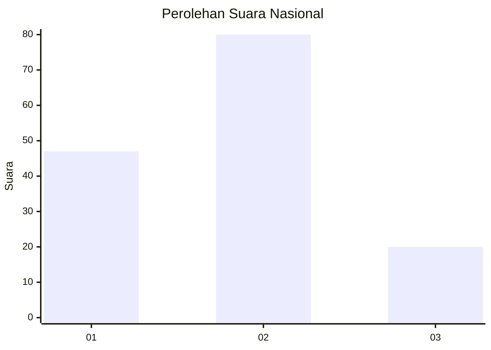
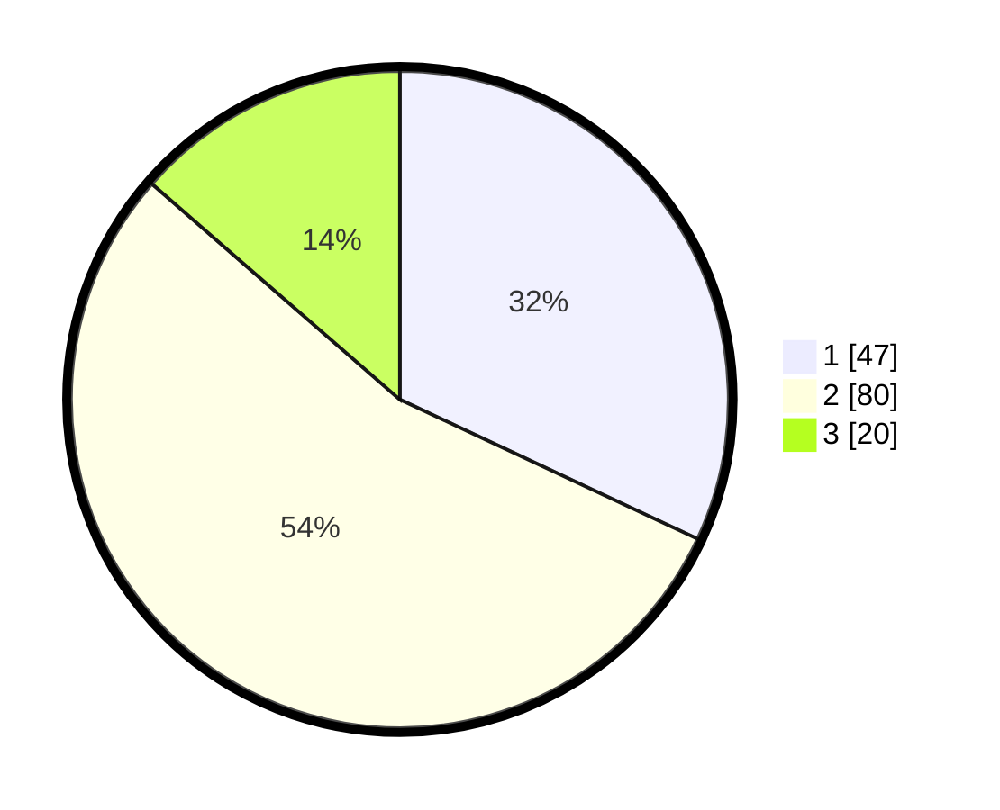

# Hasil

## Grafik

## Tabel

| No.    | Nama Paslon    | Suara | Suara (raw) | Persentase |
|:------ |:-------------- | -----:| -----------:| ----------:|
| 100025 | ANIES MUHAIMIN | 47    | [47][p-1]   | 31,97      |
| 100026 | PRABOWO GIBRAN | 80    | [80][p-2]   | 54,42      |
| 100027 | GANJAR MAHFUD  | 20    | [20][p-3]   | 13,61      |

[p-1]: https://github.com/gigit-pemilu/pemilu-2024/blob/main/pilpres/hitung-suara/sub/31-dki-jakarta/sub/72-jakarta-utara/sub/01-penjaringan/sub/1004-pejagalan/sub/227-tps/sub/paslon-1.txt
[p-2]: https://github.com/gigit-pemilu/pemilu-2024/blob/main/pilpres/hitung-suara/sub/31-dki-jakarta/sub/72-jakarta-utara/sub/01-penjaringan/sub/1004-pejagalan/sub/227-tps/sub/paslon-2.txt
[p-3]: https://github.com/gigit-pemilu/pemilu-2024/blob/main/pilpres/hitung-suara/sub/31-dki-jakarta/sub/72-jakarta-utara/sub/01-penjaringan/sub/1004-pejagalan/sub/227-tps/sub/paslon-3.txt

## Foto C Plano

https://sirekap-obj-formc.kpu.go.id/7ed3/pemilu/ppwp/31/72/01/10/04/3172011004227-20240302-120858--f0776dd9-4655-4409-b778-a9a568c28ae5.jpg

https://sirekap-obj-formc.kpu.go.id/7ed3/pemilu/ppwp/31/72/01/10/04/3172011004227-20240214-141938--cadc63c6-49f1-4355-bf5c-a60bbb3279b3.jpg

https://sirekap-obj-formc.kpu.go.id/7ed3/pemilu/ppwp/31/72/01/10/04/3172011004227-20240215-005824--f05a1add-0c47-4a53-9e7c-71c46a2be01c.jpg

## Metadata

| Key        | Value               |
| ---------- | ------------------- |
| Time Stamp | 2024-03-02 13:00:00 |

