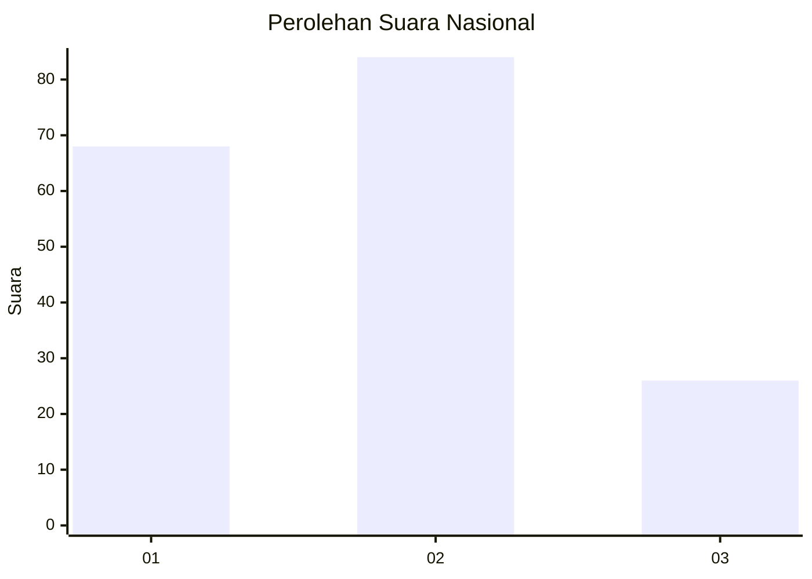
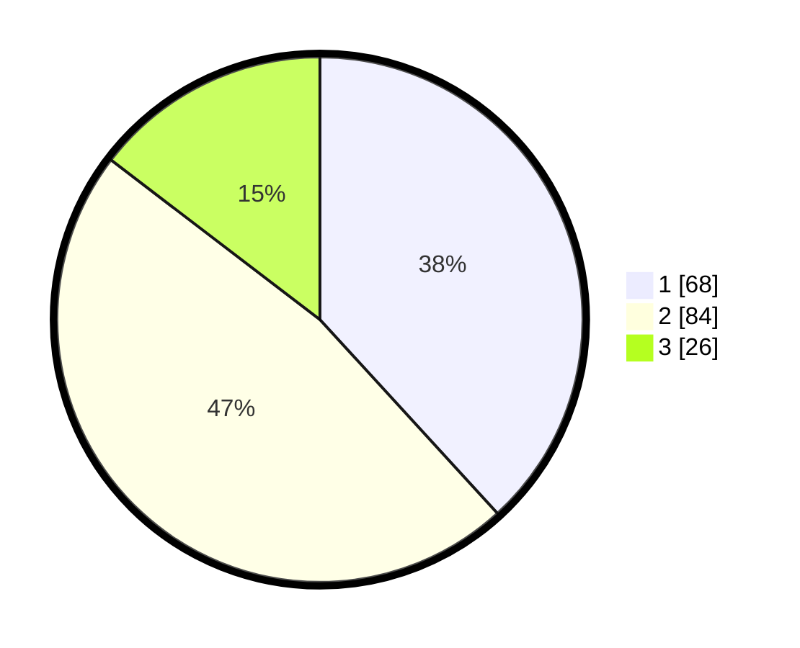

# Hasil

## Grafik

## Tabel

| No.    | Nama Paslon    | Suara | Suara (raw) | Persentase |
|:------ |:-------------- | -----:| -----------:| ----------:|
| 100025 | ANIES MUHAIMIN | 68    | [68][p-1]   | 38,20      |
| 100026 | PRABOWO GIBRAN | 84    | [84][p-2]   | 47,19      |
| 100027 | GANJAR MAHFUD  | 26    | [26][p-3]   | 14,61      |

[p-1]: https://github.com/gigit-pemilu/pemilu-2024/blob/main/pilpres/hitung-suara/sub/31-dki-jakarta/sub/72-jakarta-utara/sub/01-penjaringan/sub/1004-pejagalan/sub/228-tps/sub/paslon-1.txt
[p-2]: https://github.com/gigit-pemilu/pemilu-2024/blob/main/pilpres/hitung-suara/sub/31-dki-jakarta/sub/72-jakarta-utara/sub/01-penjaringan/sub/1004-pejagalan/sub/228-tps/sub/paslon-2.txt
[p-3]: https://github.com/gigit-pemilu/pemilu-2024/blob/main/pilpres/hitung-suara/sub/31-dki-jakarta/sub/72-jakarta-utara/sub/01-penjaringan/sub/1004-pejagalan/sub/228-tps/sub/paslon-3.txt

## Foto C Plano

https://sirekap-obj-formc.kpu.go.id/282e/pemilu/ppwp/31/72/01/10/04/3172011004228-20240302-122237--0c13a806-f23c-45b8-8f77-6745d80e1474.jpg

https://sirekap-obj-formc.kpu.go.id/282e/pemilu/ppwp/31/72/01/10/04/3172011004228-20240214-224559--e7a797ce-74c2-49f2-9ca2-a3769618b8df.jpg

https://sirekap-obj-formc.kpu.go.id/282e/pemilu/ppwp/31/72/01/10/04/3172011004228-20240302-122324--b16216e5-458f-4739-b5f8-b44835fe7917.jpg

## Metadata

| Key        | Value               |
| ---------- | ------------------- |
| Time Stamp | 2024-03-02 13:00:00 |

