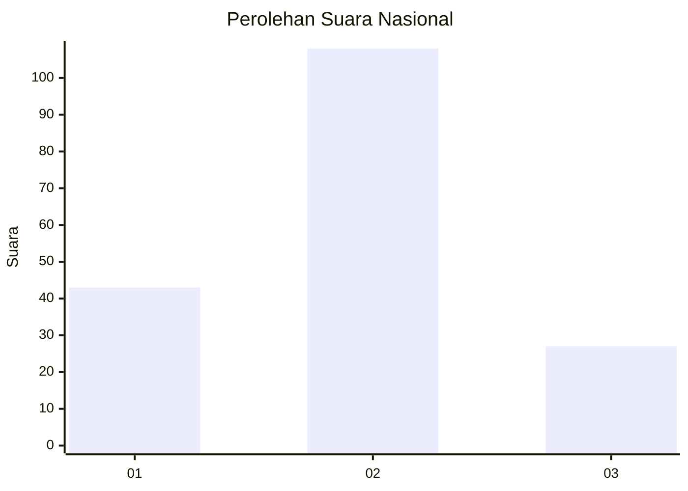

# Hasil

## Grafik

## Tabel

| No.    | Nama Paslon    | Suara | Suara (raw) | Persentase |
|:------ |:-------------- | -----:| -----------:| ----------:|
| 100025 | ANIES MUHAIMIN | 43    | [43][p-1]   | 24,16      |
| 100026 | PRABOWO GIBRAN | 108   | [108][p-2]  | 60,67      |
| 100027 | GANJAR MAHFUD  | 27    | [27][p-3]   | 15,17      |

[p-1]: https://github.com/gigit-pemilu/pemilu-2024/blob/main/pilpres/hitung-suara/sub/31-dki-jakarta/sub/72-jakarta-utara/sub/01-penjaringan/sub/1004-pejagalan/sub/229-tps/sub/paslon-1.txt
[p-2]: https://github.com/gigit-pemilu/pemilu-2024/blob/main/pilpres/hitung-suara/sub/31-dki-jakarta/sub/72-jakarta-utara/sub/01-penjaringan/sub/1004-pejagalan/sub/229-tps/sub/paslon-2.txt
[p-3]: https://github.com/gigit-pemilu/pemilu-2024/blob/main/pilpres/hitung-suara/sub/31-dki-jakarta/sub/72-jakarta-utara/sub/01-penjaringan/sub/1004-pejagalan/sub/229-tps/sub/paslon-3.txt

## Foto C Plano

https://sirekap-obj-formc.kpu.go.id/7b43/pemilu/ppwp/31/72/01/10/04/3172011004229-20240302-122400--74d3fb0e-7691-469d-b992-b32fb7651cf6.jpg

https://sirekap-obj-formc.kpu.go.id/7b43/pemilu/ppwp/31/72/01/10/04/3172011004229-20240215-021115--42de9b32-6384-4a1c-a829-af3ffe63700e.jpg

https://sirekap-obj-formc.kpu.go.id/7b43/pemilu/ppwp/31/72/01/10/04/3172011004229-20240302-122443--cab19e29-5b6c-4f5a-9fcb-c2cf1e7c4da8.jpg

## Metadata

| Key        | Value               |
| ---------- | ------------------- |
| Time Stamp | 2024-03-02 13:00:00 |

