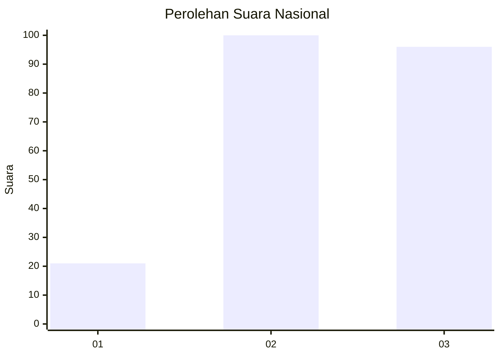
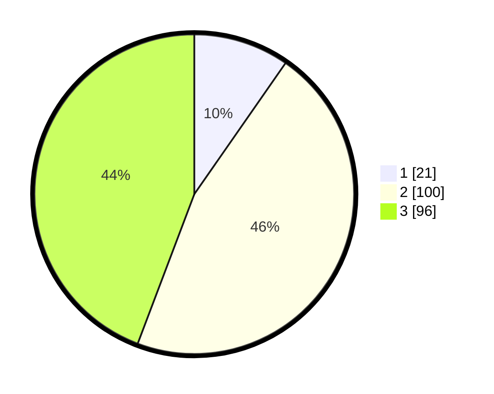

# Hasil

## Grafik

## Tabel

| No.    | Nama Paslon    | Suara | Suara (raw) | Persentase |
|:------ |:-------------- | -----:| -----------:| ----------:|
| 100025 | ANIES MUHAIMIN | 21    | [21][p-1]   | 9,68       |
| 100026 | PRABOWO GIBRAN | 100   | [100][p-2]  | 46,08      |
| 100027 | GANJAR MAHFUD  | 96    | [96][p-3]   | 44,24      |

[p-1]: https://github.com/gigit-pemilu/pemilu-2024/blob/main/pilpres/hitung-suara/sub/31-dki-jakarta/sub/72-jakarta-utara/sub/01-penjaringan/sub/1004-pejagalan/sub/240-tps/sub/paslon-1.txt
[p-2]: https://github.com/gigit-pemilu/pemilu-2024/blob/main/pilpres/hitung-suara/sub/31-dki-jakarta/sub/72-jakarta-utara/sub/01-penjaringan/sub/1004-pejagalan/sub/240-tps/sub/paslon-2.txt
[p-3]: https://github.com/gigit-pemilu/pemilu-2024/blob/main/pilpres/hitung-suara/sub/31-dki-jakarta/sub/72-jakarta-utara/sub/01-penjaringan/sub/1004-pejagalan/sub/240-tps/sub/paslon-3.txt

## Foto C Plano

https://sirekap-obj-formc.kpu.go.id/44e0/pemilu/ppwp/31/72/01/10/04/3172011004240-20240215-011053--e5e9f647-c24e-4734-a19f-3ce38a196ead.jpg

https://sirekap-obj-formc.kpu.go.id/44e0/pemilu/ppwp/31/72/01/10/04/3172011004240-20240215-011227--9b682ceb-c7a6-46f3-9d5b-ea32e1e0719f.jpg

https://sirekap-obj-formc.kpu.go.id/44e0/pemilu/ppwp/31/72/01/10/04/3172011004240-20240215-011332--28e260ca-ed16-482b-ab82-274b1df7861d.jpg

## Metadata

| Key        | Value               |
| ---------- | ------------------- |
| Time Stamp | 2024-02-22 11:00:00 |

