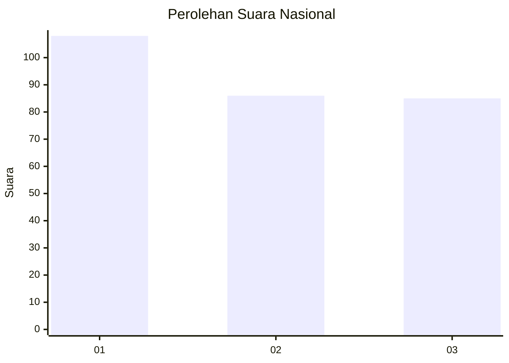
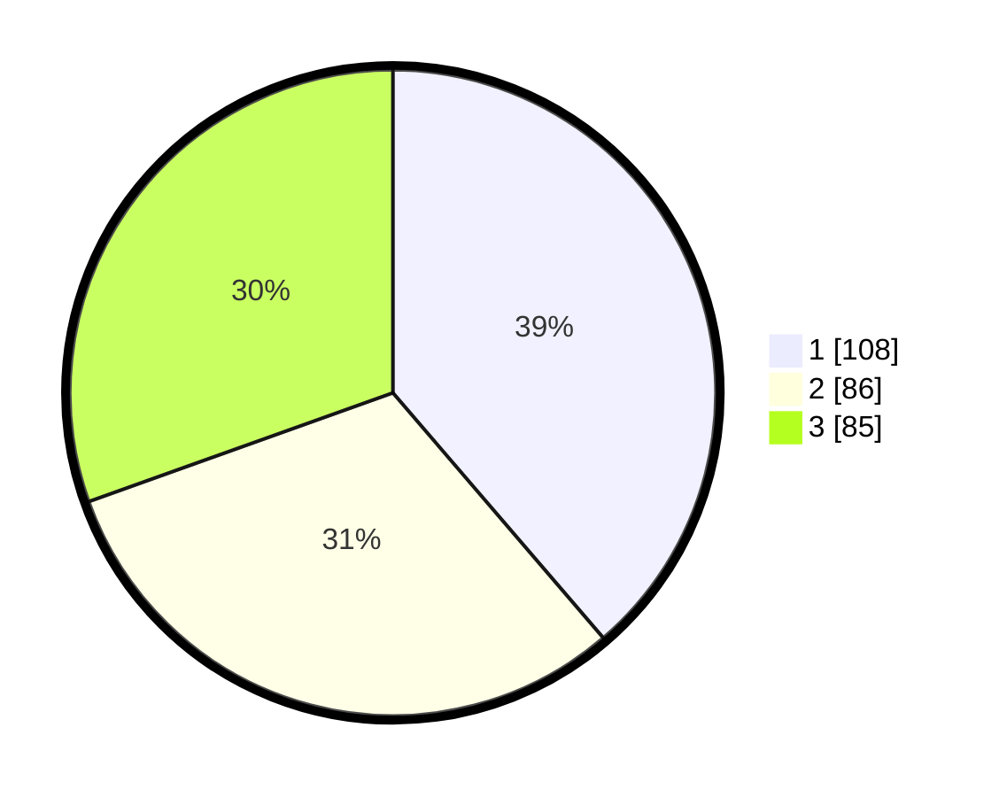

# Hasil

## Grafik

## Tabel

| No.    | Nama Paslon    | Suara | Suara (raw) | Persentase |
|:------ |:-------------- | -----:| -----------:| ----------:|
| 100025 | ANIES MUHAIMIN | 108   | [108][p-1]  | 38,71      |
| 100026 | PRABOWO GIBRAN | 86    | [86][p-2]   | 30,82      |
| 100027 | GANJAR MAHFUD  | 85    | [85][p-3]   | 30,47      |

[p-1]: https://github.com/gigit-pemilu/pemilu-2024/blob/main/pilpres/hitung-suara/sub/31-dki-jakarta/sub/72-jakarta-utara/sub/01-penjaringan/sub/1004-pejagalan/sub/242-tps/sub/paslon-1.txt
[p-2]: https://github.com/gigit-pemilu/pemilu-2024/blob/main/pilpres/hitung-suara/sub/31-dki-jakarta/sub/72-jakarta-utara/sub/01-penjaringan/sub/1004-pejagalan/sub/242-tps/sub/paslon-2.txt
[p-3]: https://github.com/gigit-pemilu/pemilu-2024/blob/main/pilpres/hitung-suara/sub/31-dki-jakarta/sub/72-jakarta-utara/sub/01-penjaringan/sub/1004-pejagalan/sub/242-tps/sub/paslon-3.txt

## Foto C Plano

https://sirekap-obj-formc.kpu.go.id/a1a3/pemilu/ppwp/31/72/01/10/04/3172011004242-20240302-124757--ff8e9e75-12b3-420c-a99d-dc5bef3d519b.jpg

https://sirekap-obj-formc.kpu.go.id/a1a3/pemilu/ppwp/31/72/01/10/04/3172011004242-20240214-211036--4957ab96-9376-4334-87dc-1f1032ff16fe.jpg

https://sirekap-obj-formc.kpu.go.id/a1a3/pemilu/ppwp/31/72/01/10/04/3172011004242-20240214-190510--93b95a3a-2ffe-4319-8730-5674fe146438.jpg

## Metadata

| Key        | Value               |
| ---------- | ------------------- |
| Time Stamp | 2024-03-02 13:00:00 |

