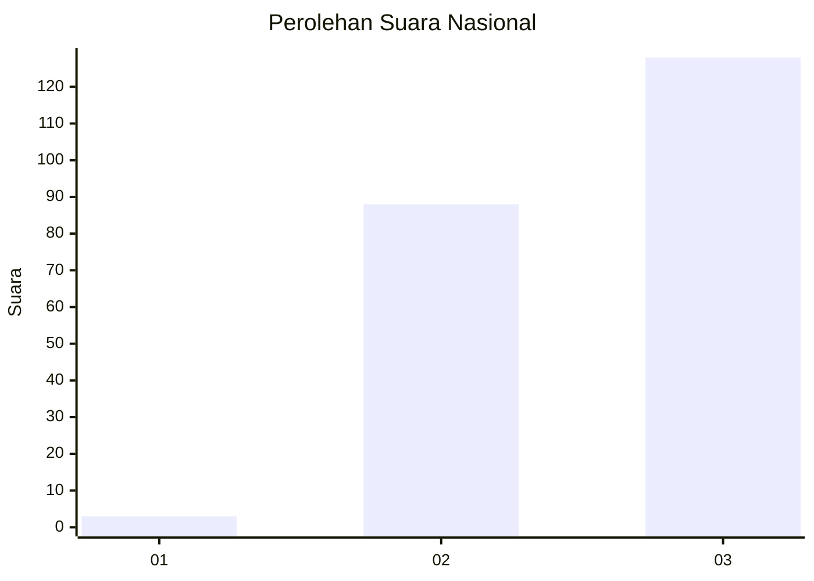
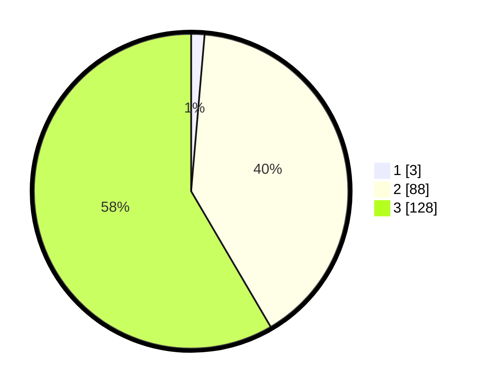

# Hasil

## Grafik

## Tabel

| No.    | Nama Paslon    | Suara | Suara (raw) | Persentase |
|:------ |:-------------- | -----:| -----------:| ----------:|
| 100025 | ANIES MUHAIMIN | 3     | [3][p-1]    | 1,37       |
| 100026 | PRABOWO GIBRAN | 88    | [88][p-2]   | 40,18      |
| 100027 | GANJAR MAHFUD  | 128   | [128][p-3]  | 58,45      |

[p-1]: https://github.com/gigit-pemilu/pemilu-2024/blob/main/pilpres/hitung-suara/sub/31-dki-jakarta/sub/72-jakarta-utara/sub/01-penjaringan/sub/1005-pluit/sub/036-tps/sub/paslon-1.txt
[p-2]: https://github.com/gigit-pemilu/pemilu-2024/blob/main/pilpres/hitung-suara/sub/31-dki-jakarta/sub/72-jakarta-utara/sub/01-penjaringan/sub/1005-pluit/sub/036-tps/sub/paslon-2.txt
[p-3]: https://github.com/gigit-pemilu/pemilu-2024/blob/main/pilpres/hitung-suara/sub/31-dki-jakarta/sub/72-jakarta-utara/sub/01-penjaringan/sub/1005-pluit/sub/036-tps/sub/paslon-3.txt

## Foto C Plano

https://sirekap-obj-formc.kpu.go.id/6144/pemilu/ppwp/31/72/01/10/05/3172011005036-20240214-202016--43657d5c-076b-4dc9-9f85-7df81d7185c0.jpg

https://sirekap-obj-formc.kpu.go.id/6144/pemilu/ppwp/31/72/01/10/05/3172011005036-20240214-202115--769b8fad-8490-4f43-aa1d-cc7294ec96af.jpg

https://sirekap-obj-formc.kpu.go.id/6144/pemilu/ppwp/31/72/01/10/05/3172011005036-20240214-202227--73aeded7-35a5-4806-a715-5ffeadf8abd6.jpg

## Metadata

| Key        | Value               |
| ---------- | ------------------- |
| Time Stamp | 2024-02-21 18:00:00 |

