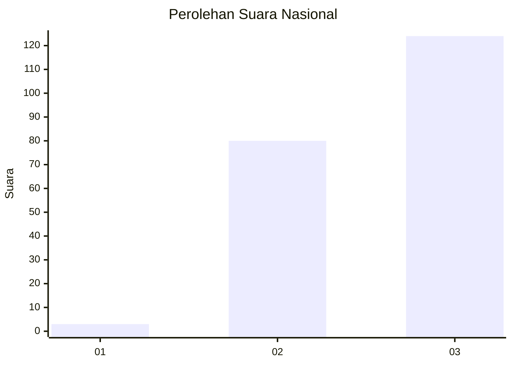
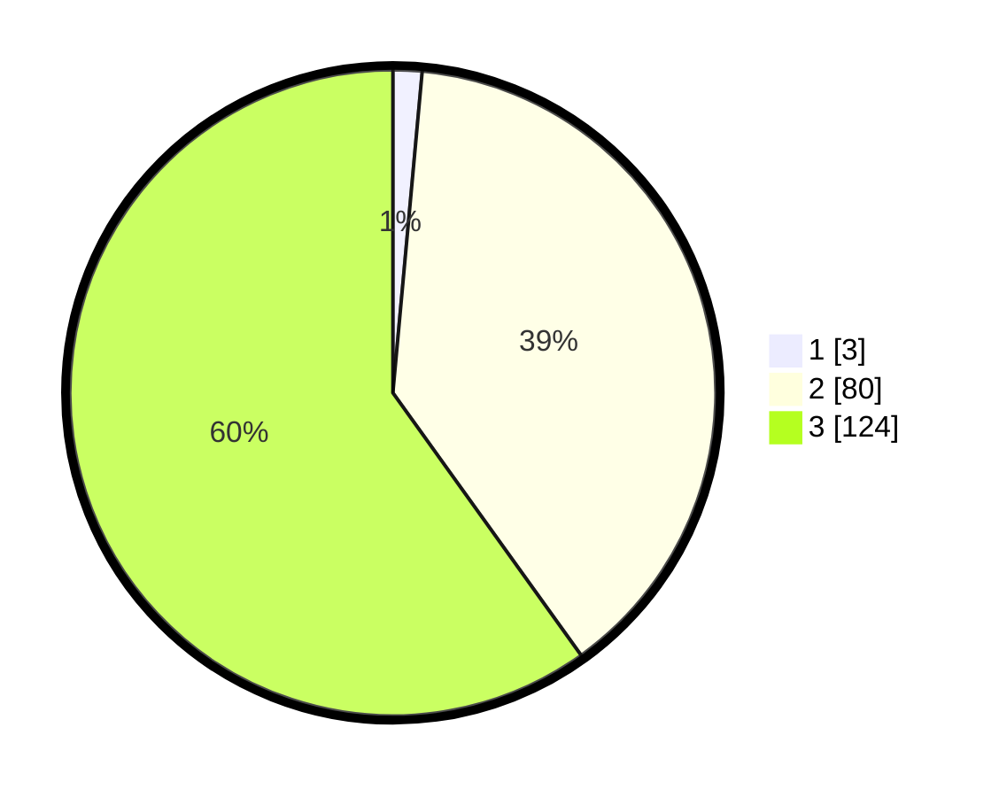

# Hasil

## Grafik

## Tabel

| No.    | Nama Paslon    | Suara | Suara (raw) | Persentase |
|:------ |:-------------- | -----:| -----------:| ----------:|
| 100025 | ANIES MUHAIMIN | 3     | [3][p-1]    | 1,45       |
| 100026 | PRABOWO GIBRAN | 80    | [80][p-2]   | 38,65      |
| 100027 | GANJAR MAHFUD  | 124   | [124][p-3]  | 59,90      |

[p-1]: https://github.com/gigit-pemilu/pemilu-2024/blob/main/pilpres/hitung-suara/sub/31-dki-jakarta/sub/72-jakarta-utara/sub/01-penjaringan/sub/1005-pluit/sub/069-tps/sub/paslon-1.txt
[p-2]: https://github.com/gigit-pemilu/pemilu-2024/blob/main/pilpres/hitung-suara/sub/31-dki-jakarta/sub/72-jakarta-utara/sub/01-penjaringan/sub/1005-pluit/sub/069-tps/sub/paslon-2.txt
[p-3]: https://github.com/gigit-pemilu/pemilu-2024/blob/main/pilpres/hitung-suara/sub/31-dki-jakarta/sub/72-jakarta-utara/sub/01-penjaringan/sub/1005-pluit/sub/069-tps/sub/paslon-3.txt

## Foto C Plano

https://sirekap-obj-formc.kpu.go.id/6773/pemilu/ppwp/31/72/01/10/05/3172011005069-20240214-190432--1e0c3535-5c60-45ad-a60f-c20d5a78a99f.jpg

https://sirekap-obj-formc.kpu.go.id/6773/pemilu/ppwp/31/72/01/10/05/3172011005069-20240214-190030--e779187d-4b1b-4945-9e51-fdf7608c15ea.jpg

https://sirekap-obj-formc.kpu.go.id/6773/pemilu/ppwp/31/72/01/10/05/3172011005069-20240214-190653--16cce43c-e0f9-411f-b4e6-d8f027919912.jpg

## Metadata

| Key        | Value               |
| ---------- | ------------------- |
| Time Stamp | 2024-02-21 14:00:00 |

