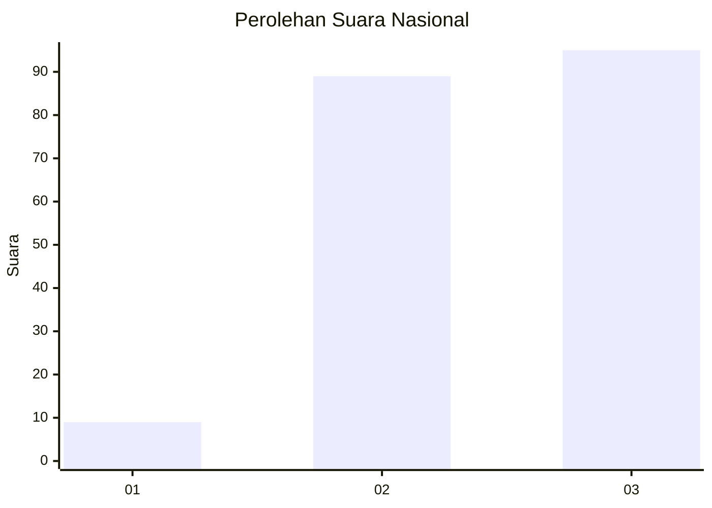
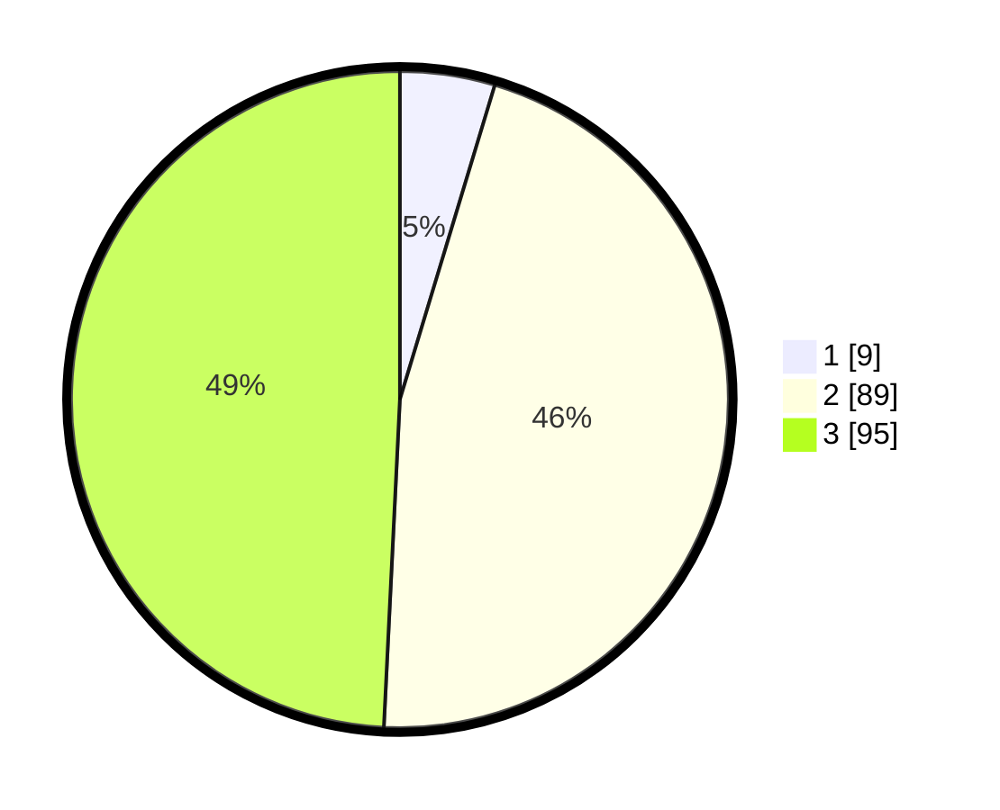

# Hasil

## Grafik

## Tabel

| No.    | Nama Paslon    | Suara | Suara (raw) | Persentase |
|:------ |:-------------- | -----:| -----------:| ----------:|
| 100025 | ANIES MUHAIMIN | 9     | [9][p-1]    | 4,66       |
| 100026 | PRABOWO GIBRAN | 89    | [89][p-2]   | 46,11      |
| 100027 | GANJAR MAHFUD  | 95    | [95][p-3]   | 49,22      |

[p-1]: https://github.com/gigit-pemilu/pemilu-2024/blob/main/pilpres/hitung-suara/sub/31-dki-jakarta/sub/72-jakarta-utara/sub/01-penjaringan/sub/1005-pluit/sub/080-tps/sub/paslon-1.txt
[p-2]: https://github.com/gigit-pemilu/pemilu-2024/blob/main/pilpres/hitung-suara/sub/31-dki-jakarta/sub/72-jakarta-utara/sub/01-penjaringan/sub/1005-pluit/sub/080-tps/sub/paslon-2.txt
[p-3]: https://github.com/gigit-pemilu/pemilu-2024/blob/main/pilpres/hitung-suara/sub/31-dki-jakarta/sub/72-jakarta-utara/sub/01-penjaringan/sub/1005-pluit/sub/080-tps/sub/paslon-3.txt

## Foto C Plano

https://sirekap-obj-formc.kpu.go.id/6302/pemilu/ppwp/31/72/01/10/05/3172011005080-20240214-230010--5904aab3-ab79-4929-9501-c433e61546b8.jpg

https://sirekap-obj-formc.kpu.go.id/6302/pemilu/ppwp/31/72/01/10/05/3172011005080-20240214-225930--5d8e6241-1cd4-4eb2-b191-2238af4c3fc8.jpg

https://sirekap-obj-formc.kpu.go.id/6302/pemilu/ppwp/31/72/01/10/05/3172011005080-20240214-230058--c4c38af2-ac16-4bd8-a9bb-37e4f01ce162.jpg

## Metadata

| Key        | Value               |
| ---------- | ------------------- |
| Time Stamp | 2024-02-21 15:00:00 |

