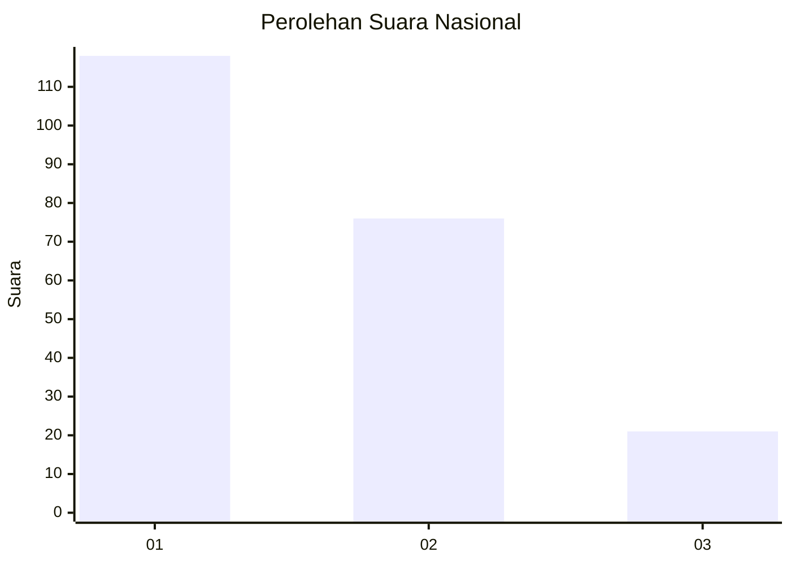
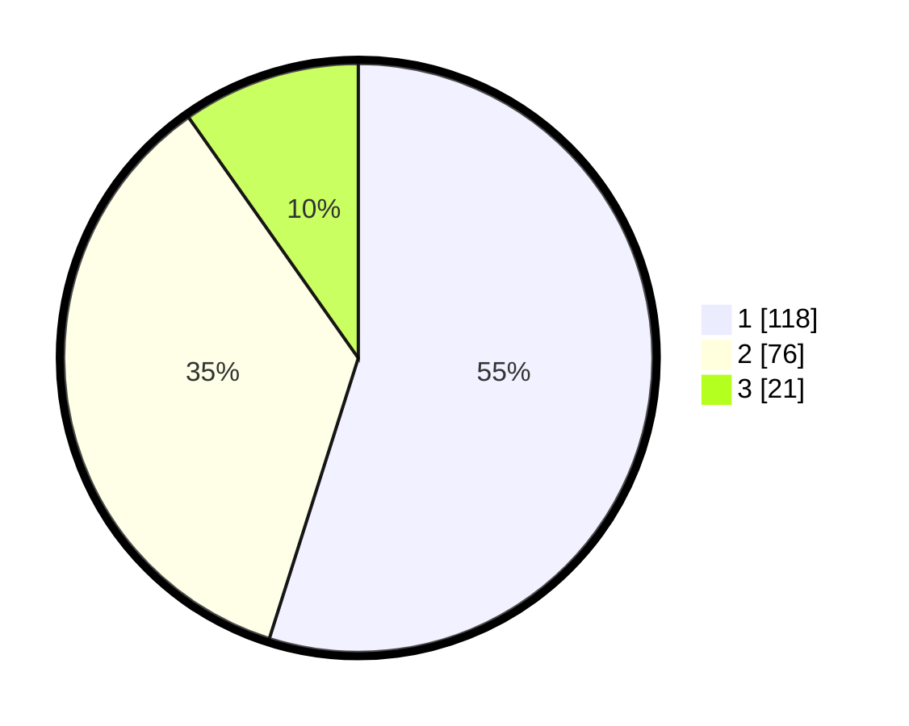

# Hasil

## Grafik

## Tabel

| No.    | Nama Paslon    | Suara | Suara (raw) | Persentase |
|:------ |:-------------- | -----:| -----------:| ----------:|
| 100025 | ANIES MUHAIMIN | 118   | [118][p-1]  | 54,88      |
| 100026 | PRABOWO GIBRAN | 76    | [76][p-2]   | 35,35      |
| 100027 | GANJAR MAHFUD  | 21    | [21][p-3]   | 9,77       |

[p-1]: https://github.com/gigit-pemilu/pemilu-2024/blob/main/pilpres/hitung-suara/sub/31-dki-jakarta/sub/72-jakarta-utara/sub/01-penjaringan/sub/1005-pluit/sub/083-tps/sub/paslon-1.txt
[p-2]: https://github.com/gigit-pemilu/pemilu-2024/blob/main/pilpres/hitung-suara/sub/31-dki-jakarta/sub/72-jakarta-utara/sub/01-penjaringan/sub/1005-pluit/sub/083-tps/sub/paslon-2.txt
[p-3]: https://github.com/gigit-pemilu/pemilu-2024/blob/main/pilpres/hitung-suara/sub/31-dki-jakarta/sub/72-jakarta-utara/sub/01-penjaringan/sub/1005-pluit/sub/083-tps/sub/paslon-3.txt

## Foto C Plano

https://sirekap-obj-formc.kpu.go.id/4a18/pemilu/ppwp/31/72/01/10/05/3172011005083-20240214-213923--454e7234-c1e0-43f5-8f53-2f8963a7e840.jpg

https://sirekap-obj-formc.kpu.go.id/4a18/pemilu/ppwp/31/72/01/10/05/3172011005083-20240214-213932--fdc4641d-1bc2-42a4-9175-1c9cbc8bfda0.jpg

https://sirekap-obj-formc.kpu.go.id/4a18/pemilu/ppwp/31/72/01/10/05/3172011005083-20240214-213942--8666e806-d9e7-4076-832e-2d5e2a8aa9d4.jpg

## Metadata

| Key        | Value               |
| ---------- | ------------------- |
| Time Stamp | 2024-02-21 18:00:00 |

