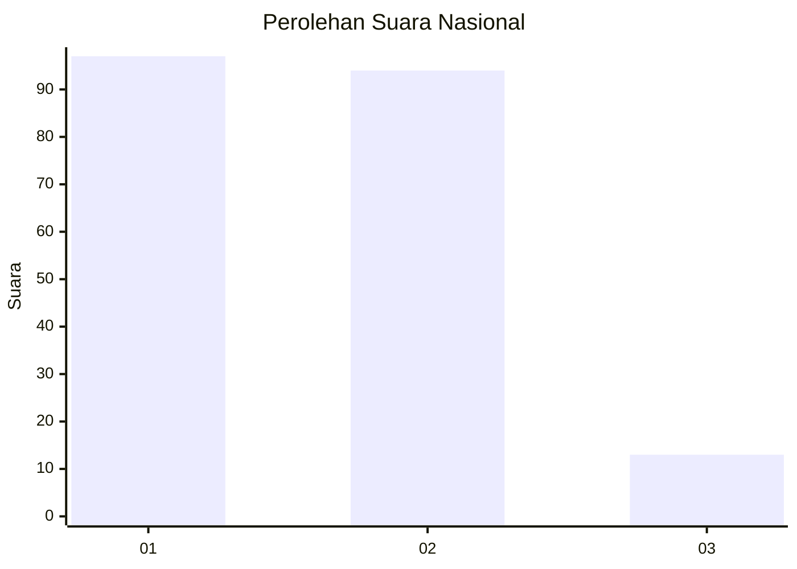
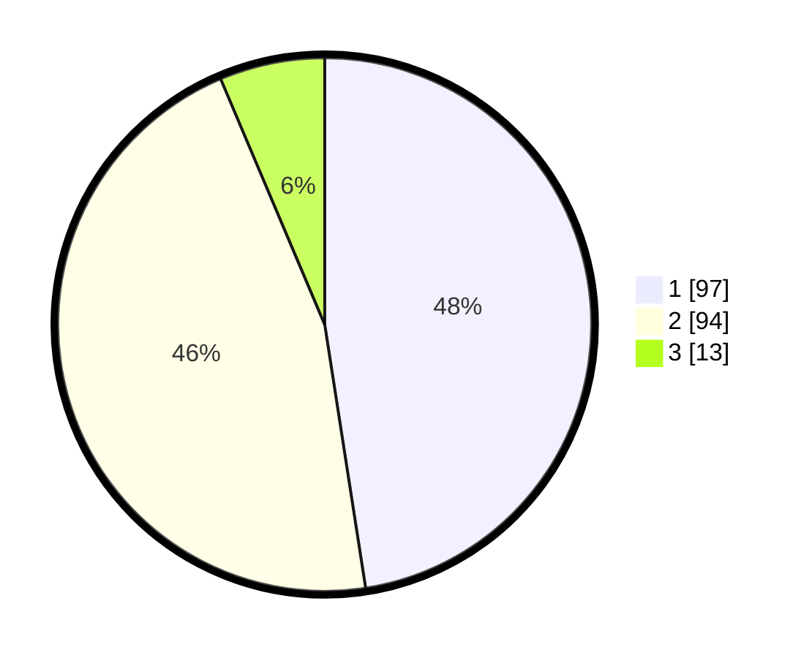

# Hasil

## Grafik

## Tabel

| No.    | Nama Paslon    | Suara | Suara (raw) | Persentase |
|:------ |:-------------- | -----:| -----------:| ----------:|
| 100025 | ANIES MUHAIMIN | 97    | [97][p-1]   | 47,55      |
| 100026 | PRABOWO GIBRAN | 94    | [94][p-2]   | 46,08      |
| 100027 | GANJAR MAHFUD  | 13    | [13][p-3]   | 6,37       |

[p-1]: https://github.com/gigit-pemilu/pemilu-2024/blob/main/pilpres/hitung-suara/sub/31-dki-jakarta/sub/72-jakarta-utara/sub/01-penjaringan/sub/1005-pluit/sub/084-tps/sub/paslon-1.txt
[p-2]: https://github.com/gigit-pemilu/pemilu-2024/blob/main/pilpres/hitung-suara/sub/31-dki-jakarta/sub/72-jakarta-utara/sub/01-penjaringan/sub/1005-pluit/sub/084-tps/sub/paslon-2.txt
[p-3]: https://github.com/gigit-pemilu/pemilu-2024/blob/main/pilpres/hitung-suara/sub/31-dki-jakarta/sub/72-jakarta-utara/sub/01-penjaringan/sub/1005-pluit/sub/084-tps/sub/paslon-3.txt

## Foto C Plano

https://sirekap-obj-formc.kpu.go.id/e884/pemilu/ppwp/31/72/01/10/05/3172011005084-20240227-173433--3dc5c8e3-3eed-4bf7-aa3b-00d7c81dbc1c.jpg

https://sirekap-obj-formc.kpu.go.id/e884/pemilu/ppwp/31/72/01/10/05/3172011005084-20240227-173449--8349e901-5653-40a8-80d6-3e09640d88aa.jpg

https://sirekap-obj-formc.kpu.go.id/e884/pemilu/ppwp/31/72/01/10/05/3172011005084-20240227-173516--b4eb022a-e651-4ff4-813c-11e11095ebde.jpg

## Metadata

| Key        | Value               |
| ---------- | ------------------- |
| Time Stamp | 2024-02-27 22:00:00 |

