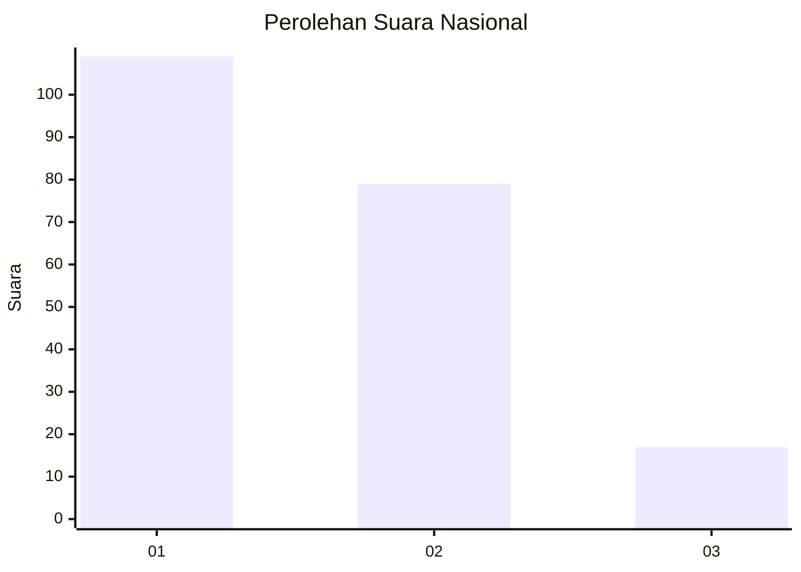
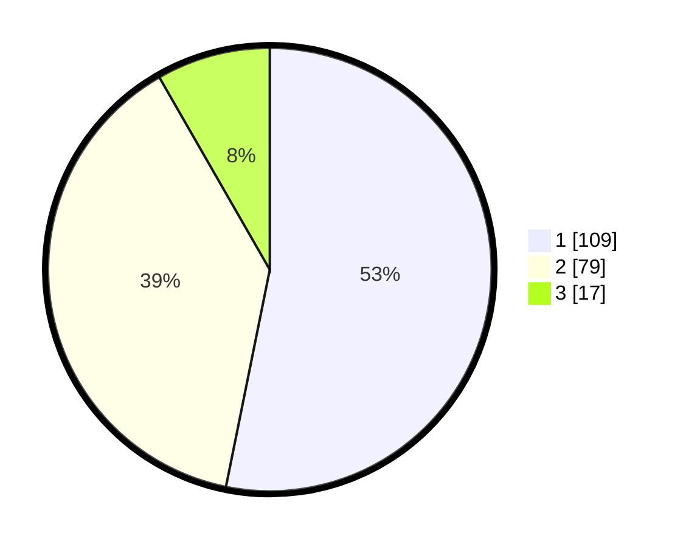

# Hasil

## Grafik

## Tabel

| No.    | Nama Paslon    | Suara | Suara (raw) | Persentase |
|:------ |:-------------- | -----:| -----------:| ----------:|
| 100025 | ANIES MUHAIMIN | 109   | [109][p-1]  | 53,17      |
| 100026 | PRABOWO GIBRAN | 79    | [79][p-2]   | 38,54      |
| 100027 | GANJAR MAHFUD  | 17    | [17][p-3]   | 8,29       |

[p-1]: https://github.com/gigit-pemilu/pemilu-2024/blob/main/pilpres/hitung-suara/sub/31-dki-jakarta/sub/72-jakarta-utara/sub/01-penjaringan/sub/1005-pluit/sub/085-tps/sub/paslon-1.txt
[p-2]: https://github.com/gigit-pemilu/pemilu-2024/blob/main/pilpres/hitung-suara/sub/31-dki-jakarta/sub/72-jakarta-utara/sub/01-penjaringan/sub/1005-pluit/sub/085-tps/sub/paslon-2.txt
[p-3]: https://github.com/gigit-pemilu/pemilu-2024/blob/main/pilpres/hitung-suara/sub/31-dki-jakarta/sub/72-jakarta-utara/sub/01-penjaringan/sub/1005-pluit/sub/085-tps/sub/paslon-3.txt

## Foto C Plano

https://sirekap-obj-formc.kpu.go.id/d40a/pemilu/ppwp/31/72/01/10/05/3172011005085-20240227-195734--a6203ab9-1115-4276-b78c-317534071617.jpg

https://sirekap-obj-formc.kpu.go.id/d40a/pemilu/ppwp/31/72/01/10/05/3172011005085-20240214-192128--c994a6ce-c6f9-446d-9e5a-06bb66be00f7.jpg

https://sirekap-obj-formc.kpu.go.id/d40a/pemilu/ppwp/31/72/01/10/05/3172011005085-20240214-192234--acb530b4-406d-4e78-b8fe-30f60df7a316.jpg

## Metadata

| Key        | Value               |
| ---------- | ------------------- |
| Time Stamp | 2024-02-27 20:00:00 |

