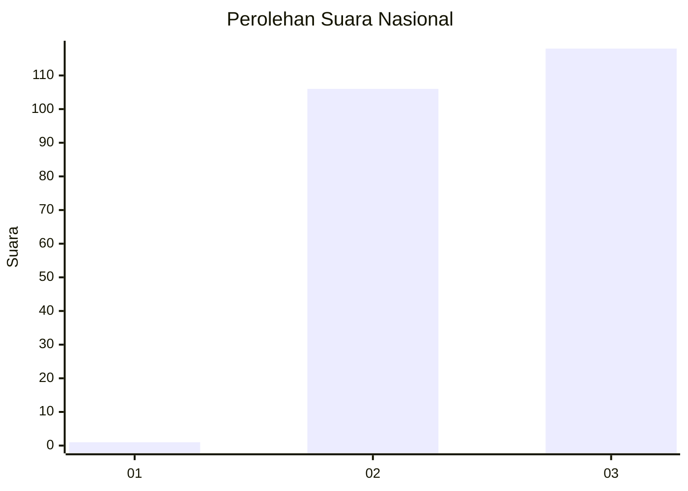
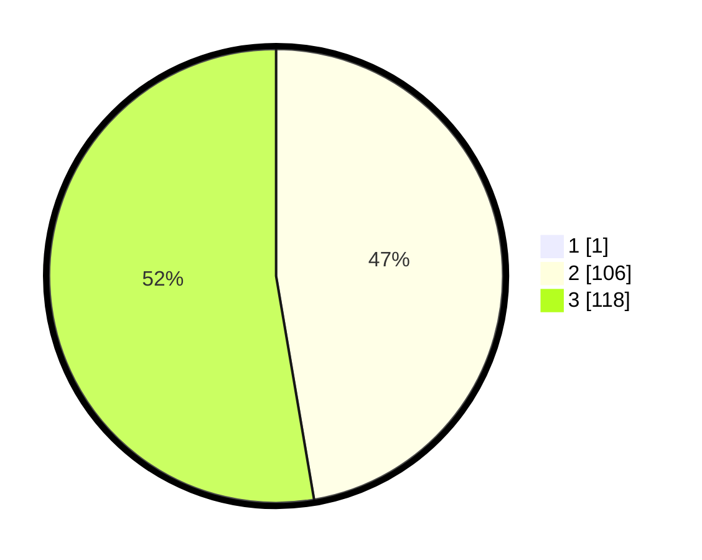

# Hasil

## Grafik

## Tabel

| No.    | Nama Paslon    | Suara | Suara (raw) | Persentase |
|:------ |:-------------- | -----:| -----------:| ----------:|
| 100025 | ANIES MUHAIMIN | 1     | [1][p-1]    | 0,44       |
| 100026 | PRABOWO GIBRAN | 106   | [106][p-2]  | 47,11      |
| 100027 | GANJAR MAHFUD  | 118   | [118][p-3]  | 52,44      |

[p-1]: https://github.com/gigit-pemilu/pemilu-2024/blob/main/pilpres/hitung-suara/sub/31-dki-jakarta/sub/72-jakarta-utara/sub/01-penjaringan/sub/1005-pluit/sub/110-tps/sub/paslon-1.txt
[p-2]: https://github.com/gigit-pemilu/pemilu-2024/blob/main/pilpres/hitung-suara/sub/31-dki-jakarta/sub/72-jakarta-utara/sub/01-penjaringan/sub/1005-pluit/sub/110-tps/sub/paslon-2.txt
[p-3]: https://github.com/gigit-pemilu/pemilu-2024/blob/main/pilpres/hitung-suara/sub/31-dki-jakarta/sub/72-jakarta-utara/sub/01-penjaringan/sub/1005-pluit/sub/110-tps/sub/paslon-3.txt

## Foto C Plano

https://sirekap-obj-formc.kpu.go.id/8a70/pemilu/ppwp/31/72/01/10/05/3172011005110-20240227-180422--c2dae4d1-ee00-4240-aaae-d0300d9f1efa.jpg

https://sirekap-obj-formc.kpu.go.id/8a70/pemilu/ppwp/31/72/01/10/05/3172011005110-20240214-203702--109f78b9-81d7-43d9-a4ac-9d470dc7cb02.jpg

https://sirekap-obj-formc.kpu.go.id/8a70/pemilu/ppwp/31/72/01/10/05/3172011005110-20240214-203706--fef5fe48-aafe-4fce-bef3-926e103a1eb9.jpg

## Metadata

| Key        | Value               |
| ---------- | ------------------- |
| Time Stamp | 2024-02-27 19:00:00 |

